# SeventySix

> **Work in Progress — Not Production Ready**
>
> This codebase is under active development and is **not yet suitable for production use**. APIs, database schemas, and configuration may change without notice.

A full-stack monorepo built with .NET 10 and Angular 21. Secure by default, observable from the start, designed for AI-assisted development.

### What's In It

**Security**
- .NET Core Identity with Argon2 password hashing
- Altcha proof-of-work CAPTCHA — no third-party tracking
- Fail2Ban intrusion prevention with GeoIP blocking
- GitHub OAuth, MFA (TOTP + backup codes)
- Native .NET rate limiting on all endpoints

**Observability**
- End-to-end OpenTelemetry traces (server + browser → Jaeger)
- Prometheus metrics with pre-provisioned Grafana dashboards
- Real-time API monitoring, cache metrics, and Web Vitals
- All UIs proxied through HTTPS nginx

**AI-Assisted Development**
- A set of Copilot prompts, auto-applied instruction files, and MCP servers
- Hands-free /create-plan → /review-plan → /execute-plan workflow — add your own corrections at each phase
- Let Chrome DevTools MCP handle interacting and testing your code, build E2E as you go, confirm load testing with existing structures

**Free Infrastructure**
- MIT licensed, no paid tiers required
- PostgreSQL, Valkey (Redis-compatible), Docker Compose
- Self-hosted observability stack

**Testing**
- **Server**: xUnit test projects with NSubstitute + Shouldly, architecture tests, custom Roslyn analyzers with autofixes
- **Client**: Vitest unit tests with architecture validation (domain isolation enforced) and web-vitals metrics
- **E2E**: Playwright across defined auth roles with axe-core WCAG 2.2 AA accessibility scanning
- **Load**: k6 with multiple scenarios and profiles (quick/smoke/load/stress), Docker-isolated, HTML reports

**CLI-First**
- A set of npm scripts covering development, testing, secrets, certificates, and Docker
- `npm start` to stand up, `npm stop` to tear down, `npm run format` to clean all code

### Why It Exists

This is a public sandbox for building secure, scalable applications. The architectural decisions come down to:

- **Clean separation** — Domain-Driven Design with bounded contexts
- **Parallel development safety** — Ports & Adapters (Hexagonal Architecture)
- **Vertical slice isolation** — CQRS with Wolverine message handlers
- **AI collaboration** — Structured prompts and context-aware instructions
- **Tracing everything** — Jaeger traces and log correlation with copy/paste outputs for debugging in Admin

The rule: **hands-free AI-assisted coding**. Describe it, the AI builds it. Use the sandbox page and any of the prompts below for new domains to experiment with proof-of-concept work.

### Architecture

- **Server**: .NET 10 — strict `Shared ← Domains ← Api` dependency flow
  - Bounded contexts include: Identity, Logging, ApiTracking, ElectronicNotifications
  - Each domain owns its schema, migrations, and EF Core `DbContext`
  - Wolverine CQRS with static handlers and method-injected dependencies

- **Client**: Angular 21 — enforced domain isolation
  - Client domains (admin, auth, account, developer, home, sandbox)
  - Each imports only `@shared/*` + itself, never cross-domain
  - Zoneless change detection, Signals, TanStack Query for server state

- **Patterns**: DDD + Hexagonal + CQRS + Vertical Slices
  - Modular monolith — one domain already split out, ready to evolve into microservices if further separation is needed
  - Interface-driven contracts for testability
  - Strong type safety across client and server

- **Architectural Tests**: Tests that confirm Copilot never breaks the architecture
  - If you catch him breaking the structure you want, ask him to write tests to check his own code in the server or client
  - Domain boundaries, method/class size, parameter counts, short variables — all enforced on server and client

- **Formatting**: `npm run format` handles everything
  - EditorConfig, ESLint, dprint, dotnet format all ran on every file in the server, client, e2e, and load testing folders. Automatically passing and codefixed check-ins.

- **CI/CD**: GitHub Actions with gated master merges
  - Lint passing with zero build warnings on the client or server
  - Server, client, E2E, and go/no-go load tests gate the final phase

- **Environment Realism**: Development matches production
  - 1:1 in development with only less restrictive rate limits. User-secrets are the only thing that changes between environments, and this was selected to match expected deployments using Docker variables. Critical: Never use development passwords or keys in production — cycle keys monthly and do not store anything in code or re-use development setups.

### AI Tooling

Built with GitHub Copilot, Claude (Opus 4.5/4.6), Raptor Mini for simple tasks, and the Microsoft AI Agent Toolkit extension (AIAgentExpert agent mode). The prompts and instructions are provider-agnostic — adapt them to whatever AI assistant you prefer.

None of this code was handwritten. I wrote more in this markdown file than I have in the entire codebase. It started as a fresh .NET 10 Core Web Project and a single `ng new my-app` prompt. Over time it grew from stubbed weather service samples into what you see here, mostly shaped by personal preferences.

The design goal behind every decision: long term I might want a self-hosted LLM running a dynamic MMORPG AI, maybe I want to run realistic physics models in a simulator, or maybe just a quick proof of concept in this tech stack. This codebase is standalone, polyglot-capable, secure out of the gate with error tracking and observability, with the major design standards locked in for whatever direction the sandbox goes.

## Table of Contents

- [Technology Stack](#technology-stack)
- [Architecture Overview](#architecture-overview)
- [Project Structure](#project-structure)
- [Getting Started](#getting-started)
- [Configuration Overview](#configuration-overview)
- [Scripts Reference](#scripts-reference)
- [Sub-Project READMEs](#sub-project-readmes)
- [Application Showcase](#application-showcase)
  - [Authentication](#authentication)
  - [Account](#account)
  - [Administration](#administration)
  - [Developer Tools](#developer-tools)
  - [Observability](#observability-1)
- [Security](#security)
- [Accessibility](#accessibility)
- [Observability](#observability)
- [Caching](#caching)
- [Background Jobs](#background-jobs)
- [Email System](#email-system)
- [Progressive Web App](#progressive-web-app)
- [Theming](#theming)
- [Copilot Integration](#copilot-integration)
- [Docker Environments](#docker-environments)
- [Cost Model](#cost-model)
- [Code Quality](#code-quality)
- [Testing](#testing)
- [License](#license)

## Technology Stack

### Server

| Technology | Version | License | Purpose |
|---|---|---|---|
| .NET | 10 LTS | MIT | Runtime and SDK |
| ASP.NET Core | 10 | MIT | HTTP framework |
| [Wolverine](https://wolverine.netlify.app/) | latest | MIT | CQRS message bus with scheduled messaging |
| Entity Framework Core | 10 | MIT | ORM and migrations |
| PostgreSQL | 18 | PostgreSQL License | Primary database |
| [FusionCache](https://github.com/ZiggyCreatures/FusionCache) | latest | MIT | Two-tier caching (L1 memory + L2 distributed) |
| Valkey | 9.0 | BSD-3-Clause | Distributed cache and backplane (Redis-compatible, Linux Foundation) |
| [FluentValidation](https://docs.fluentvalidation.net/) | latest | Apache-2.0 | Request validation with startup-time `ValidateOnStart()` |
| Serilog | latest | Apache-2.0 | Structured logging to console and OpenTelemetry |
| .NET Core Identity | 10 | MIT | Authentication and authorization (Argon2 password hashing) |
| OpenAPI + Scalar | latest | MIT | Interactive API documentation (development only) |

### Client

| Technology | Version | License | Purpose |
|---|---|---|---|
| Angular | 21 LTS | MIT | SPA framework (Zoneless change detection, Signals) |
| [TanStack Query](https://tanstack.com/query/latest) | latest | MIT | Server state management with cache coordination |
| [Angular Material](https://material.angular.io/) | 21 | MIT | Material Design 3 component library |
| Angular Service Worker | 21 | MIT | PWA offline support, automatic updates |
| Vitest | latest | MIT | Unit and integration testing |
| [Playwright](https://playwright.dev/) | latest | Apache-2.0 | E2E browser automation |
| [k6](https://grafana.com/docs/k6/latest/) | latest | AGPL-3.0 | Load and performance testing (Grafana) |
| ESLint | latest | MIT | Linting with custom rules |
| dprint | latest | MIT | Code formatting |

### Infrastructure

| Technology | Version | License | Purpose |
|---|---|---|---|
- Docker Compose | latest | Apache-2.0 | Container orchestration (multiple environment configs)
| nginx | latest | BSD-2-Clause | HTTPS reverse proxy for observability tools |
| Jaeger | latest | Apache-2.0 | Distributed tracing |
| Prometheus | latest | Apache-2.0 | Metrics collection |
| Grafana | 11.4 | AGPL-3.0 | Metrics dashboards |
| OpenTelemetry Collector | latest | Apache-2.0 | Telemetry pipeline (OTLP to Jaeger + Prometheus) |
| Fail2Ban | latest | GPL-2.0 | Intrusion prevention (auth, rate limit, geo-blocking) |
| MaxMind GeoIP | latest | Free tier | Country-level IP geolocation for Fail2Ban |
| pgAdmin | latest | PostgreSQL License | PostgreSQL web UI |
| RedisInsight | latest | SSPL | Valkey/Redis GUI for cache visualization |

## Architecture Overview

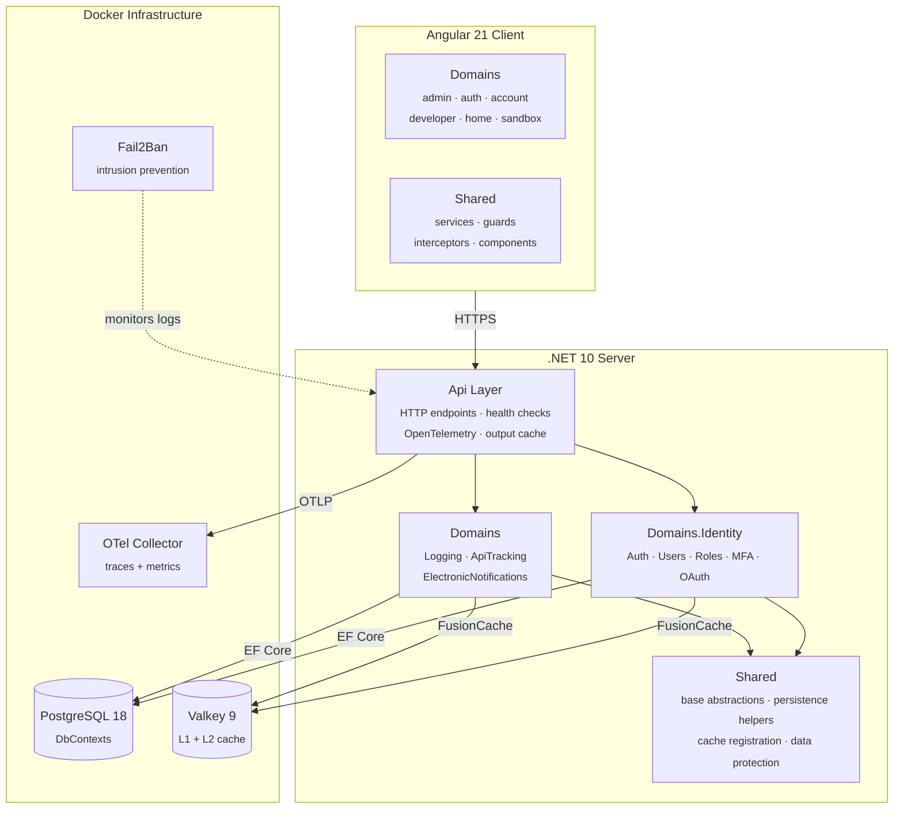
```mermaid
graph TB
    subgraph Client["Angular 21 Client"]
        direction LR
        AppDomains["Domains<br/><sub>admin · auth · account<br/>developer · home · sandbox</sub>"]
        AppShared["Shared<br/><sub>services · guards<br/>interceptors · components</sub>"]
    end

    subgraph Server[".NET 10 Server"]
        direction TB
        Api["Api Layer<br/><sub>HTTP endpoints · health checks<br/>OpenTelemetry · output cache</sub>"]
        DomainLayer["Domains<br/><sub>Logging · ApiTracking<br/>ElectronicNotifications</sub>"]
        Identity["Domains.Identity<br/><sub>Auth · Users · Roles · MFA · OAuth</sub>"]
        SharedServer["Shared<br/><sub>base abstractions · persistence helpers<br/>cache registration · data protection</sub>"]
    end

    subgraph Infra["Docker Infrastructure"]
        direction LR
        PG[("PostgreSQL 18<br/><sub>DbContexts</sub>")]
        VK[("Valkey 9<br/><sub>L1 + L2 cache</sub>")]
        OT["OTel Collector<br/><sub>traces + metrics</sub>"]
        F2B["Fail2Ban<br/><sub>intrusion prevention</sub>"]
    end

    Client -- "HTTPS" --> Api
    Api --> DomainLayer
    Api --> Identity
    DomainLayer --> SharedServer
    Identity --> SharedServer
    DomainLayer -- "EF Core" --> PG
    Identity -- "EF Core" --> PG
    DomainLayer -- "FusionCache" --> VK
    Identity -- "FusionCache" --> VK
    Api -- "OTLP" --> OT
    F2B -. "monitors logs" .-> Api
```

**Server** follows Clean Architecture with a strict `Shared <- Domains <- Api` dependency flow — never reversed. Wolverine dispatches commands and queries to static handlers with method-injected dependencies. Bounded contexts (Identity, Logging, ApiTracking, ElectronicNotifications) each own their database schema, migrations, and EF Core `DbContext`.

**Client** enforces domain isolation — each of the client domains (admin, auth, account, developer, home, sandbox) imports only `@shared/*` and itself, never another domain. Zoneless change detection with Signals eliminates `zone.js`. TanStack Query manages all server state with coordinated cache invalidation via `CacheCoordinationService`. The HTTP interceptor pipeline (auth, cache-bypass, date-parser, error, logging) handles cross-cutting concerns.

**Infrastructure** uses Docker Compose to orchestrate development services. All observability UIs are proxied through nginx with TLS termination. Fail2Ban monitors API logs in real-time with filter/jail combinations.

## Project Structure

```
SeventySix/
├── SeventySix.Server/            .NET 10 API (Clean Architecture, Wolverine CQRS)
│   ├── SeventySix.Api/           HTTP layer, health checks, OpenAPI + Scalar
│   ├── SeventySix.Domains/       Logging, ApiTracking, ElectronicNotifications
│   ├── SeventySix.Domains.Identity/  Auth, users, roles, MFA, OAuth
│   ├── SeventySix.Shared/        Base abstractions, caching, data protection
│   ├── SeventySix.Analyzers/     custom Roslyn analyzers
│   └── Tests/                    test projects (xUnit + NSubstitute + Shouldly)
├── SeventySix.Client/            Angular 21 SPA (Zoneless, Signals, TanStack Query)
│   ├── src/app/domains/          admin | auth | account | developer | home | sandbox
│   ├── src/app/shared/           Services, guards, interceptors, components, pipes
│   ├── e2e/                      Playwright E2E tests (auth roles, axe-core WCAG)
│   └── load-testing/             k6 load tests (scenarios, Docker-isolated)
├── docs/                         Project documentation
│   ├── Caching-Strategy.md       Three-tier caching architecture
│   ├── E2E-Speed-Optimization.md E2E performance tuning guide
│   ├── MCP-Server-Setup.md       MCP server configuration (free MCP servers)
│   ├── Prompt-Guide.md           How to use Copilot prompts effectively
│   ├── Settings.md               Complete settings reference
│   ├── Startup-Instructions.md   Step-by-step setup walkthrough
│   └── screenshots/              application screenshots for README
├── .github/
│   ├── prompts/                  Copilot prompt files
│   └── instructions/             instruction files (auto-applied by glob)
├── observability/                OpenTelemetry Collector, Prometheus, Grafana configs
├── fail2ban/                     Intrusion prevention filters and jails
├── scripts/                      PowerShell dev scripts (start, stop, secrets, certs)
├── docker-compose.yml            Development (services)
├── docker-compose.e2e.yml        E2E testing (isolated ports + MailDev)
├── docker-compose.loadtest.yml   Load testing
├── docker-compose.production.yml Production deployment
└── package.json                  Root orchestration scripts
```

## Getting Started

For a complete step-by-step walkthrough including account signups, VS Code configuration, and extension installation, see the [Startup Instructions](docs/Startup-Instructions.md).

### Prerequisites

- [.NET 10 SDK](https://dotnet.microsoft.com/download) (version 10.0.100+)
- [Node.js 22+](https://nodejs.org/) with npm
- [Docker Desktop](https://www.docker.com/products/docker-desktop/)

### Setup

1. **Clone the repository**

   ```bash
   git clone https://github.com/your-org/SeventySix.git
   cd SeventySix
   ```

2. **Install client dependencies**

   ```bash
   cd SeventySix.Client && npm install && cd ..
   ```

3. **Initialize user secrets** — stores database, JWT, OAuth, email, Altcha, and data protection secrets

   ```bash
   npm run secrets:init
   ```

4. **Generate SSL certificate** for local HTTPS

   ```bash
   npm run generate:ssl-cert
   ```

5. **Generate data protection certificate** for .NET Data Protection API

   ```bash
   npm run generate:dataprotection-cert
   ```

6. **Start everything** — Docker infrastructure, .NET API, and Angular dev server

   ```bash
   npm start
   ```

   A seeded administrator account is created on first startup in development:

   | Field | Value |
   |---|---|
   | Username | `admin` |
   | Email | `admin@seventysix.local` |
   | Password | Set via `AdminSeeder:InitialPassword` user secret |
   | First Login | Requires mandatory password change |

   > This account is created by `AdminSeederService` and is **not** created in production environments.

7. **Access the application**

   | Service | URL |
   |---|---|
   | Client (Angular) | `https://localhost:4200` |
   | API (.NET) | `https://localhost:7074` |
   | API Docs (Scalar) | `https://localhost:7074/scalar/v1` (dev only) |
   | Grafana | `https://localhost:3443` |
   | Jaeger | `https://localhost:16687` |
   | Prometheus | `https://localhost:9091` |
   | pgAdmin | `https://localhost:5051` |
   | RedisInsight | `https://localhost:5540` |

### Debugging the API in Your IDE

If you want to debug the .NET API with breakpoints and hot reload instead of running it in Docker:

1. **Start infrastructure only** — `npm run start:api-debug`
2. **Open the solution** — `SeventySix.Server/SeventySix.Server.slnx` in Visual Studio or VS Code (C# Dev Kit)
3. **Set startup project** — `SeventySix.Api`
4. **Select launch profile** — `https` (runs on `https://localhost:7074`)
5. **F5** — full native debugging with breakpoints, hot reload, and watch variables

The Docker infrastructure (PostgreSQL, Valkey, observability) is already running. The API connects to it on startup — same as `npm start`, but the API runs in your debugger instead of a container.

To also run the Angular client: `npm run start:client` in a separate terminal.

To stop: stop the debugger in your IDE, then `npm stop` to tear down Docker infrastructure.

## Configuration Overview

SeventySix uses a layered configuration system:

| Layer | File | Purpose |
|-------|------|---------|
| Base | `appsettings.json` | Default settings for all environments |
| Development | `appsettings.Development.json` | Dev-specific overrides |
| User Secrets | `secrets.json` (not committed) | Sensitive values (API keys, passwords) |
| Environment Variables | Docker Compose `.env` - Only for K6 | Container-level overrides |

> See [docs/Settings.md](docs/Settings.md) for a complete reference of all settings.

### Key Configuration Sections

| Section | Controls |
|---------|----------|
| Authentication | JWT, OAuth, MFA, password policy, lockout |
| Background Jobs | Log cleanup, token cleanup, DB maintenance, GDPR anonymization |
| Caching | FusionCache tiers, output cache policies |
| Email | Brevo SMTP, queue settings |
| Observability | OpenTelemetry, Serilog, tracing |
| Security | Rate limiting, CORS, HTTPS enforcement |

## Scripts Reference

A set of npm scripts handle the full development lifecycle from the repo root. All scripts provide status output, URLs, health checks, and troubleshooting context.

### Lifecycle Management

| Command | Description | Output Highlights |
|---|---|---|
| `npm start` | Start full development environment (Docker + API + Client) | Container health status, API readiness check, all service URLs |
| `npm stop` | Stop all running services | Graceful shutdown confirmation, cleanup summary |
| `npm run start:client` | Start Angular dev server only (assumes infrastructure running) | Dev server URL, compilation status, HMR enabled |
| `npm run start:api-debug` | Start Docker infrastructure only (for F5 debugging API in IDE) | Infrastructure health, database ready, cache connected |
| `npm run stop:api` | Stop API container only | Container stop confirmation, volumes preserved |

### Testing

| Command | Description | Output Highlights |
|---|---|---|
| `npm test` | Run server + client unit tests | Combined test summary, pass/fail counts, coverage metrics |
| `npm run test:server` | Run .NET test suite (`dotnet test`) | Per-project results, total tests, duration, architecture test validation |
| `npm run test:client` | Run Angular test suite (Vitest + architecture tests) | Test file count, domain isolation violations, performance |
| `npm run test:e2e` | Run Playwright E2E tests across auth roles with accessibility | Role-based test results, axe-core violations, screenshots on failure |
| `npm run loadtest:quick` | Run quick load test profile | RPS (requests/sec), p95/p99 latency, error rate, summary HTML report |
| `npm run loadtest:smoke` | Run smoke load test profile | Endpoint availability, baseline performance, early error detection |
| `npm run loadtest:load` | Run standard load test profile | Sustained load metrics, resource usage, bottleneck identification |
| `npm run loadtest:stress` | Run stress load test profile | Breaking point analysis, recovery behavior, max throughput |

### Code Quality

| Command | Description | Output Highlights |
|---|---|---|
| `npm run format` | Format all code (server: dotnet format + analyzers, client: ESLint + dprint) | Files changed, analyzer build status, lint rule violations fixed |
| `npm run format:server` | Format .NET code only (builds analyzers first) | Roslyn analyzer compilation, formatting changes applied |
| `npm run format:client` | Format Angular code only | ESLint + dprint pass, custom rule enforcement summary |

### Security & Secrets

| Command | Description | Output Highlights |
|---|---|---|
| `npm run secrets:init` | Initialize user secrets (one-time setup) | Secret IDs created, encryption status, configuration file locations |
| `npm run secrets:list` | List current user secrets | Masked secret keys, last modified timestamps, which domains use them |
| `npm run secrets:set` | Set a specific user secret | Interactive prompt, validation, confirmation |
| `npm run secrets:delete` | Delete a specific user secret | Confirmation prompt, cascade impact warnings |
| `npm run generate:ssl-cert` | Generate self-signed SSL certificate for local HTTPS | Certificate paths, expiration date, trust instructions |
| `npm run generate:dataprotection-cert` | Generate data protection certificate | Certificate thumbprint, storage location, rotation reminder |

### Docker & Cleanup

| Command | Description | Output Highlights |
|---|---|---|
| `npm run clean:docker` | Remove Docker containers | Containers stopped, networks removed, volumes preserved |
| `npm run clean:docker:full` | Remove Docker containers AND volumes (excludes PostgreSQL) | Volumes removed except postgres, confirmation required |

### Generation

| Command | Description | Output Highlights |
|---|---|---|
| `npm run generate:icons` | Generate all PWA icons from source image ([sharp](https://sharp.pixelplumbing.com/)) | 9 standard + 2 maskable icons + favicon.ico from `icon-source-file.png` |

### Sample Output — `npm start`

```
[14:32:05] Starting SeventySix development environment...

[Infrastructure]
- Docker Compose up (development services)
- PostgreSQL ready on port 5432
- Valkey ready on port 6379
- Jaeger UI: https://localhost:16687
- Grafana UI: https://localhost:3443
- Prometheus UI: https://localhost:9091

[API]
- .NET API starting...
- Health check passed: https://localhost:7074/health
- Scalar docs: https://localhost:7074/scalar/v1

[Client]
- Angular dev server: https://localhost:4200
- HMR enabled, watching for changes

All systems ready! Open https://localhost:4200
```

## Sub-Project READMEs

Each sub-project has its own README with deeper technical detail:

| Project | Description | README |
|---|---|---|
| **SeventySix.Server** | .NET 10 API — Clean Architecture, Wolverine CQRS, bounded contexts, custom Roslyn analyzers, architecture tests, background job scheduler, health checks | [Server README](SeventySix.Server/README.md) |
| **SeventySix.Client** | Angular 21 SPA — domain modules, Zoneless with Signals, TanStack Query, Material Design 3, HTTP interceptors, PWA, theme variants, client-side telemetry | [Client README](SeventySix.Client/README.md) |
| **E2E Tests** | Playwright — auth roles (public, authenticated, admin, developer), axe-core WCAG 2.2 AA, custom fixtures, `data-testid` selectors | [E2E README](SeventySix.Client/e2e/README.md) |
| **Load Tests** | k6 (Grafana) — scenarios, Docker-isolated environment, HTML summary reports, multiple run profiles (quick, smoke, load, stress) | [Load Testing README](SeventySix.Client/load-testing/README.md) |

## Application Showcase

Every page below works out of the box after `npm start`. Role-based navigation splits the interface into three sections: **Main** (all users), **Developer** (Developer and Admin roles), and **Management** (Admin only). Four Material Design 3 themes (light/dark × blue/cyan-orange) switch from the header.

### Authentication

The `auth` domain handles the full authentication lifecycle — from first visit through verified login.

The login page supports email/password authentication alongside GitHub OAuth. Altcha proof-of-work CAPTCHA protects all public forms — login, registration, forgot password — without third-party services or tracking cookies. After login, users with multi-factor authentication enabled verify via email verification code. Trusted device management skips MFA on recognized browsers. First-login forced password change ensures seeded or admin-created accounts update their credentials immediately.

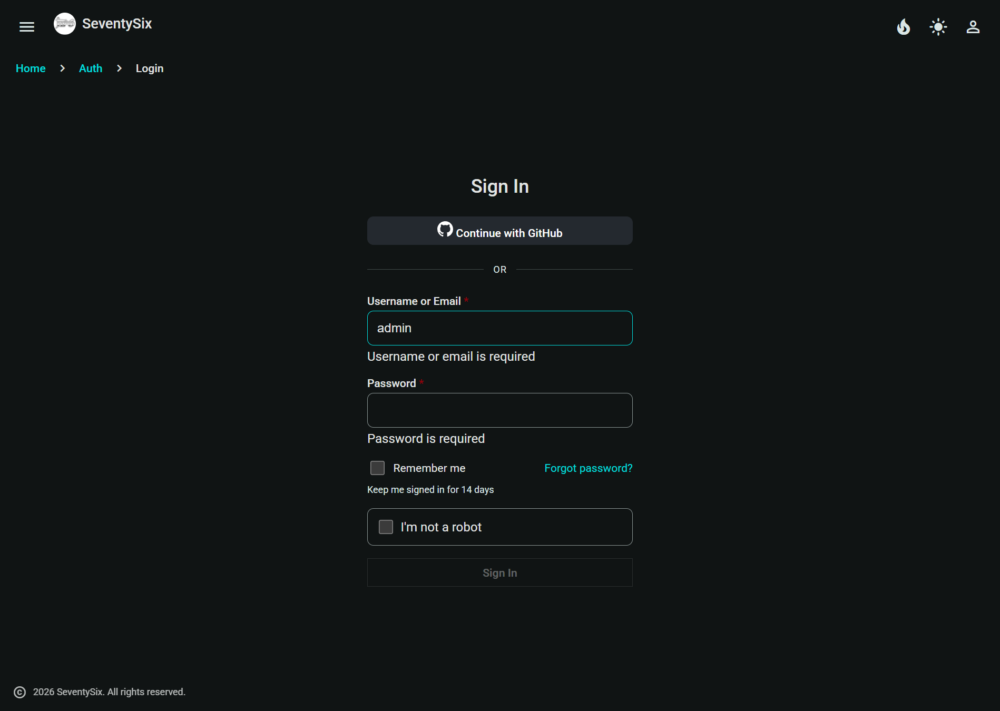

<!-- TODO: Capture additional auth flow screenshots when dev environment is running:
  - create-account.png — Registration form with Altcha
  - account-wizard.png — Account creation wizard completion
  - totp-setup.png — TOTP/MFA setup with QR code
  - mfa-verify.png — MFA email verification code entry
  - reset-password.png — Forgot/Reset password flow
-->

### Account

The `account` domain covers authenticated user self-service features — profile management and role escalation.

The user menu at the top right provides quick access to profile settings and logout.

The profile page allows users to update their email and display name.

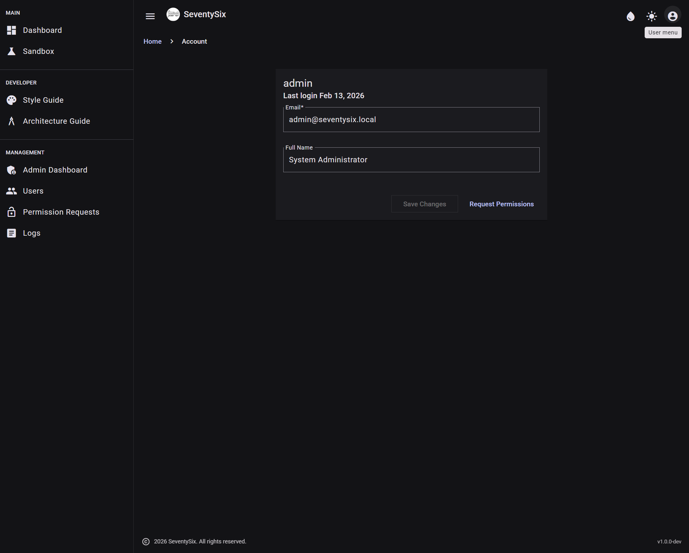

Users without the desired roles can request Developer or Admin access from their account page, providing an optional reason for review.

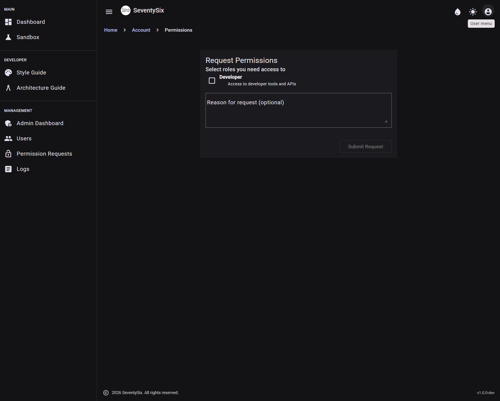

### Administration

The `admin` domain is the management control center — user lifecycle, log investigation, permission governance, and system dashboards.

#### Admin Dashboard

The admin dashboard is a four-tab control center. The first three tabs embed **pre-provisioned Grafana dashboards** via iframe — no manual Grafana setup required. Dashboards sync automatically to the application's active theme (light or dark).

| Tab | Source | Key Panels |
|---|---|---|
| **System Overview** | Grafana | API Health status, Total Requests, Error Rate, Response Time p95, Memory Usage, GC Collections, CPU Usage, Thread Pool Queue Length |
| **API Metrics** | Grafana | Top 10 Slowest Endpoints, HTTP Status Code Distribution, Error Rate by Endpoint, Per-Endpoint Response Time charts |
| **Cache Metrics** | Grafana | Connected Clients, Memory Usage, Uptime, L2 Cache Hit Rate, Network I/O, Operations/sec, Total Keys, Command Stats |
| **External Systems** | Angular | Third-Party API Statistics table (daily call counts, limits, lock status), Scheduled Jobs table (last run, status), Observability tool links, Data tool links |

The External Systems tab is built with Angular components rather than Grafana — it surfaces data from the `ApiTracking` domain (third-party API usage with daily limit **enforcement**) and background job execution statuses. In development mode, quick links to Jaeger, Prometheus, Grafana, pgAdmin, and RedisInsight appear here.

##### System Overview

The default tab shows real-time system health at a glance. Key panels include API Health status, Total Requests, Error Rate, Response Time p95, Memory Usage, GC Collections, CPU Usage, and Thread Pool Queue Length. All metrics auto-refresh and adapt to the active theme.

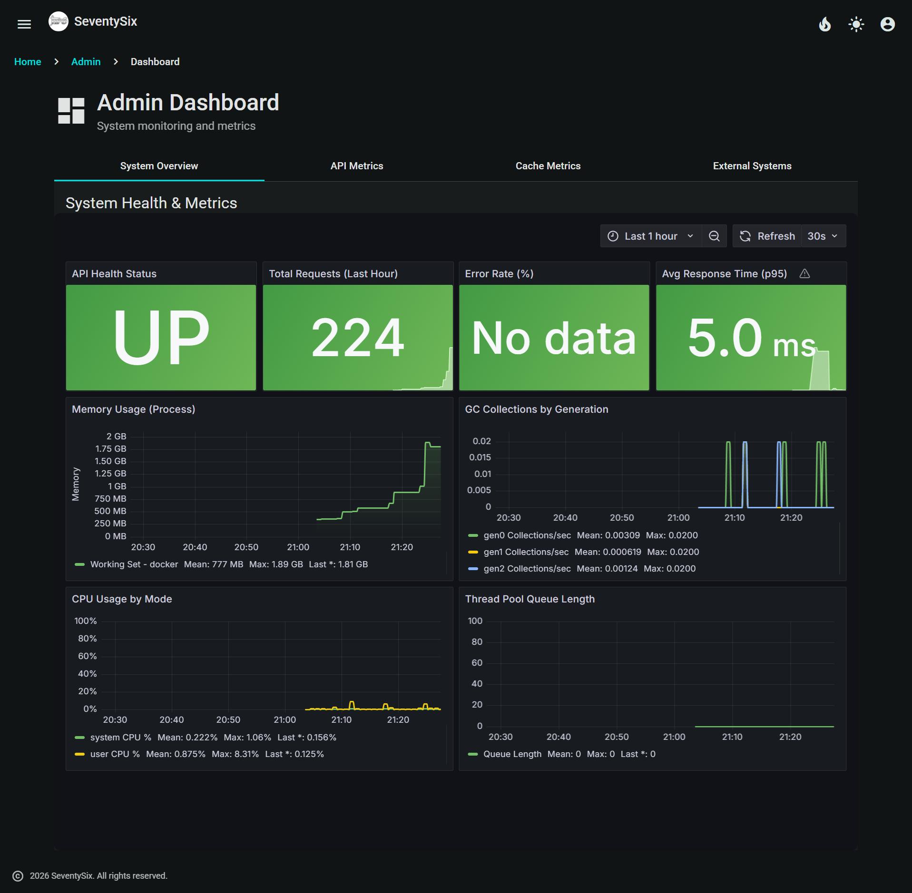

##### API Metrics

The API Metrics tab provides endpoint-level performance analysis. Panels show the Top 10 Slowest Endpoints, HTTP Status Code Distribution, Error Rate by Endpoint, and Per-Endpoint Response Time charts. Use this tab to identify slow routes and error hotspots.

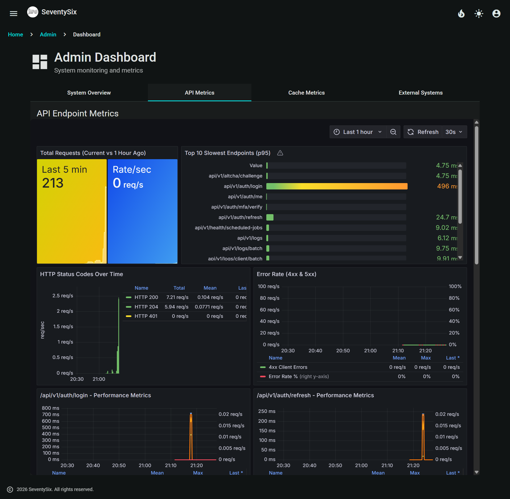

##### Cache Metrics

The Cache Metrics tab monitors the Valkey (Redis-compatible) cache layer. Panels include Connected Clients, Memory Usage, Uptime, L2 Cache Hit Rate, Network I/O, Operations/sec, Total Keys, and Command Stats. Critical for verifying FusionCache's L1/L2 behavior.

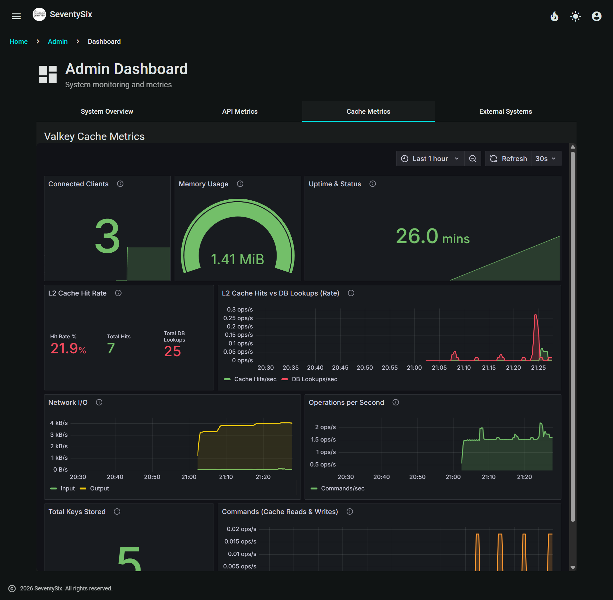

##### External Systems

The External Systems tab is built with Angular components rather than Grafana. It surfaces the `ApiTracking` domain's Third-Party API Statistics (daily call counts, limits, lock status), Scheduled Jobs status (last run, next run, health), and quick links to observability and data tools (Jaeger, Prometheus, Grafana, pgAdmin, RedisInsight) in development mode.

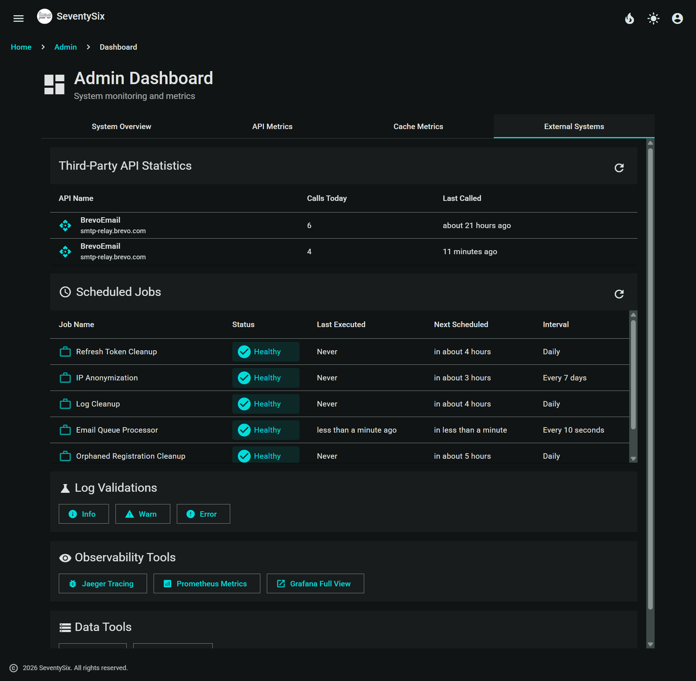

#### User Management

Administrators manage the full user lifecycle from a paginated data table with server-side filtering. Quick filter chips (All, Active, Inactive, Deleted) narrow the view instantly. Each row offers contextual actions — View, Edit, Reset Password, Restore (for soft-deleted accounts), and Deactivate. The detail page shows a full audit trail and supports role management. CSV export and bulk operations (activate, deactivate) round out the toolset.

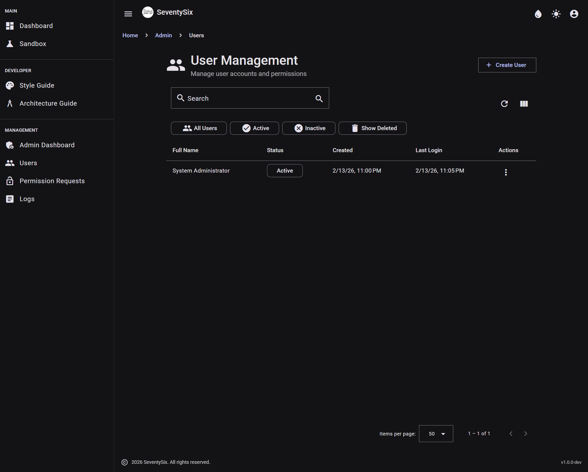

Clicking a user row opens the detail view with profile information, role assignment, and a complete audit trail.

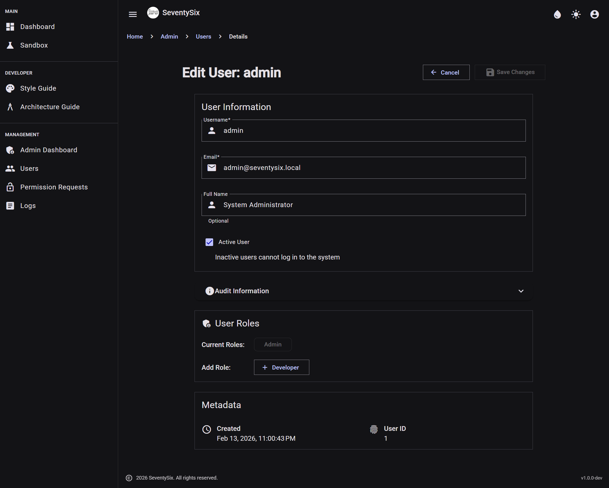

#### Permission Requests

Users self-serve role escalation by requesting permissions from their account page. Requests appear in the admin Permission Requests table with approve and reject actions per row. Bulk selection supports approving or rejecting multiple requests at once. Approval triggers cross-domain cache invalidation so the user's new role takes effect immediately without logout.

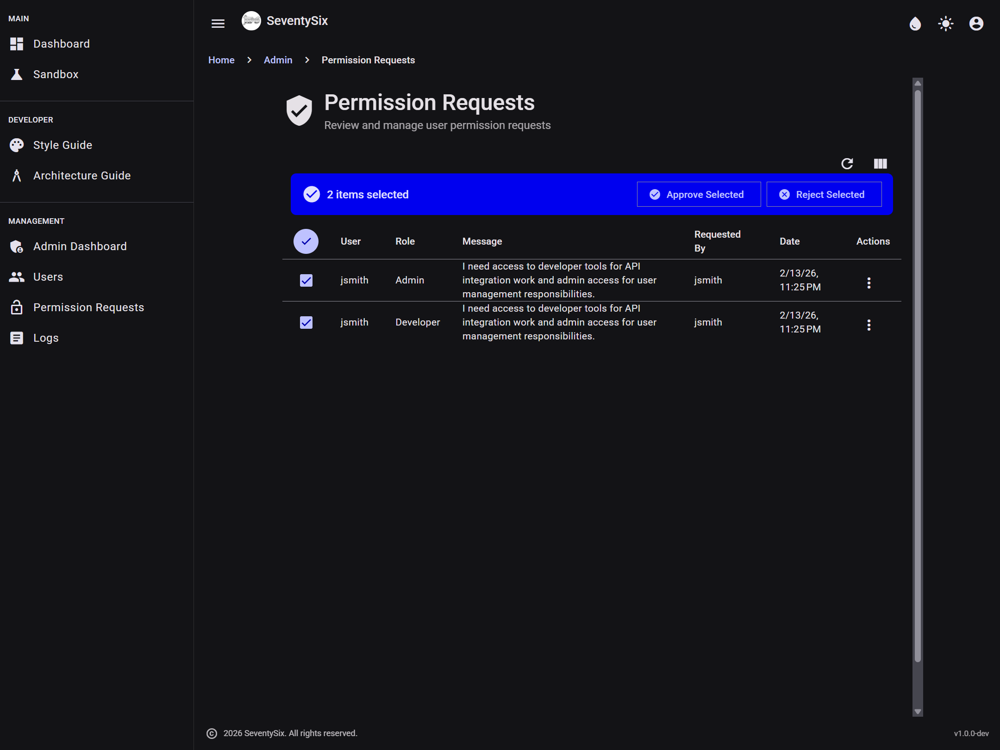

#### Log Management

Client-side errors and diagnostic events flow into a centralized log table with level-based badges (Debug, Info, Warning, Error, Critical) and date range filtering.

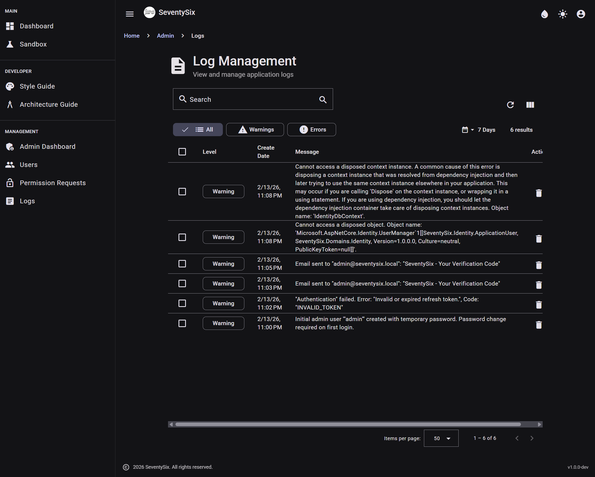

Clicking a row opens a detail dialog showing the full log payload — including the OpenTelemetry `CorrelationId`. An **"Open in Jaeger"** button constructs the trace URL directly from the correlation ID, giving administrators one-click access to the distributed trace for any logged event. Copy outputs a JSON object representing the full error for quick chat-based debugging, including the stack trace and any messages or details associated.

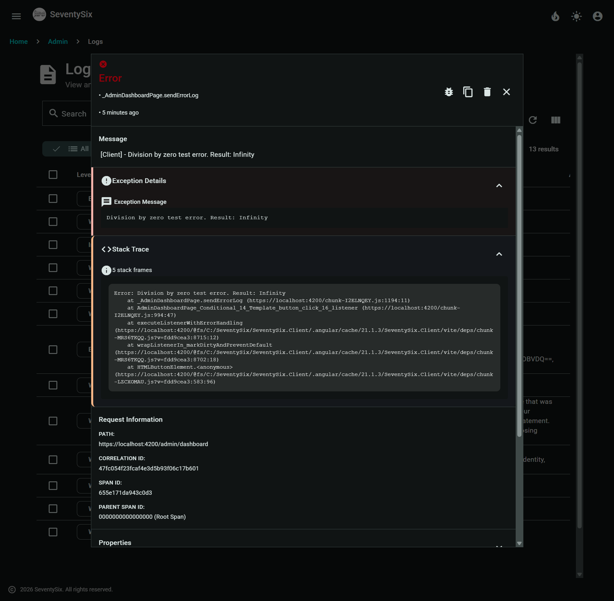

### Developer Tools

The `developer` domain has tooling for designers and engineers.

The **Style Guide** shows every Material Design 3 component organized into sections: Colors, Typography, Buttons, Forms, Tables, Feedback, Icons, and Loading States. Theme controls at the top preview multiple theme variants (light/dark × color variants).

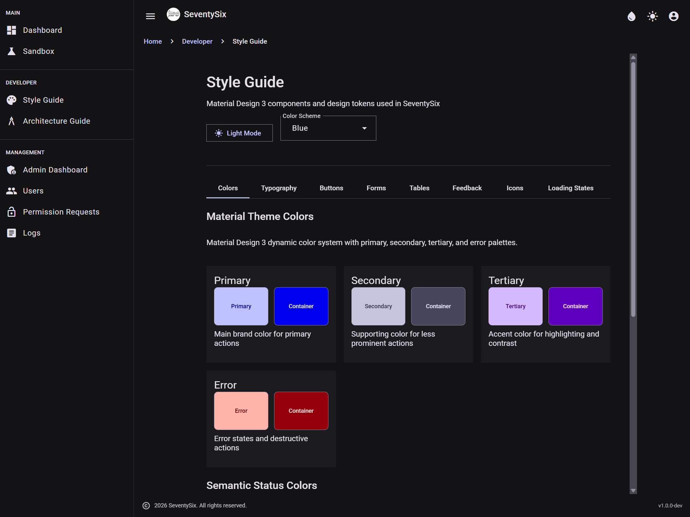

An **Architecture Guide** page provides project-specific architectural documentation. This section is a work in progress and will expand as the codebase evolves.

### Observability

**Links to Jaeger, Prometheus, and Grafana Readonly local hosted dashboards are offered in the Admin Dashboard/External Service tab as direct links**

Distributed tracing is built in. Every HTTP request generates an OpenTelemetry trace that flows through to Jaeger, and piped into Grafana and Prometheus. Log entries include the trace's correlation ID, and the "Open in Jaeger" button in Admin Logs jumps directly to the full trace waterfall.

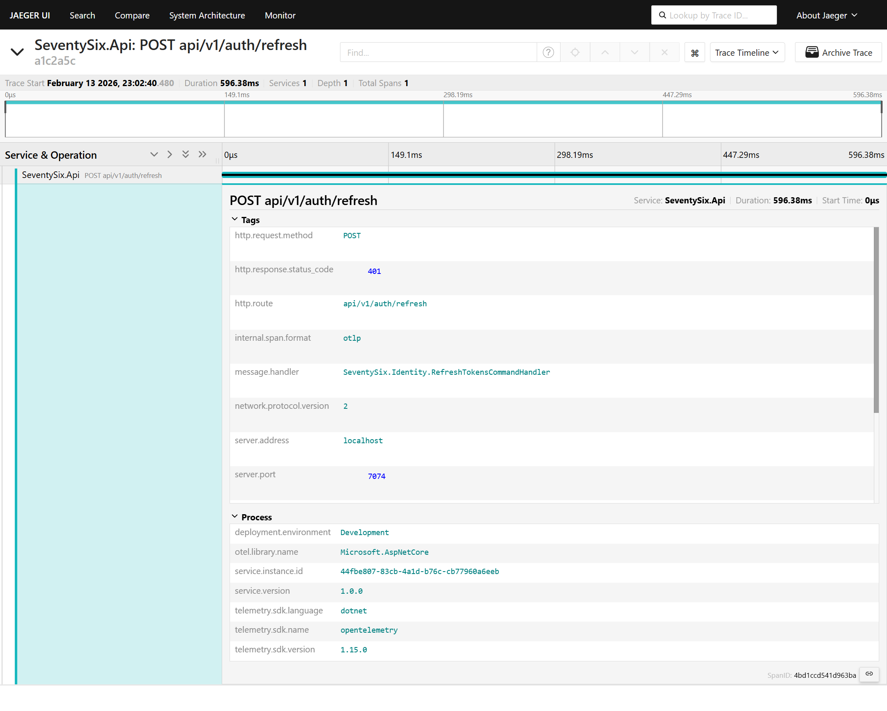

## Security

### Identity and Authentication

The server uses .NET Core 10 Identity with Argon2 password hashing for credential storage. Authentication flows through JWT bearer tokens with refresh token rotation — expired refresh tokens are automatically cleaned up by a recurring background job.

- **Multi-factor authentication**: TOTP authenticator app support with QR code setup, plus single-use backup codes for account recovery
- **GitHub OAuth**: Social login as an alternative to email/password registration
- **Role-based access control**: Three roles — User, Admin, Developer — enforced by both server-side authorization and client-side route guards with `canMatch`
- **Permission request workflow**: Users request elevated roles through the application; administrators approve or reject from the admin dashboard with optional bulk operations
- **Account lockout**: Automatic lockout after configurable failed login attempts
- **Soft delete and restore**: User accounts are soft-deleted with `IsDeleted` flags and EF Core global query filters. Administrators can restore soft-deleted accounts via `RestoreUserCommand`
- **Secure password flows**: Forgot password, set password, and change password — all with token-based email verification

### CAPTCHA

Altcha proof-of-work CAPTCHA protects registration, login, forgot password, and contact forms. Unlike reCAPTCHA or hCaptcha, Altcha requires no third-party services, no tracking cookies, and no external network calls. GDPR-compliant by design. The client uses a shared `altcha-widget` component.

### Intrusion Prevention (Fail2Ban)

Three Fail2Ban filter/jail combinations monitor the API in real-time:

| Jail | Filter | Trigger | Threshold | Ban Duration |
|---|---|---|---|---|
| `seventysix-auth` | Failed login / account lockout | `Login failed` or `AccountLocked` in logs | 5 failures in 10 min | 1 hour |
| `seventysix-ratelimit` | HTTP 429 responses | Rate limit exceeded | 10 in 1 min | 30 min |
| `seventysix-geoip` | Requests from blocked countries | GeoLite2 country match | 1 request | Permanent until manual unban |

GeoIP filtering uses MaxMind GeoLite2 databases, updated automatically by the `geoipupdate` Docker service.

### Rate Limiting

.NET rate limiting middleware with per-endpoint and global policies configured through `RateLimitingSettings` and `RateLimitPolicyNames`. Runs in-process — no third-party services.

### CSRF Protection

All authentication cookies use `SameSite=Strict` to prevent cross-site request forgery. OAuth flows include state parameter CSRF validation.

### Secure API Responses

All error responses follow ProblemDetails (RFC 9457). Exception messages are never exposed to clients — they are logged server-side and replaced with safe constants from `ProblemDetailConstants`. Authentication errors are mapped through explicit switch cases with generic defaults to prevent user enumeration.

### Data Protection

The .NET Data Protection API uses certificate-based key encryption. HTTPS is enforced in all environments (development, E2E, production) via self-signed or real certificates.

## Accessibility

- **WCAG 2.2 Level AA** target
- **axe-core scanning** in every Playwright E2E category — dedicated `accessibility.spec.ts` per auth role (public, authenticated, admin, developer)
- **Critical + serious violations** fail tests; moderate violations are flagged but don't block
- **Material Design 3** components with ARIA attributes
- **Instruction file** (`.github/instructions/accessibility.instructions.md`) enforces at code-generation time:
  - `aria-hidden="true"` on decorative `mat-icon` elements
  - `aria-label` on icon-only buttons
  - `aria-expanded` + `aria-controls` on toggle buttons
  - Skip links, landmark regions, and keyboard navigation patterns

## Observability

### Pipeline

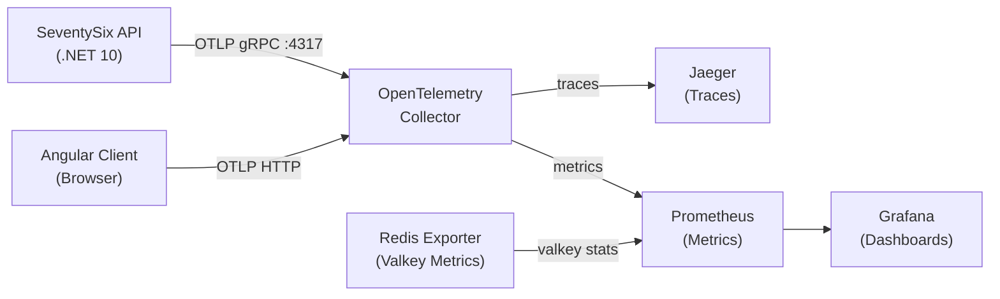
```mermaid
graph LR
    API["SeventySix API<br/>(.NET 10)"]
    Browser["Angular Client<br/>(Browser)"]
    OTEL["OpenTelemetry<br/>Collector"]
    Jaeger["Jaeger<br/>(Traces)"]
    Prom["Prometheus<br/>(Metrics)"]
    Grafana["Grafana<br/>(Dashboards)"]
    RedisExp["Redis Exporter<br/>(Valkey Metrics)"]

    API -->|OTLP gRPC :4317| OTEL
    Browser -->|OTLP HTTP| OTEL
    OTEL -->|traces| Jaeger
    OTEL -->|metrics| Prom
    RedisExp -->|valkey stats| Prom
    Prom --> Grafana
```

- **Server traces**: .NET API sends traces via OTLP gRPC to the OpenTelemetry Collector, which routes them to Jaeger
- **Browser traces**: `TelemetryService` in the Angular client sends browser-side traces to the OTel Collector via OTLP HTTP — providing end-to-end distributed tracing from click to database
- **Web Vitals**: `WebVitalsService` monitors Core Web Vitals in the browser — LCP, INP, CLS, FCP, and TTFB — for real user performance measurement
- **Client error logging**: `ClientErrorLoggerService` captures JavaScript errors in the browser and sends them to the server's Logging domain for centralized error tracking
- **Metrics**: OTel Collector exposes metrics for Prometheus to scrape. Redis Exporter adds Valkey cache metrics
- **Dashboards**: Grafana reads from Prometheus with pre-provisioned data source configuration
- **HTTPS access**: All observability UIs are proxied through nginx with TLS termination

### Pre-Provisioned Grafana Dashboards

Three dashboards are auto-provisioned on first `npm start` — no manual Grafana configuration required:

| Dashboard | Datasource | Key Panels |
|---|---|---|
| **System Overview** | Prometheus | API Health, Total Requests, Error Rate, Avg Response Time p95, Memory Usage, GC Collections, CPU Usage, Thread Pool Queue Length |
| **API Endpoints** | Prometheus | Top 10 Slowest Endpoints, HTTP Status Code Distribution, Error Rate, 10 Per-Endpoint Performance panels |
| **Valkey Cache Monitoring** | Prometheus + Redis Exporter | Connected Clients, Memory Usage, Uptime, L2 Cache Hit Rate, Network I/O, Operations/sec, Total Keys, Commands Processed |

All three dashboards are also embedded in the admin dashboard's first three tabs (see [Application Showcase](#admin-dashboard)), automatically syncing to the application's active light or dark theme.

### Endpoints

| Tool | URL | Purpose |
|---|---|---|
| Grafana | `https://localhost:3443` | Metrics dashboards |
| Jaeger | `https://localhost:16687` | Distributed tracing |
| Prometheus | `https://localhost:9091` | Metrics queries |
| pgAdmin | `https://localhost:5051` | Database management |
| RedisInsight | `https://localhost:5540` | Cache visualization |

### Health Checks

The API exposes per-domain health checks — Identity, Logging, ApiTracking, and ElectronicNotifications — each independently configurable. Health check endpoints use Wolverine's built-in health check registration (`AddWolverineHealthCheck<>()`) to verify that each domain's message handlers are operational.

## Caching

Two-tier caching with FusionCache provides both low-latency in-memory access (L1) and distributed consistency across nodes (L2 via Valkey):

- **MemoryPack** serialization for high-performance binary cache entries
- **Backplane** pub/sub through Valkey for multi-node cache invalidation
- **Named caches**: Default, Identity (1 min TTL), Logging (5 min), ApiTracking (5 min)
- **Fail-safe** enabled with eager refresh at 80% TTL — stale data is served while fresh data loads in the background
- **Client-side coordination**: `CacheCoordinationService` in Angular invalidates TanStack Query caches after mutations using typed `QueryKeys`
- **Grafana visibility**: The pre-provisioned Valkey Cache Monitoring dashboard provides real-time insight into L2 cache hit rates, memory usage, connected clients, and operations per second — also embedded in the admin dashboard's Cache Metrics tab

Full documentation: [Caching Strategy](docs/Caching-Strategy.md)

## Background Jobs

`RecurringJobSchedulerService` manages scheduled background jobs across domains using Wolverine's message scheduling. Each job records its execution history in the `RecurringJobExecution` table, visible in the admin dashboard's External Systems tab.

| Job | Domain | Purpose | Schedule |
|---|---|---|---|
| `RefreshTokenCleanupJob` | Identity | Removes expired refresh tokens | Daily at preferred UTC time |
| `IpAnonymizationJob` | Identity | Nullifies `LastLoginIp` for inactive users (GDPR Article 4 compliance) | Every 7 days |
| `OrphanedRegistrationCleanupJob` | Identity | Deletes users who never completed email verification | Daily |
| `EmailQueueProcessJob` | ElectronicNotifications | Sends pending emails in batches, handles rate limiting and retries | Every 10 seconds |
| `LogCleanupJob` | Logging | Purges log entries and log files older than the configurable retention period | Daily |
| `DatabaseMaintenanceJob` | Logging | Runs PostgreSQL `VACUUM ANALYZE` to reclaim storage and update query planner statistics | Daily |

Jobs use two scheduling strategies: **preferred-time** jobs (Identity, Logging) fire at a configured UTC hour and repeat at their interval; the **high-frequency** email queue processor runs on a tight seconds-based interval. All jobs respect the global `BackgroundJobs:Enabled` toggle. The scheduler runs as a .NET hosted background service with bounded retry (3 attempts, exponential backoff) for resilient Docker startup.

## Email System

Queue-based email delivery in the `ElectronicNotifications` domain:

- **Email queue**: `EmailQueueEntry` entities with status tracking, idempotency keys, and retry logic
- **SMTP**: Brevo SMTP with configurable settings
- **CQRS**: Send, retry, and query email status
- **Settings**: Sender address, SMTP credentials, retry policies — `EmailSettings` with FluentValidation

The queue decouples sending from request processing. Failed emails retry automatically.

## Progressive Web App

The Angular client is a full Progressive Web App:

- **Service Worker** (`ngsw-worker.js`) managed by `@angular/service-worker` with configurable caching strategies
- **Prefetch** strategy for the app shell (index, manifest, CSS, JS bundles) — cached on install for instant subsequent loads
- **Lazy** strategy for chunk files and static assets — cached on first access
- **Automatic updates**: `SwUpdateService` checks for new versions, notifies users, and supports forced updates for critical releases
- **Installable**: `manifest.webmanifest` with app icons, theme colors, and standalone display mode

## Theming

The client supports four Material Design 3 theme variants:

| Theme | Description |
|---|---|
| Light Blue | Default light theme with blue primary palette |
| Dark Blue | Dark theme with blue primary palette |
| Light Cyan-Orange | Light theme with cyan-orange complementary palette |
| Dark Cyan-Orange | Dark theme with cyan-orange complementary palette |

`ThemeService` manages theme selection with localStorage persistence. Themes are implemented as CSS custom properties on the document root, enabling instant switching without page reload.

## Copilot Integration

A set of Copilot prompts, instruction files, and MCP servers — committed to the repo so every developer starts with the same AI setup.

### Prompts

Prompt files in `.github/prompts/` cover the full development lifecycle:

| Prompt | Purpose |
|---|---|
| `/create-plan` | Write an `Implementation.md` plan for new work |
| `/review-plan` | Validate `Implementation.md` against all project rules |
| `/execute-plan` | Execute all phases in `Implementation.md`, run tests |
| `/code-review` | Review staged changes against all project rules |
| `/fix-warnings` | Find and fix all build/lint warnings (never suppress) |
| `/new-feature` | Scaffold a full-stack feature (Angular + .NET) |
| `/new-server-domain` | Scaffold a new .NET bounded context |
| `/new-client-domain` | Scaffold a new Angular domain module |
| `/new-component` | Scaffold an Angular component with tests |
| `/new-angular-service` | Scaffold an Angular service with domain scoping |
| `/new-service` | Scaffold a .NET service with repository |
| `/new-e2e-test` | Scaffold a Playwright E2E test |
| `/new-load-test` | Scaffold a k6 load test scenario |
| `/new-domain-feature` | Scaffold a feature within an existing domain |
| `/update-documentation` | Study and align all READMEs and documentation |
| `/review-solution` | Deep review of entire codebase against all rules |

**Core workflow**: `/create-plan` → `/review-plan` → `/execute-plan` → `/code-review`

### Instruction Files

Glob-matched instruction files in `.github/instructions/` automatically apply rules when Copilot edits matching files. For example, `angular.instructions.md` activates for any file matching `**/SeventySix.Client/src/**/*.ts` and enforces Zoneless patterns, Signal usage, TanStack Query conventions, and domain isolation rules.

| Instruction File | Scope |
|---|---|
| `formatting.instructions.md` | `**/*.{ts,cs}` — naming, structure, operators |
| `angular.instructions.md` | `**/SeventySix.Client/src/**/*.ts` — Angular patterns |
| `csharp.instructions.md` | `**/SeventySix.Server/**/*.cs` — .NET patterns |
| `security.instructions.md` | `**/*.{ts,cs}` — ProblemDetails, auth errors |
| `accessibility.instructions.md` | `**/*.{ts,html,scss}` — WCAG, ARIA |
| `testing-server.instructions.md` | `**/Tests/**/*.cs` — xUnit patterns |
| `testing-client.instructions.md` | `**/*.spec.ts` — Vitest patterns |
| `e2e.instructions.md` | `**/e2e/**/*.ts` — Playwright patterns |
| `cross-platform.instructions.md` | `**/*.{ts,cs,ps1,sh,mjs}` — Windows/Linux |
| `new-domain.instructions.md` | Manual reference — domain blueprints |
| `load-testing.instructions.md` | `**/load-testing/**/*.js` — k6 patterns |

### MCP Servers

MCP servers, all free, zero billing risk:

| Server | Purpose | Cost |
|---|---|---|
| GitHub | PRs, issues, repo metadata | Free |
| PostgreSQL | Read-only database queries for debugging | Free (local) |
| Chrome DevTools | Live browser inspection, console, network | Free (local) |
| Context7 | Up-to-date library documentation | Free |
| Figma | Design-to-code from Figma files | Free (Starter plan) |

#### Figma MCP Workflow

Extract design specs and assets directly from Figma files:

1. **Extract component specs** — `mcp_figma_get_figma_data` retrieves layout, spacing, typography, and color tokens from any Figma node
2. **Download assets** — `mcp_figma_download_figma_images` exports icons, illustrations, and other assets at any scale
3. **Design-to-code** — Combine extracted specs with Angular Material tokens to generate components that match the design system

Example: Provide a Figma file URL → extract component dimensions and colors → generate an Angular component with matching Material Design 3 tokens.

#### Chrome DevTools MCP Workflow

Inspect, debug, and verify the running application in a real browser:

| Tool | Purpose |
|---|---|
| `navigate_page` / `take_screenshot` | Navigate to a page and capture visual state |
| `take_snapshot` | Inspect the DOM/accessibility tree structure |
| `list_console_messages` | Check for runtime errors or warnings |
| `list_network_requests` | Verify API call patterns, CORS headers, response codes |
| `evaluate_script` | Test signal values, component state, or run accessibility audits |
| `performance_start_trace` / `performance_stop_trace` | Capture and analyze performance traces |

Example: Navigate to deployed page → take snapshot → verify accessibility tree → check console for errors → capture performance trace.

Full setup guide: [MCP Server Setup](docs/MCP-Server-Setup.md)

### Post-Edit Hooks

Automatic formatting runs after every Copilot edit — ESLint for `.ts` files, `dotnet format` for `.cs` files. Developers never need to manually format AI-generated code.

Full prompt guide: [Copilot Prompt Guide](docs/Prompt-Guide.md)

## Docker Environments

Four Docker Compose configurations cover all environments:

| File | Purpose | Services | Key Ports |
|---|---|---|---|
| `docker-compose.yml` + `override` | Development | development services (full stack) | API: 7074, Client: 4200, DB: 5433 |
| `docker-compose.e2e.yml` | E2E testing | Isolated stack + MailDev | API: 7174, Client: 4201, DB: 5434 |
| `docker-compose.loadtest.yml` | Load testing | API + infrastructure | Isolated from dev |
| `docker-compose.production.yml` | Production | API + infrastructure | Resource limits, external secrets |

### Development Services

The development stack (`docker-compose.yml`) orchestrates development services:

| Service | Image | Purpose |
|---|---|---|
| `valkey` | `valkey/valkey:9.0-alpine` | Distributed cache and backplane |
| `postgres` | `postgres:18-alpine` | Primary database |
| `pgadmin` | pgAdmin | Database web UI |
| `redisinsight` | RedisInsight | Cache visualization GUI |
| `seventysix-api` | .NET 10 | Application API |
| `prometheus` | Prometheus | Metrics collection |
| `jaeger` | Jaeger All-in-One | Distributed tracing |
| `otel-collector` | OpenTelemetry Collector | Telemetry pipeline |
| `redis-exporter` | Redis Exporter | Valkey metrics for Prometheus |
| `grafana` | Grafana 11.4 | Metrics dashboards |
| `nginx-proxy` | nginx | HTTPS reverse proxy |
| `fail2ban` | Fail2Ban | Intrusion prevention |
| `geoipupdate` | MaxMind GeoIP Updater | Automatic GeoIP database refresh |

### Secret Management

Secrets flow through .NET user-secrets — never committed to the repository:

1. Developer runs `npm run secrets:init` (one-time)
2. `manage-user-secrets.ps1` stores secrets in the .NET user-secrets store
3. `npm start` calls `start-dev.ps1`, which exports secrets as environment variables
4. Docker Compose reads environment variables via `${VAR}` substitution
5. For F5 debugging (API outside Docker), secrets load directly via user-secrets

## Cost Model

Everything is free except transactional email:

| Service | Cost | Notes |
|---|---|---|
| All Docker infrastructure | Free | Containers run locally |
| Valkey | Free | BSD-3-Clause, Linux Foundation |
| PostgreSQL | Free | PostgreSQL License |
| Observability stack | Free | Jaeger, Prometheus, Grafana, OTel Collector |
| Fail2Ban + GeoIP | Free | GeoLite2 free tier (MaxMind account required) |
| MCP servers | Free | No credit card, no auto-upgrade, no metered API calls |
| VS Code + Copilot | Copilot subscription | Required for AI-assisted features |
| **SMTP (Brevo)** | **Free tier** | **300 emails/day** — sufficient for development and small production |

### Third Party Api Tracking Domain
The `ApiTracking` domain provides cost breakpoint visibility — this is used to monitor third-party API usage and set alerts ot completely block calls before hitting paid tiers. In the case of Brevo SMTP, the email queue system will stop sending emails as soon as 250 emails are sent in a 24 hour period, so the site should never accidentally go over limits.

In this case, we back off of checking emails for 30 minute chunks as a fail-fast option once the rate limit is hit, then when 24 hours at midnight local have passed this will process the queued emails, allowing heavier load handling without adding cost.

ThirdPartyApiTracking can be decorated on any domain Handler and specific configurations are defined to handle multiple time frames and amounts (Such as monthly), this is also an atomic operation so the count will never differ from the amount even under load using the TransactionManager class. In the client, Third Party Api Tracking statistics are available at all times with an overall count in the admin dashboard in the external services tab.

always be cautious, and ensure the third party api tracking is working as intended, I have tests setup but if for any reason this is not working as intended I want you to know early. Emails for example are sent via the Create User flow Verify Email and Time-Based One Time Passwords flows (TOTP) for Multi-Factor Authentication (MFA).

## Code Quality

### Server (.NET)

- **Custom Roslyn analyzers** in `SeventySix.Analyzers/` enforce project rules at compile time
- **`TreatWarningsAsErrors = true`** in `Directory.Build.props` — no tolerance for warnings
- **`dotnet format`** with analyzer rules for consistent formatting
- **Architecture tests** enforce dependency rules, god method/class checks, parameter limits, TimeProvider/DateTimeOffset requirements, and more
- **OpenAPI generation** via `builder.Services.AddOpenApi()` + `app.MapScalarApiReference()` (development only)

### Client (Angular)

- **ESLint with custom rules** in `eslint-rules/` — closing-angle-same-line, arrow-body-newline, assignment-newline, call-argument-object-newline, closing-paren-same-line, operator-continuation-indent — plus `@stylistic` and `@typescript-eslint`
- **dprint** for fast code formatting
- **Architecture tests** in `scripts/architecture-tests.mjs` enforce domain isolation, import rules, god methods/classes, date-fns requirements, and more
- **OpenAPI client generation**: `npm run generate:openapi` generates a fully typed API client from the server's OpenAPI specification — no manual interface definitions
- **Selective route preloading**: `SelectivePreloadingStrategy` preloads routes marked with `data: { preload: true }` for optimized navigation performance
- **Shared components**: altcha-widget, breadcrumb, confirm-dialog, data-table, layout, notification-toast, page-header

### Shared Enforcement

All rules — Roslyn analyzers, ESLint configs, architecture tests, instruction files — are committed to the repository. No per-developer setup needed.

## Testing

Multiple test suites provide automated checks across the full stack:

| Suite | Framework | Tests | Command | What It Covers |
|---|---|---|---|---|
| Server | xUnit + NSubstitute + Shouldly | 1,400+ | `npm run test:server` | Server projects: API, Domains, Identity, Shared, Architecture, Analyzers |
| Client | Vitest | 1,200+ | `npm run test:client` | Unit/integration tests across 100+ spec files + architecture enforcement |
| E2E | Playwright | 270+ | `npm run test:e2e` | Specs across auth roles (public, authenticated, admin, developer), WCAG 2.2 AA accessibility scanning per role |
| Load | k6 (Grafana) | scenarios | `npm run loadtest:quick` | Auth, users, permissions, logging, and health across multiple profiles (smoke, quick, stress, load) |

### E2E Coverage by Role

Playwright tests authenticate once per role via `global-setup.ts` and reuse saved auth state — no login step in individual tests. Every role category includes a dedicated `accessibility.spec.ts` that scans pages with axe-core for WCAG 2.2 AA compliance.

| Role | Specs | Tests | Key Coverage |
|---|---|---|---|
| Public | 10 | 100+ | Login, registration, forgot/set password, OAuth, error pages, accessibility |
| Authenticated | 11 | 70+ | Profile, password change, MFA/TOTP setup, backup codes, permissions, session, navigation |
| Admin | 8 | 80+ | Dashboard, user CRUD, log viewer, permission approvals, role enforcement |
| Developer | 4 | 20+ | Style guide, architecture guide, role enforcement, accessibility |

### Load Testing Profiles

Load tests run in a fully isolated Docker environment with dedicated ports. The orchestration scripts handle environment setup, test execution, result aggregation into HTML reports, and teardown.

| Profile | Virtual Users | Duration | p95 Target | Error Rate |
|---|---|---|---|---|
| smoke | 2 | 30s | < 2000ms | < 1% |
| quick | 20 | 60s | < 2000ms | < 5% |
| stress | 200 | 10min | < 3000ms | < 10% |
| load | 50 | 5min | < 1500ms | < 5% |

### Gate Condition

All four suites must pass before any work is considered complete:

| Suite | Command | Expected Output |
|---|---|---|
| Server | `npm run test:server` | `Test summary: total: X, failed: 0` |
| Client | `npm run test:client` | `X passed (X)` |
| E2E | `npm run test:e2e` | `[PASS] All E2E tests passed!` |
| Load (quick) | `npm run loadtest:quick` | All scenarios pass thresholds |

> **Note:** Load quick tests require the load-testing Docker environment (`docker compose -f docker-compose.loadtest.yml up -d`). Full load and stress profiles can take 10-30+ minutes — use `npm run loadtest:smoke` for a fast health-only sanity check.

## License

MIT License — Copyright (c) 2026 SeventySix

See [LICENSE.txt](LICENSE.txt) for the full license text.
