# SeventySix

[](https://github.com/actionjacksonthegoat-debug/SeventySix/actions/workflows/ci.yml)
[](https://github.com/actionjacksonthegoat-debug/SeventySix/actions/workflows/deploy.yml)
[](https://github.com/actionjacksonthegoat-debug/SeventySix/actions/workflows/codeql.yml)
[](https://codecov.io/gh/actionjacksonthegoat-debug/SeventySix)
[](LICENSE.txt)
[](https://dotnet.microsoft.com/en-us/download/dotnet/10.0)
[](https://angular.dev)
[](https://web.dev/progressive-web-apps/)
[](https://opentelemetry.io)
[](https://github.com/actionjacksonthegoat-debug/SeventySix/actions/workflows/dast.yml)
[](https://scorecard.dev/viewer/?uri=github.com/actionjacksonthegoat-debug/SeventySix)
<!-- OpenSSF Best Practices badge — application in progress; replace with the live badge URL once the project ID is assigned. See docs/Security-Policy.md. -->
[](docs/Security-Policy.md)
[](https://www.w3.org/TR/WCAG22/)

This site has been deployed to production - You can try it here at [SeventySix](https://seventysixsandbox.com/). Logged in users will be given access to the development and style-guide page.

Disclaimer: This document was validated on 3/10/26. I plan on revisiting this with each new .Net and Angular release so this should stay up to date. This is V1 and there are no more planned features, I plan on forking off of this myself with a private branch and seeing where I can go with it also.

Try it in Codespace first (Green 'Code' dropdown at the top of this page):

- Copilot's first months worth of requests are free on a trial, I prefer Sonnet and Opus. You can get a ton done in a month.
- Github's free account allows 120 hours of codespace and the Dev Container created in Codespace is 4 cores and 16gb ram matching production.

## Site Walkthrough

<video src="https://github.com/actionjacksonthegoat-debug/SeventySix/releases/download/media-assets/Site_Walkthrough_SeventySix.mp4](https://github.com/user-attachments/assets/dfac2b4a-33e6-4de1-a6f7-6da7cf0c5c78" controls width="100%"></video>

## Start Developing in 10 Minutes

Download the branch locally and install there with the following two commands or run in a CodeSpace (Code Dropdown at the top of this page) - Be online as the site admin and coding in 10 Minutes (Even from your phone).

### `npm run bootstrap` - Environment Initialization, Skippable feature prompts with solid defaults

Install it all or just the admin password, postgre password, and altcha password for the minimal version - build what you want to start with

<video src="https://github.com/user-attachments/assets/d1a98168-96bd-4f83-9e7f-b95f631820e9" controls width="100%"></video>

### `npm run start`, new VSCode terminal `npm run start:client` - Spin up the full Docker Container, run and login as admin with your set user password from the prompt above. Enjoy

When you know you want to move forward - I recommend installing all extensions and MCPs (Toast in the bottom right of VSCode),  accepting all github profile permissions in the bottom left of VSCode (Github user link, Microsoft Link), and clicking the Finish Setup (Copilot) and clicking Use AI Features in the bottom right corner in the VS Code footer ribbon.

<video src="https://github.com/user-attachments/assets/d1d9f7dd-3bab-4d70-9229-3777ace98d59" controls width="100%"></video>

## Overview

A multi-application ecosystem demonstrating enterprise-grade patterns across three independently deployable sites. The main application pairs a .NET 10 API with an Angular 21 SPA featuring developer tools and full site administration. Two satellite e-commerce storefronts — one built with SvelteKit 2 + Svelte 5 and the other with TanStack Start + React 19 — showcase modern full-stack alternatives with shared infrastructure for payments (Stripe), fulfillment (Printful), and transactional email (Brevo). Built entirely through AI-assisted development using GitHub Copilot and Claude, this codebase serves as both a functional application and a reference implementation for secure, observable, well-tested systems.

**Core Stack**: .NET 10 (Wolverine CQRS, EF Core, PostgreSQL) • Angular 21 (Zoneless, Signals, TanStack Query) • SvelteKit 2 (Svelte 5, Drizzle ORM, Stripe) • TanStack Start (React 19, Drizzle ORM, Stripe) • Docker Compose infrastructure • MIT licensed with no paid dependencies

## Quick Start

> **One command. Full environment.** Clone the repo, run the bootstrap, start developing.

### Windows

```cmd
git clone https://github.com/actionjacksonthegoat-debug/SeventySix.git
cd SeventySix
scripts\bootstrap.cmd
```

### Linux / macOS

```bash
git clone https://github.com/actionjacksonthegoat-debug/SeventySix.git
cd SeventySix
chmod +x scripts/bootstrap.sh
./scripts/bootstrap.sh
```

### What the bootstrap does

1. **Installs prerequisites** — PowerShell 7 and Node.js (via winget/apt) if not present, then verifies Git, .NET 10 SDK, Docker Desktop
2. **Collects your secrets** — admin email/password, database password, Brevo API key, GitHub OAuth keys, data protection cert password
3. **Installs all dependencies** — `npm install` (root + client + load-testing), `dotnet restore`, k6 (load testing), Playwright browsers (E2E testing), commerce shared module linking
4. **Generates certificates** — SSL dev cert (localhost) and ASP.NET Core Data Protection cert
5. **Builds and verifies** — .NET server build + Angular client build
6. **Runs all test suites** — server tests, client tests, E2E tests, load tests
7. **Offers to start** — `npm start` launches the full dev stack

> **`scripts\bootstrap.cmd` is the true entry point** — it works from a fresh Windows install with just `cmd.exe`.
> It installs PowerShell 7 and Node.js automatically, then hands off to `bootstrap.ps1`.
> Once bootstrap completes, use `npm run bootstrap` for subsequent runs (Node.js is available by then).

### Optional: Disable Email and OAuth Requirements

Most contributors won't need email or OAuth for local development. The bootstrap prompts clearly mark these as **[OPTIONAL]** — press Enter to skip them.

After bootstrap, disable MFA (which requires Brevo email) by adding to `SeventySix.Server/SeventySix.Api/appsettings.Development.json`:

```json
{
  "Mfa": { "Enabled": false, "RequiredForAllUsers": false },
  "Totp": { "Enabled": false }
}
```

Login then requires only email + password. OAuth is already inactive without provider secrets.

**Adding Brevo or OAuth later**: Run `npm run secrets:set` with the appropriate keys — see [Startup Instructions](docs/Startup-Instructions.md#adding-brevooauth-later) for details.

> ⚠️ **Production Security**: `Mfa.Enabled` is **highly recommended for all production deployments** — disabling it removes email-based second-factor protection for every user. `Totp.Enabled` adds authenticator-app support and is also recommended. OAuth is safe to leave off until provider secrets are configured. The server enforces this: `StartupValidator` will throw a startup exception if `Mfa.Enabled: false` is detected in the Production environment.

For the full step-by-step manual setup, see [Startup Instructions](docs/Startup-Instructions.md).

## Key Features

### Security

- **.NET Core Identity** with Argon2 password hashing and JWT bearer tokens
- **Altcha proof-of-work CAPTCHA** on all public forms (no third-party tracking)
- **Multi-factor authentication** via TOTP authenticator apps with backup codes
- **GitHub OAuth** provider integration with account linking (connect/disconnect from profile page)
- **Role-based access control** enforced server-side and client-side (User, Developer, Admin)
- **Mutual TLS (mTLS)** for all production inter-service communication (PostgreSQL, Valkey, OTEL Collector, Jaeger) with internal CA and annual cert rotation
- **Subresource Integrity (SRI)** on all Angular production bundles to prevent supply-chain tampering
- **DAST scanning** via OWASP ZAP baseline scan on every push to master and weekly schedule

### Observability

- **End-to-end OpenTelemetry traces** from browser through API to database (exported to Jaeger)
- **Prometheus metrics** with pre-provisioned Grafana dashboards for system, API, and cache monitoring
- **Structured logging** via Serilog with correlation IDs linking logs to distributed traces
- **Client-side telemetry** tracking Web Vitals and user interactions
- **All observability UIs** served via HTTPS through nginx reverse proxy

### Testing

- **Server tests**: xUnit with NSubstitute and Shouldly, architecture enforcement via custom Roslyn analyzers
- **Client tests**: Vitest unit tests with domain isolation validation and web-vitals benchmarks
- **E2E tests**: Playwright with role-based fixtures (public, authenticated, admin, developer) and axe-core WCAG 2.2 AA scanning
- **Load tests**: k6 with multiple profiles (quick, smoke, load, stress), Docker-isolated environment, HTML summary reports

### Development Workflow

- **AI-assisted tooling** with Copilot prompts, auto-applied instruction files, and MCP server integrations (GitHub, PostgreSQL, Chrome DevTools, context7)
- **Structured plan execution** via `/create-plan` → `/review-plan` → `/execute-plan` workflow
- **npm script orchestration** for lifecycle management: `npm start` (full stack), `npm stop` (teardown), `npm test` (all suites), `npm run format` (all code)
- **Hot reload** enabled for both .NET API and Angular client during development
- **IDE debugging** support with F5 configuration for API breakpoint debugging

## Architecture

### Server (.NET 10)

Clean Architecture with strict dependency flow: `Shared ← Domains ← Api`

- **Bounded contexts**: Identity, Logging, ApiTracking, ElectronicNotifications — each owns its schema, migrations, and `DbContext`
- **Message handling**: Wolverine CQRS with static handlers and method-injected dependencies
- **Patterns**: DDD + Hexagonal + Vertical Slices in a modular monolith (ready to extract domains as microservices)

### Client (Angular 21)

Domain-driven modules with enforced isolation via architecture tests

- **Domain modules**: admin, auth, account, developer, home, sandbox — each imports only `@shared/*` and itself, never cross-domain
- **Rendering**: Zoneless change detection with Signals (no `zone.js`)
- **State management**: TanStack Query for server state with coordinated cache invalidation

### Infrastructure

- **Databases**: PostgreSQL (primary) + Valkey (Redis-compatible distributed cache)
- **Observability**: Jaeger (traces), Prometheus (metrics), Grafana (dashboards), OpenTelemetry Collector (pipeline)
- **Security**: Cloudflare WAF, .NET rate limiting, nginx TLS termination
- **Management UIs**: pgAdmin (database), RedisInsight (cache), Scalar (API docs in dev mode)

### Quality Gates

- **Code formatting**: `npm run format` runs EditorConfig, ESLint (with custom rules), dprint, and `dotnet format` across all code
- **CI/CD**: GitHub Actions enforce zero build warnings, test passage (server, client, E2E, load), and lint compliance before merge
- **Architecture tests**: Automated enforcement of domain boundaries, method size, parameter counts, and variable length
- **Configuration parity**: Development mirrors production (1:1 except rate limits) — all secrets via user-secrets/environment variables

## Table of Contents

- [Technology Stack](#technology-stack)
- [Architecture Overview](#architecture-overview)
- [Project Structure](#project-structure)
- [Getting Started](#getting-started)
- [Configuration Overview](#configuration-overview)
- [Scripts Reference](#scripts-reference)
- [Sub-Project READMEs](#sub-project-readmes)
- [Application Showcase](#application-showcase)
  - [Authentication](#authentication)
  - [Account](#account)
  - [Administration](#administration)
  - [Developer Tools](#developer-tools)
  - [Observability](#observability-1)
- [Security](#security)
- [Accessibility](#accessibility)
- [Observability](#observability)
- [Caching](#caching)
- [Background Jobs](#background-jobs)
- [Email System](#email-system)
- [Progressive Web App](#progressive-web-app)
- [Theming](#theming)
- [Copilot Integration](#copilot-integration)
- [Docker Environments](#docker-environments)
- [Cost Model](#cost-model)
- [Code Quality](#code-quality)
- [CI/CD](#cicd)
- [Testing](#testing)
- [License](#license)

## Technology Stack

### Server

| Technology | Version | License | Purpose |
|---|---|---|---|
| .NET | 10 LTS | MIT | Runtime and SDK |
| ASP.NET Core | 10 | MIT | HTTP framework |
| [Wolverine](https://wolverine.netlify.app/) | latest | MIT | CQRS message bus with scheduled messaging |
| Entity Framework Core | 10 | MIT | ORM and migrations |
| PostgreSQL | 18 | PostgreSQL License | Primary database |
| [FusionCache](https://github.com/ZiggyCreatures/FusionCache) | latest | MIT | Two-tier caching (L1 memory + L2 distributed) |
| Valkey | 9.0 | BSD-3-Clause | Distributed cache and backplane (Redis-compatible, Linux Foundation) |
| [FluentValidation](https://docs.fluentvalidation.net/) | latest | Apache-2.0 | Request validation with startup-time `ValidateOnStart()` |
| Serilog | latest | Apache-2.0 | Structured logging to console and OpenTelemetry |
| .NET Core Identity | 10 | MIT | Authentication and authorization (Argon2 password hashing) |
| OpenAPI + Scalar | latest | MIT | Interactive API documentation (development only) |

### Client

| Technology | Version | License | Purpose |
|---|---|---|---|
| Angular | 21 LTS | MIT | SPA framework (Zoneless change detection, Signals) |
| [TanStack Query](https://tanstack.com/query/latest) | latest | MIT | Server state management with cache coordination |
| [Angular Material](https://material.angular.io/) | 21 | MIT | Material Design 3 component library |
| Angular Service Worker | 21 | MIT | PWA offline support, automatic updates |
| Vitest | latest | MIT | Unit and integration testing |
| [Playwright](https://playwright.dev/) | latest | Apache-2.0 | E2E browser automation |
| [k6](https://grafana.com/docs/k6/latest/) | latest | AGPL-3.0 | Load and performance testing (Grafana) |
| ESLint | latest | MIT | Linting with custom rules |
| dprint | latest | MIT | Code formatting |

### Infrastructure

| Technology | Version | License | Purpose |
|---|---|---|---|
| Docker Compose | latest | Apache-2.0 | Container orchestration (multiple environment configs) |
| nginx | latest | BSD-2-Clause | HTTPS reverse proxy for observability tools |
| Jaeger | latest | Apache-2.0 | Distributed tracing |
| Prometheus | latest | Apache-2.0 | Metrics collection |
| Grafana | 11.4 | AGPL-3.0 | Metrics dashboards |
| OpenTelemetry Collector | latest | Apache-2.0 | Telemetry pipeline (OTLP to Jaeger + Prometheus) |
| pgAdmin | latest | PostgreSQL License | PostgreSQL web UI |
| RedisInsight | latest | SSPL | Valkey/Redis GUI for cache visualization |

### E-Commerce Sites

Both e-commerce storefronts are independently deployable Node.js applications sharing a common feature set. A shared TypeScript library (`@seventysixcommerce/shared`) provides framework-agnostic utilities — Drizzle ORM schema, Stripe/Printful/Brevo integrations, cart logic, analytics, and webhook handling — consumed by both sites.

| Technology | SvelteKit Version | TanStack Version | License | Purpose |
|---|---|---|---|---|
| Node.js | 22+ | 22+ | MIT | Server runtime |
| TypeScript | 5.9+ | 6.0+ | Apache-2.0 | Type safety |
| Drizzle ORM | 0.45+ | 0.45+ | Apache-2.0 | Type-safe ORM |
| PostgreSQL | 18 | 18 | PostgreSQL | Database |
| Stripe | 21+ | 21+ | MIT | Payment processing (SAQ-A) |
| Printful | API | API | — | Print-on-demand fulfillment |
| Brevo | API | API | — | Transactional email |
| Tailwind CSS | 4.2+ | 4.2+ | MIT | Utility-first CSS |
| Playwright | 1.58+ | 1.58+ | Apache-2.0 | E2E testing |
| Vitest | 4.1+ | 4.1+ | MIT | Unit and architecture testing |
| SvelteKit | 2.50+ | — | MIT | Full-stack framework |
| Svelte | 5.54+ | — | MIT | UI library (runes) |
| TanStack Start | — | 1.167+ | MIT | Full-stack framework |
| React | — | 19.2+ | MIT | UI library |

#### E-Commerce Development Commands

All commerce commands run from the repo root via `npm run`. Both sites use isolated Docker environments for E2E and load testing — no port conflicts with the main app or each other.

| Command | Description |
|---|---|
| `npm run start:svelte` | Start SvelteKit commerce dev server |
| `npm run start:tanstack` | Start TanStack commerce dev server |
| `npm run test:shared` | Run shared library unit tests |
| `npm run test:svelte` | Run SvelteKit unit tests |
| `npm run test:tanstack` | Run TanStack unit tests |
| `npm run test:e2e:svelte` | Run SvelteKit Playwright E2E tests (Docker-isolated) |
| `npm run test:e2e:tanstack` | Run TanStack Playwright E2E tests (Docker-isolated) |
| `npm run loadtest:svelte:quick` | Run SvelteKit quick load test |
| `npm run loadtest:tanstack:quick` | Run TanStack quick load test |
| `npm run format:shared` | Format shared library code |
| `npm run format:svelte` | Format SvelteKit code |
| `npm run format:tanstack` | Format TanStack code |

## Architecture Overview

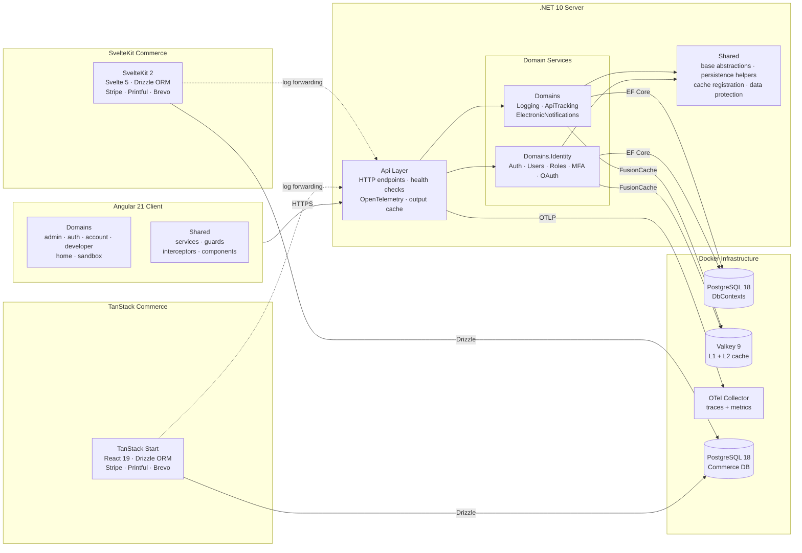
```mermaid
flowchart LR
    subgraph Client["Angular 21 Client"]
        direction TB
        AppDomains["Domains<br/>admin · auth · account · developer<br/>home · sandbox"]
        AppShared["Shared<br/>services · guards<br/>interceptors · components"]
    end

    subgraph Server[".NET 10 Server"]
        direction TB
        Api["Api Layer<br/>HTTP endpoints · health checks<br/>OpenTelemetry · output cache"]
        subgraph DomainGroup["Domain Services"]
            direction LR
            DomainLayer["Domains<br/>Logging · ApiTracking<br/>ElectronicNotifications"]
            Identity["Domains.Identity<br/>Auth · Users · Roles · MFA · OAuth"]
        end
        SharedServer["Shared<br/>base abstractions · persistence helpers<br/>cache registration · data protection"]
        Api --> DomainLayer
        Api --> Identity
        DomainLayer --> SharedServer
        Identity --> SharedServer
    end

    subgraph SvelteKit["SvelteKit Commerce"]
        direction TB
        SvelteApp["SvelteKit 2<br/>Svelte 5 · Drizzle ORM<br/>Stripe · Printful · Brevo"]
    end

    subgraph TanStack["TanStack Commerce"]
        direction TB
        TanStackApp["TanStack Start<br/>React 19 · Drizzle ORM<br/>Stripe · Printful · Brevo"]
    end

    subgraph Infra["Docker Infrastructure"]
        direction TB
        PG[("PostgreSQL 18<br/>DbContexts")]
        VK[("Valkey 9<br/>L1 + L2 cache")]
        OT["OTel Collector<br/>traces + metrics"]
        PGCommerce[("PostgreSQL 18<br/>Commerce DB")]
    end

    Client -->|HTTPS| Api
    DomainLayer -->|EF Core| PG
    Identity -->|EF Core| PG
    DomainLayer -->|FusionCache| VK
    Identity -->|FusionCache| VK
    Api -->|OTLP| OT
    SvelteApp -->|Drizzle| PGCommerce
    TanStackApp -->|Drizzle| PGCommerce
    SvelteApp -.->|log forwarding| Api
    TanStackApp -.->|log forwarding| Api
```

**Server** follows Clean Architecture with a strict `Shared <- Domains <- Api` dependency flow — never reversed. Wolverine dispatches commands and queries to static handlers with method-injected dependencies. Bounded contexts (Identity, Logging, ApiTracking, ElectronicNotifications) each own their database schema, migrations, and EF Core `DbContext`.

**Client** enforces domain isolation — each of the client domains (admin, auth, account, developer, home, sandbox) imports only `@shared/*` and itself, never another domain. Zoneless change detection with Signals eliminates `zone.js`. TanStack Query manages all server state with coordinated cache invalidation via `CacheCoordinationService`. The HTTP interceptor pipeline (auth, cache-bypass, date-parser, error, logging) handles cross-cutting concerns.

**E-Commerce Sites** — Two independently deployable e-commerce storefronts showcase modern full-stack alternatives. Both use Drizzle ORM with PostgreSQL, Stripe for payments, Printful for print-on-demand fulfillment, and Brevo for transactional email. They forward application logs to the SeventySix API for centralized observability. The SvelteKit site uses file-based routing with form actions; the TanStack Start site uses TanStack Router with server functions.

**Infrastructure** uses Docker Compose to orchestrate development services. All observability UIs are proxied through nginx with TLS termination.

## Project Structure

```
SeventySix/
├── SeventySix.Server/            .NET 10 API (Clean Architecture, Wolverine CQRS)
│   ├── SeventySix.Api/           HTTP layer, health checks, OpenAPI + Scalar
│   ├── SeventySix.Domains/       Logging, ApiTracking, ElectronicNotifications
│   ├── SeventySix.Domains.Identity/  Auth, users, roles, MFA, OAuth
│   ├── SeventySix.Shared/        Base abstractions, caching, data protection
│   ├── SeventySix.Analyzers/     custom Roslyn analyzers
│   └── Tests/                    test projects (xUnit + NSubstitute + Shouldly)
├── SeventySix.Client/            Angular 21 SPA (Zoneless, Signals, TanStack Query)
│   ├── src/app/domains/          admin | auth | account | developer | home | sandbox
│   ├── src/app/shared/           Services, guards, interceptors, components, pipes
│   ├── e2e/                      Playwright E2E tests (auth roles, axe-core WCAG)
│   └── load-testing/             k6 load tests (scenarios, Docker-isolated)
├── ECommerce/                    E-Commerce storefronts and shared library
│   ├── seventysixcommerce-shared/    Shared TypeScript library (@seventysixcommerce/shared)
│   │   └── src/                      Schema, integrations, cart, analytics, webhooks
│   ├── seventysixcommerce-sveltekit/ SvelteKit 2 E-Commerce (Svelte 5, Drizzle, Stripe)
│   │   ├── src/lib/                  Components, server DB, integrations
│   │   ├── src/routes/               File-based routing with form actions
│   │   └── e2e/                      Playwright E2E tests
│   └── seventysixcommerce-tanstack/  TanStack Start E-Commerce (React 19, Drizzle, Stripe)
│       ├── src/components/           Layout, SEO, UI components
│       ├── src/routes/               File-based TanStack Router
│       └── e2e/                      Playwright E2E tests
├── docs/                         Project documentation
│   ├── Caching-Strategy.md       Three-tier caching architecture
│   ├── E2E-Speed-Optimization.md E2E performance tuning guide
│   ├── MCP-Server-Setup.md       MCP server configuration (free MCP servers)
│   ├── Prompt-Guide.md           How to use Copilot prompts effectively
│   ├── Settings.md               Complete settings reference
│   ├── Startup-Instructions.md   Step-by-step setup walkthrough
│   └── screenshots/              application screenshots for README
├── .github/
│   ├── prompts/                  Copilot prompt files
│   └── instructions/             instruction files (auto-applied by glob)
├── observability/                OpenTelemetry Collector, Prometheus, Grafana configs
├── scripts/                      PowerShell dev scripts (start, stop, secrets, certs)
├── docker-compose.yml            Development (services)
├── docker-compose.e2e.yml        E2E testing (isolated ports + mock Brevo API)
├── docker-compose.loadtest.yml   Load testing
├── docker-compose.dast.yml       DAST security scanning (OWASP ZAP)
├── docker-compose.production.yml Production deployment
├── docker-compose.seventysixcommerce.yml  Commerce production (TanStack + SvelteKit)
├── docker-compose.loadtest-svelte.yml     SvelteKit commerce load testing
├── docker-compose.loadtest-tanstack.yml   TanStack commerce load testing
└── package.json                  Root orchestration scripts
```

## Getting Started

**Recommended**: Use the [Quick Start](#quick-start) bootstrap script above — it handles everything automatically.

For manual setup or if you prefer step-by-step control, see the [Startup Instructions](docs/Startup-Instructions.md).

### Access URLs (after `npm start`)

| Service | URL |
|---|---|
| Client (Angular) | `https://localhost:4200` |
| API (.NET) | `https://localhost:7074` |
| API Docs (Scalar) | `https://localhost:7074/scalar/v1` (dev only) |
| Grafana | `https://localhost:3443` |
| Jaeger | `https://localhost:16687` |
| Prometheus | `https://localhost:9091` |
| pgAdmin | `https://localhost:5051` |
| RedisInsight | `https://localhost:5540` |

### Debugging the API in Your IDE

If you want to debug the .NET API with breakpoints and hot reload instead of running it in Docker:

1. **Start infrastructure only** — `npm run start:api-debug`
2. **Open the solution** — `SeventySix.Server/SeventySix.Server.slnx` in Visual Studio or VS Code (C# Dev Kit)
3. **Set startup project** — `SeventySix.Api`
4. **Select launch profile** — `https` (runs on `https://localhost:7074`)
5. **F5** — full native debugging with breakpoints, hot reload, and watch variables

The Docker infrastructure (PostgreSQL, Valkey, observability) is already running. The API connects to it on startup — same as `npm start`, but the API runs in your debugger instead of a container.

To also run the Angular client: `npm run start:client` in a separate terminal.

To stop: stop the debugger in your IDE, then `npm stop` to tear down Docker infrastructure.

## Configuration Overview

SeventySix uses a layered configuration system:

| Layer | File | Purpose |
|-------|------|---------|
| Base | `appsettings.json` | Default settings for all environments |
| Development | `appsettings.Development.json` | Dev-specific overrides |
| User Secrets | `secrets.json` (not committed) | Sensitive values (API keys, passwords) |
| Environment Variables | Docker Compose `environment:` blocks | Container-level overrides (dev) or GitHub Secrets via CD pipeline (production) |

> See [docs/Settings.md](docs/Settings.md) for a complete reference of all settings.

### Key Configuration Sections

| Section | Controls |
|---------|----------|
| Authentication | JWT, OAuth, MFA, password policy, lockout |
| Background Jobs | Log cleanup, token cleanup, orphaned registration cleanup, email queue processing, DB maintenance |
| Caching | FusionCache tiers, output cache policies |
| Email | Brevo HTTP API, queue settings |
| Observability | OpenTelemetry, Serilog, tracing |
| Security | Rate limiting, CORS, HTTPS enforcement |

## Scripts Reference

A set of npm scripts handle the full development lifecycle from the repo root. All scripts provide status output, URLs, health checks, and troubleshooting context.

### Lifecycle Management

| Command | Description | Output Highlights |
|---|---|---|
| `npm run bootstrap` | Run initial project setup (prerequisites, secrets, certs, builds, tests) | Full setup wizard with interactive prompts |
| `npm start` | Start full development environment (Docker + API + Client) | Container health status, API readiness check, all service URLs |
| `npm stop` | Stop all running services | Graceful shutdown confirmation, cleanup summary |
| `npm run start:client` | Start Angular dev server only (assumes infrastructure running) | Dev server URL, compilation status, HMR enabled |
| `npm run start:api-debug` | Start Docker infrastructure only (for F5 debugging API in IDE) | Infrastructure health, database ready, cache connected |
| `npm run stop:api` | Stop API container only | Container stop confirmation, volumes preserved |

### Testing

| Command | Description | Output Highlights |
|---|---|---|
| `npm test` | Run server + client unit tests | Combined test summary, pass/fail counts, coverage metrics |
| `npm run test:server` | Run .NET test suite (`dotnet test`) | Per-project results, total tests, duration, architecture test validation |
| `npm run test:client` | Run Angular test suite (Vitest + architecture tests) | Test file count, domain isolation violations, performance |
| `npm run test:coverage` | Run server + client tests with coverage reports | Combined coverage metrics from both stacks |
| `npm run test:coverage:server` | Run .NET tests with Coverlet coverage | Per-project coverage, line/branch percentages |
| `npm run test:coverage:client` | Run Vitest with V8 coverage provider | Coverage report, lcov output |
| `npm run test:e2e` | Run Playwright E2E tests across auth roles with accessibility | Role-based test results, axe-core violations, screenshots on failure |
| `npm run test:e2e:keepalive` | Run E2E tests and keep Docker environment alive for debugging | Environment stays running for Playwright MCP inspection |
| `npm run loadtest:quick` | Run quick load test profile | RPS (requests/sec), p95/p99 latency, error rate, summary HTML report |
| `npm run loadtest:smoke` | Run smoke load test profile | Endpoint availability, baseline performance, early error detection |
| `npm run loadtest:load` | Run standard load test profile | Sustained load metrics, resource usage, bottleneck identification |
| `npm run loadtest:stress` | Run stress load test profile | Breaking point analysis, recovery behavior, max throughput |
| `npm run test:dast` | Run OWASP ZAP DAST scan in isolated Docker environment | SARIF findings, alert summary, pass/fail status |

### Code Quality

| Command | Description | Output Highlights |
|---|---|---|
| `npm run format` | Format all code (server: dotnet format + analyzers, client: ESLint + dprint) | Files changed, analyzer build status, lint rule violations fixed |
| `npm run format:server` | Format .NET code only (builds analyzers first) | Roslyn analyzer compilation, formatting changes applied |
| `npm run format:client` | Format Angular code only | ESLint + dprint pass, custom rule enforcement summary |

### Security & Secrets

| Command | Description | Output Highlights |
|---|---|---|
| `npm run secrets:init` | Initialize user secrets (one-time setup) | Secret IDs created, encryption status, configuration file locations |
| `npm run secrets:list` | List current user secrets | Masked secret keys, last modified timestamps, which domains use them |
| `npm run secrets:set` | Set a specific user secret | Interactive prompt, validation, confirmation |
| `npm run secrets:delete` | Delete a specific user secret | Confirmation prompt, cascade impact warnings |
| `npm run generate:ssl-cert` | Generate self-signed SSL certificate for local HTTPS | Certificate paths, expiration date, trust instructions |
| `npm run generate:dataprotection-cert` | Generate data protection certificate | Certificate thumbprint, storage location, rotation reminder |

### Docker & Cleanup

| Command | Description | Output Highlights |
|---|---|---|
| `npm run clean:docker` | Remove Docker containers | Containers stopped, networks removed, volumes preserved |
| `npm run clean:docker:full` | Remove Docker containers AND volumes (excludes PostgreSQL) | Volumes removed except postgres, confirmation required |
| `npm run db:reset` | **⚠️ USER ONLY** — Reset database to clean state (destroys all data) | Fresh migrations, seeded admin user restored |

### Security Scanning

| Command | Description | Output Highlights |
|---|---|---|
| `npm run scan:codeql:ci` | Run CodeQL analysis for both C# and TypeScript (Docker) | SARIF results in `.codeql/results/` |
| `npm run scan:codeql:ci:csharp` | Run CodeQL analysis for C# only (~15-20 min) | C# security findings |
| `npm run scan:codeql:ci:typescript` | Run CodeQL analysis for TypeScript only (~5 min) | JS/TS security findings |
| `npm run test:dast` | Run OWASP ZAP DAST baseline scan (Docker-isolated) | Alert categories, SARIF results, pass/fail by rule |

### Generation

| Command | Description | Output Highlights |
|---|---|---|
| `npm run generate:icons` | Generate all PWA icons from source image ([sharp](https://sharp.pixelplumbing.com/)) | 9 standard + 2 maskable icons + favicon.ico from `icon-source-file.png` |

### Performance

| Command | Description | Output Highlights |
|---|---|---|
| `npm run lighthouse` | Build production bundle and run Lighthouse audit (mobile, ≥70 Performance) | Performance, accessibility, best practices, SEO scores |

### Sample Output — `npm start`

```
[14:32:05] Starting SeventySix development environment...

[Infrastructure]
- Docker Compose up (development services)
- PostgreSQL ready on port 5432
- Valkey ready on port 6379
- Jaeger UI: https://localhost:16687
- Grafana UI: https://localhost:3443
- Prometheus UI: https://localhost:9091

[API]
- .NET API starting...
- Health check passed: https://localhost:7074/health
- Scalar docs: https://localhost:7074/scalar/v1

[Client]
- Angular dev server: https://localhost:4200
- HMR enabled, watching for changes

All systems ready! Open https://localhost:4200
```

## Sub-Project READMEs

Each sub-project has its own README with deeper technical detail:

| Project | Description | README |
|---|---|---|
| **SeventySix.Server** | .NET 10 API — Clean Architecture, Wolverine CQRS, bounded contexts, custom Roslyn analyzers, architecture tests, background job scheduler, health checks | [Server README](SeventySix.Server/README.md) |
| **SeventySix.Client** | Angular 21 SPA — domain modules, Zoneless with Signals, TanStack Query, Material Design 3, HTTP interceptors, PWA, theme variants, client-side telemetry | [Client README](SeventySix.Client/README.md) |
| **E2E Tests** | Playwright — auth roles (public, authenticated, admin, developer), axe-core WCAG 2.2 AA, custom fixtures, `data-testid` selectors | [E2E README](SeventySix.Client/e2e/README.md) |
| **Load Tests** | k6 (Grafana) — scenarios, Docker-isolated environment, HTML summary reports, multiple run profiles (quick, smoke, load, stress) | [Load Testing README](SeventySix.Client/load-testing/README.md) |
| **SeventySixCommerce (Shared)** | Shared TypeScript library — Drizzle ORM schema, Stripe/Printful/Brevo integrations, cart logic, analytics, webhook handling, date utilities | [Shared Library README](ECommerce/seventysixcommerce-shared/README.md) |
| **SeventySixCommerce (SvelteKit)** | SvelteKit 2 E-Commerce — Svelte 5 runes, Drizzle ORM, PostgreSQL, Stripe payments, Printful print-on-demand, Brevo transactional email, dark mode, architecture tests | [SvelteKit Commerce README](ECommerce/seventysixcommerce-sveltekit/README.md) |
| **SeventySixCommerce (TanStack)** | TanStack Start E-Commerce — React 19, TanStack Router, Drizzle ORM, PostgreSQL, Stripe, Printful, Brevo, dark mode, CSRF middleware, architecture tests | [TanStack Commerce README](ECommerce/seventysixcommerce-tanstack/README.md) |

## Application Showcase

Every page below works out of the box after `npm start`. Role-based navigation splits the interface into three sections: **Main** (all users), **Developer** (Developer and Admin roles), and **Management** (Admin only). Four Material Design 3 themes (light/dark × blue/cyan-orange) switch from the header.

### Authentication

The `auth` domain handles the full authentication lifecycle — from first visit through verified login.

The login page supports email/password authentication alongside GitHub OAuth. Altcha proof-of-work CAPTCHA protects all public forms — login, registration, forgot password — without third-party services or tracking cookies. After login, users with multi-factor authentication enabled verify via email verification code. Trusted device management skips MFA on recognized browsers. First-login forced password change ensures admin-created accounts update their credentials immediately. The seeded dev admin skips this for convenience — the user secret password is always valid.

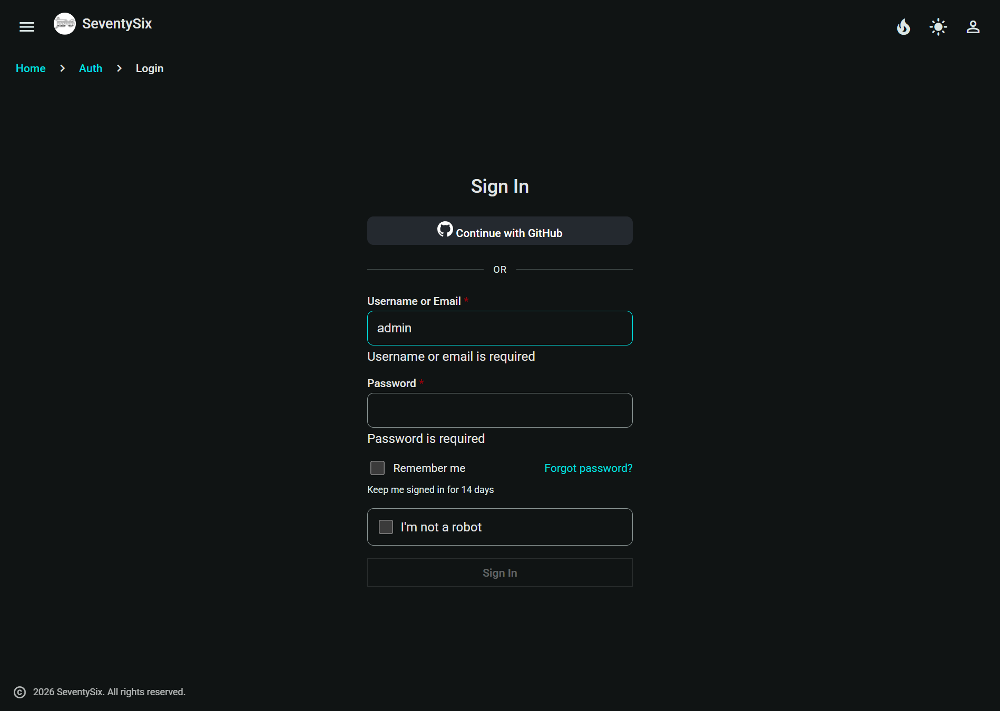

<!-- TODO: Capture additional auth flow screenshots when dev environment is running:
  - create-account.png — Registration form with Altcha
  - account-wizard.png — Account creation wizard completion
  - totp-setup.png — TOTP/MFA setup with QR code
  - mfa-verify.png — MFA email verification code entry
  - reset-password.png — Forgot/Reset password flow
-->

### Account

The `account` domain covers authenticated user self-service features — profile management and role escalation.

The user menu at the top right provides quick access to profile settings and logout.

The profile page allows users to update their email and display name. It also includes a **Linked Accounts** section for connecting and disconnecting external OAuth providers (GitHub).

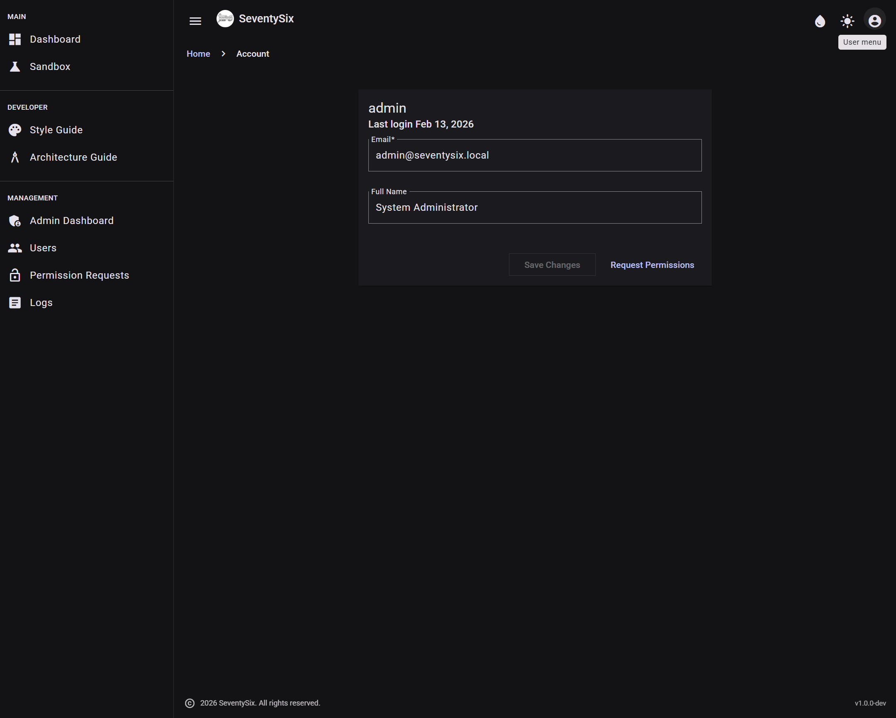

Users without the desired roles can request Developer or Admin access from their account page, providing an optional reason for review.

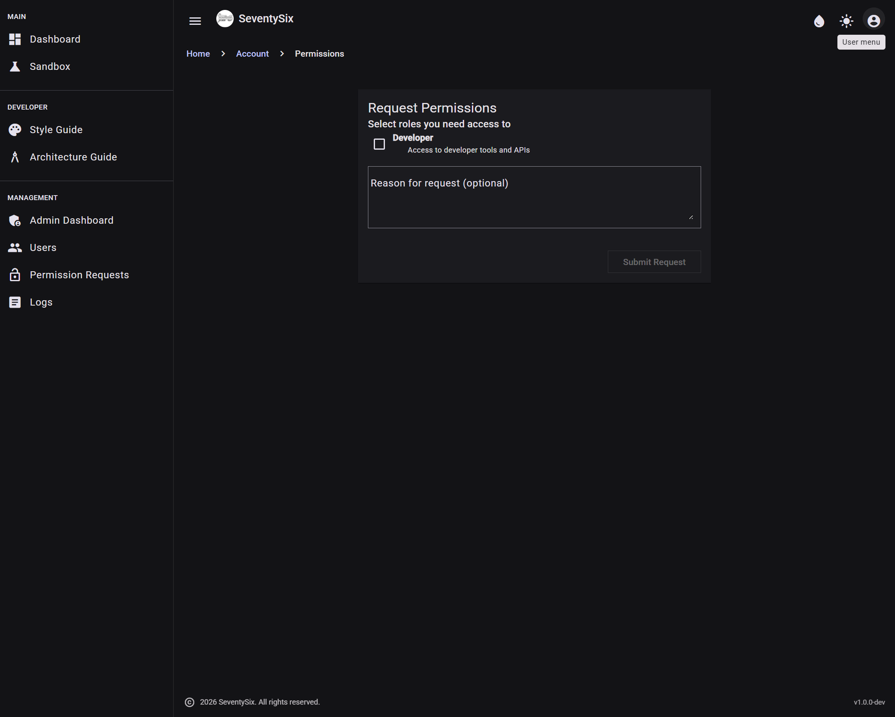

### Administration

The `admin` domain is the management control center — user lifecycle, log investigation, permission governance, and system dashboards.

#### Admin Dashboard

The admin dashboard is a four-tab control center. The first three tabs embed **pre-provisioned Grafana dashboards** via iframe — no manual Grafana setup required. Dashboards sync automatically to the application's active theme (light or dark).

| Tab | Source | Key Panels |
|---|---|---|
| **System Overview** | Grafana | API Health status, Total Requests, Error Rate, Response Time p95, Memory Usage, GC Collections, CPU Usage, Thread Pool Queue Length |
| **API Metrics** | Grafana | Top 10 Slowest Endpoints, HTTP Status Code Distribution, Error Rate by Endpoint, Per-Endpoint Response Time charts |
| **Cache Metrics** | Grafana | Connected Clients, Memory Usage, Uptime, L2 Cache Hit Rate, Network I/O, Operations/sec, Total Keys, Command Stats |
| **External Systems** | Angular | Third-Party API Statistics table (daily call counts, limits, lock status), Scheduled Jobs table (last run, status), Observability tool links, Data tool links |

The External Systems tab is built with Angular components rather than Grafana — it surfaces data from the `ApiTracking` domain (third-party API usage with daily limit **enforcement**) and background job execution statuses. In development mode, quick links to Jaeger, Prometheus, Grafana, pgAdmin, and RedisInsight appear here.

##### System Overview

The default tab shows real-time system health at a glance. Key panels include API Health status, Total Requests, Error Rate, Response Time p95, Memory Usage, GC Collections, CPU Usage, and Thread Pool Queue Length. All metrics auto-refresh and adapt to the active theme.

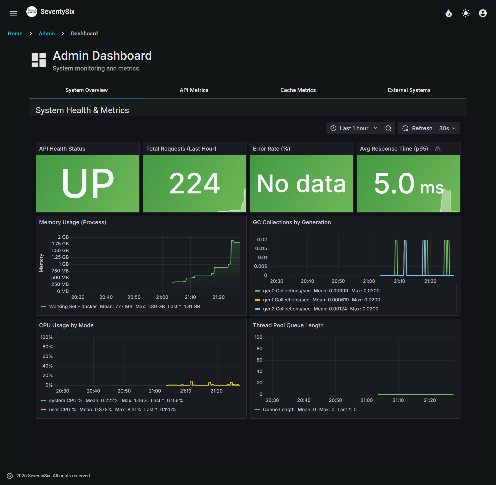

##### API Metrics

The API Metrics tab provides endpoint-level performance analysis. Panels show the Top 10 Slowest Endpoints, HTTP Status Code Distribution, Error Rate by Endpoint, and Per-Endpoint Response Time charts. Use this tab to identify slow routes and error hotspots.

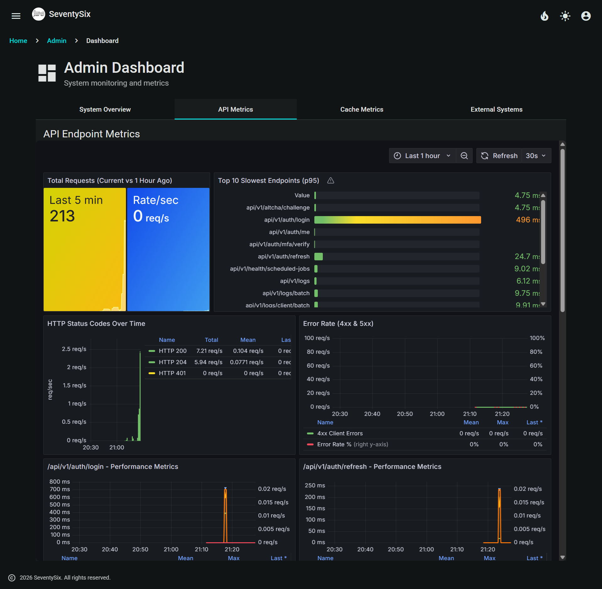

##### Cache Metrics

The Cache Metrics tab monitors the Valkey (Redis-compatible) cache layer. Panels include Connected Clients, Memory Usage, Uptime, L2 Cache Hit Rate, Network I/O, Operations/sec, Total Keys, and Command Stats. Critical for verifying FusionCache's L1/L2 behavior.

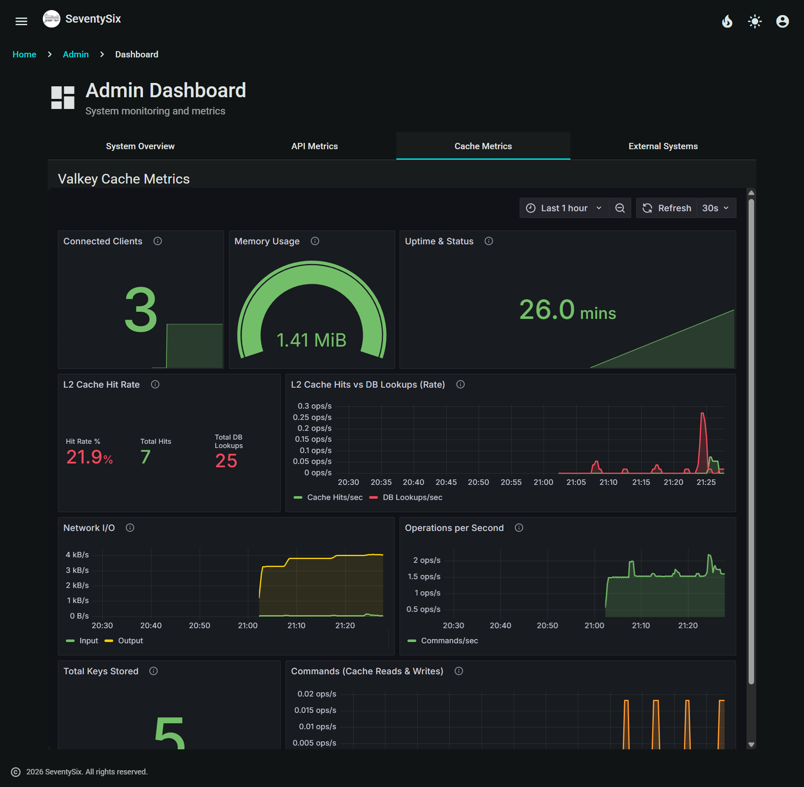

##### External Systems

The External Systems tab is built with Angular components rather than Grafana. It surfaces the `ApiTracking` domain's Third-Party API Statistics (daily call counts, limits, lock status), Scheduled Jobs status (last run, next run, health), and quick links to observability and data tools (Jaeger, Prometheus, Grafana, pgAdmin, RedisInsight) in development mode.

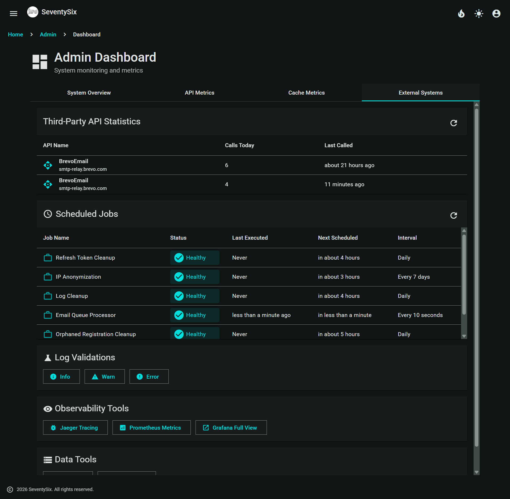

#### User Management

Administrators manage the full user lifecycle from a paginated data table with server-side filtering. Quick filter chips (All, Active, Inactive, Deleted) narrow the view instantly. Each row offers contextual actions — View, Edit, Reset Password, Restore (for soft-deleted accounts), and Deactivate. The detail page shows a full audit trail and supports role management. CSV export and bulk operations (activate, deactivate) round out the toolset.

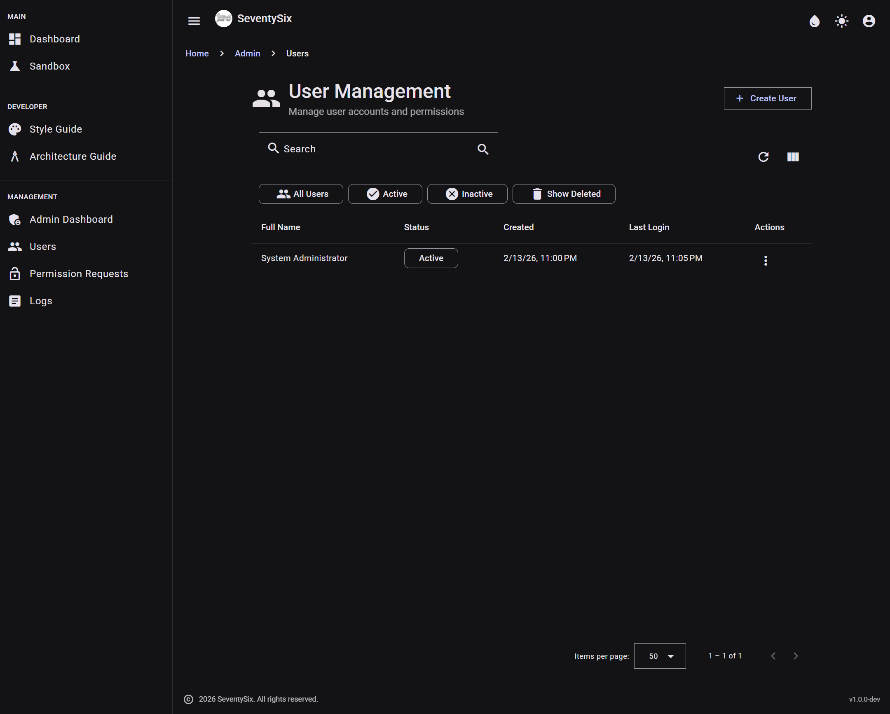

Clicking a user row opens the detail view with profile information, role assignment, and a complete audit trail.

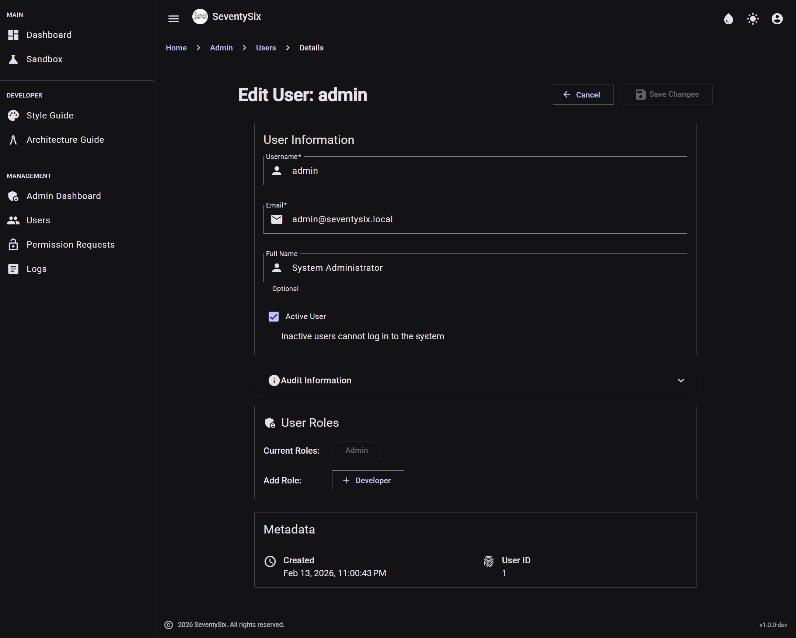

#### Permission Requests

Users self-serve role escalation by requesting permissions from their account page. Requests appear in the admin Permission Requests table with approve and reject actions per row. Bulk selection supports approving or rejecting multiple requests at once. Approval triggers cross-domain cache invalidation so the user's new role takes effect immediately without logout.

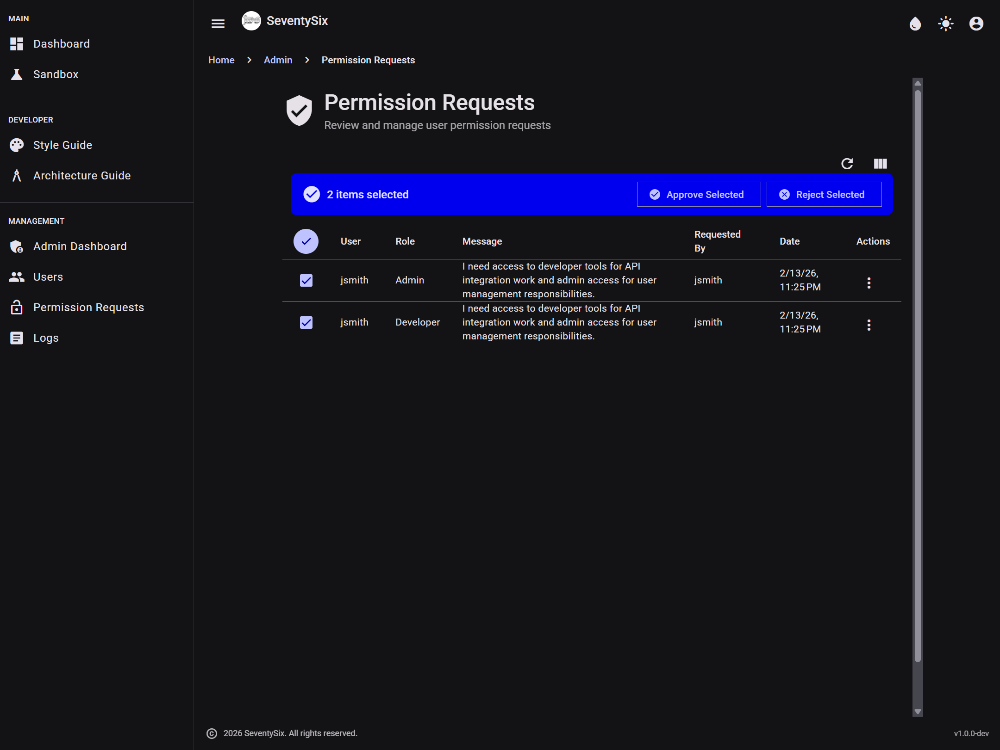

#### Log Management

Client-side errors and diagnostic events flow into a centralized log table with level-based badges (Debug, Info, Warning, Error, Critical) and date range filtering.

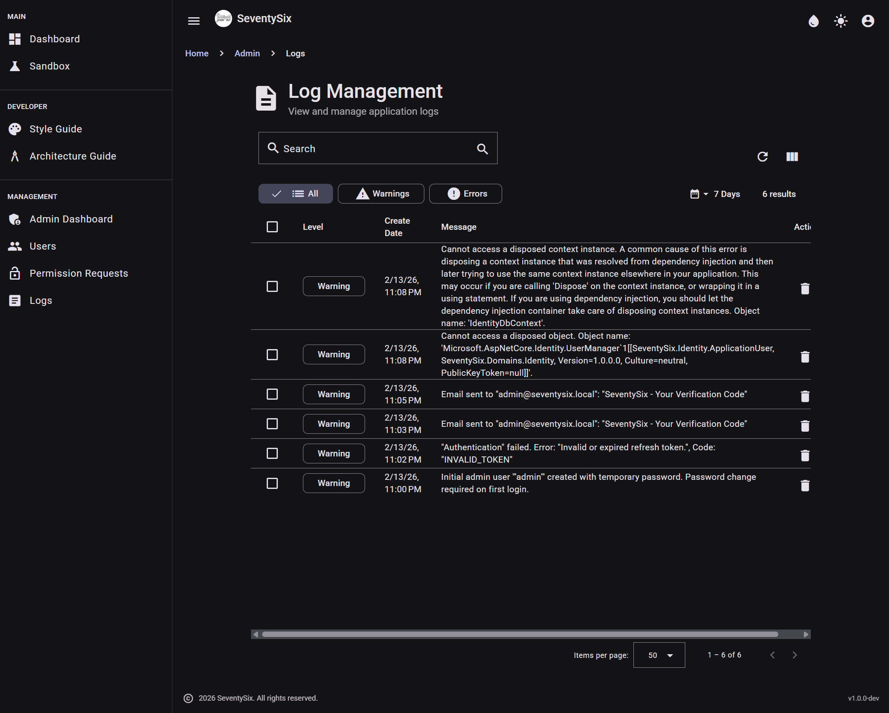

Clicking a row opens a detail dialog showing the full log payload — including the OpenTelemetry `CorrelationId`. An **"Open in Jaeger"** button constructs the trace URL directly from the correlation ID, giving administrators one-click access to the distributed trace for any logged event. Copy outputs a JSON object representing the full error for quick chat-based debugging, including the stack trace and any messages or details associated.

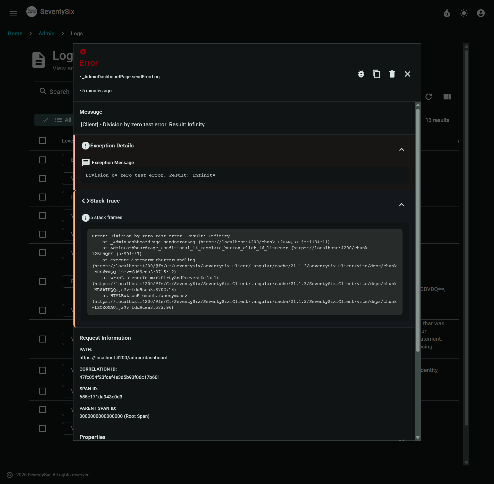

### Developer Tools

The `developer` domain has tooling for designers and engineers.

The **Style Guide** shows every Material Design 3 component organized into sections: Colors, Typography, Buttons, Forms, Tables, Feedback, Icons, and Loading States. Theme controls at the top preview multiple theme variants (light/dark × color variants).

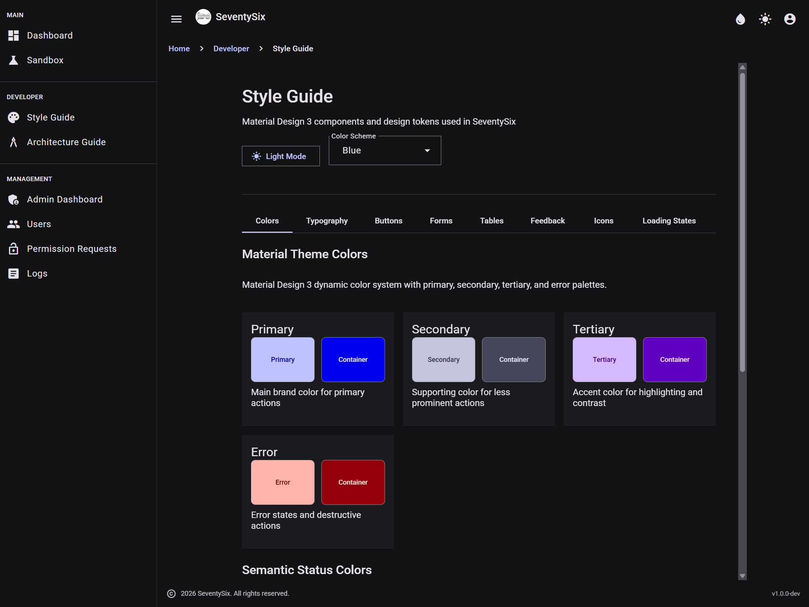

### Observability

**Links to Jaeger, Prometheus, and Grafana Readonly local hosted dashboards are offered in the Admin Dashboard/External Service tab as direct links**

Distributed tracing is built in. Every HTTP request generates an OpenTelemetry trace that flows through to Jaeger, and piped into Grafana and Prometheus. Log entries include the trace's correlation ID, and the "Open in Jaeger" button in Admin Logs jumps directly to the full trace waterfall.

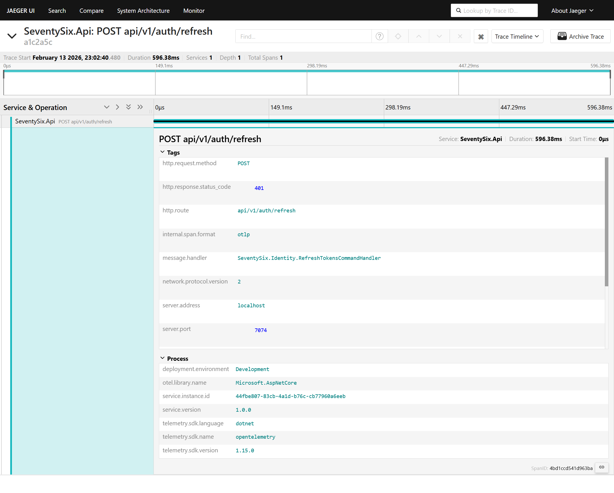

## Security

### Identity and Authentication

The server uses .NET Core 10 Identity with Argon2 password hashing for credential storage. Authentication flows through JWT bearer tokens with refresh token rotation — expired refresh tokens are automatically cleaned up by a recurring background job.

- **Multi-factor authentication**: TOTP authenticator app support with QR code setup, plus single-use backup codes for account recovery
- **GitHub OAuth**: Social login as an alternative to email/password registration
- **Role-based access control**: Three roles — User, Admin, Developer — enforced by both server-side authorization and client-side route guards with `canMatch`
- **Permission request workflow**: Users request elevated roles through the application; administrators approve or reject from the admin dashboard with optional bulk operations
- **Account lockout**: Automatic lockout after configurable failed login attempts
- **Soft delete and restore**: User accounts are soft-deleted with `IsDeleted` flags and EF Core global query filters. Administrators can restore soft-deleted accounts via `RestoreUserCommand`
- **Secure password flows**: Forgot password, set password, and change password — all with token-based email verification

### CAPTCHA

Altcha proof-of-work CAPTCHA protects registration, login, forgot password, and contact forms. Unlike reCAPTCHA or hCaptcha, Altcha requires no third-party services, no tracking cookies, and no external network calls. GDPR-compliant by design. The client uses a shared `altcha-widget` component.

### Rate Limiting

.NET rate limiting middleware with per-endpoint and global policies configured through `RateLimitingSettings` and `RateLimitPolicyNames`. Runs in-process — no third-party services.

### CSRF Protection

All authentication cookies use `SameSite=Strict` to prevent cross-site request forgery. OAuth flows include state parameter CSRF validation.

### Secure API Responses

All error responses follow ProblemDetails (RFC 9457). Exception messages are never exposed to clients — they are logged server-side and replaced with safe constants from `ProblemDetailConstants`. Authentication errors are mapped through explicit switch cases with generic defaults to prevent user enumeration.

### Data Protection

The .NET Data Protection API uses certificate-based key encryption. HTTPS is enforced in all environments (development, E2E, production) via self-signed or real certificates.

### Transport Security

Production inter-service communication uses mutual TLS (mTLS) with an internal Certificate Authority. PostgreSQL, Valkey, OpenTelemetry Collector, and Jaeger all require verified client certificates. Service certificates rotate annually; the CA root has a 10-year lifetime. See [docs/Certificate-Lifecycle.md](docs/Certificate-Lifecycle.md) for rotation procedures and architecture details.

### Supply Chain Integrity

Angular production builds include Subresource Integrity (SRI) hashes on all script and style tags. This ensures browsers reject tampered bundles even if a CDN or build artifact is compromised.

### Legal Pages

Legal pages `/privacy-policy`, `/terms-of-service`, `/license` are accessible without authentication, WCAG 2.2 AA compliant, and covered by E2E tests. All cookies used by the application (`X-Refresh-Token`, `__TD`, `XSRF-TOKEN`) are strictly necessary and exempt from GDPR consent requirements.

For security vulnerability reporting, see [SECURITY.md](SECURITY.md).

## Accessibility

- **WCAG 2.2 Level AA** target
- **axe-core scanning** in every Playwright E2E category — dedicated `accessibility.spec.ts` per auth role (public, authenticated, admin, developer)
- **Critical + serious violations** fail tests; moderate violations are flagged but don't block
- **Material Design 3** components with ARIA attributes
- **Instruction file** (`.github/instructions/accessibility.instructions.md`) enforces at code-generation time:
  - `aria-hidden="true"` on decorative `mat-icon` elements
  - `aria-label` on icon-only buttons
  - `aria-expanded` + `aria-controls` on toggle buttons
  - Skip links, landmark regions, and keyboard navigation patterns

## Observability

### Pipeline

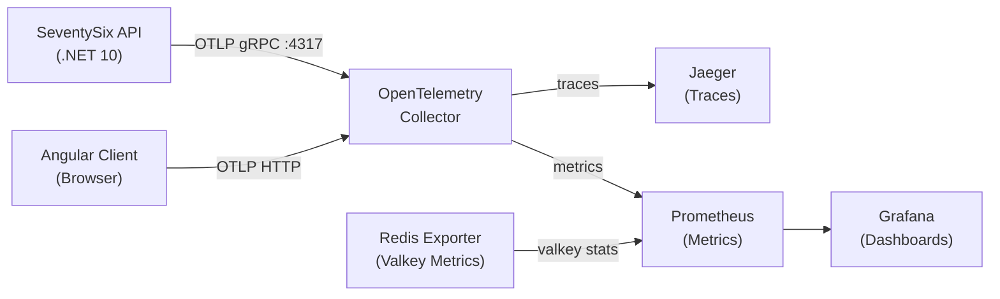
```mermaid
graph LR
    API["SeventySix API<br/>(.NET 10)"]
    Browser["Angular Client<br/>(Browser)"]
    OTEL["OpenTelemetry<br/>Collector"]
    Jaeger["Jaeger<br/>(Traces)"]
    Prom["Prometheus<br/>(Metrics)"]
    Grafana["Grafana<br/>(Dashboards)"]
    RedisExp["Redis Exporter<br/>(Valkey Metrics)"]

    API -->|OTLP gRPC :4317| OTEL
    Browser -->|OTLP HTTP| OTEL
    OTEL -->|traces| Jaeger
    OTEL -->|metrics| Prom
    RedisExp -->|valkey stats| Prom
    Prom --> Grafana
```

- **Server traces**: .NET API sends traces via OTLP gRPC to the OpenTelemetry Collector, which routes them to Jaeger
- **Browser traces**: `TelemetryService` in the Angular client sends browser-side traces to the OTel Collector via OTLP HTTP — providing end-to-end distributed tracing from click to database
- **Web Vitals**: `WebVitalsService` monitors Core Web Vitals in the browser — LCP, INP, CLS, FCP, and TTFB — for real user performance measurement
- **Client error logging**: `ClientErrorLoggerService` captures JavaScript errors in the browser and sends them to the server's Logging domain for centralized error tracking
- **Metrics**: OTel Collector exposes metrics for Prometheus to scrape. Redis Exporter adds Valkey cache metrics
- **Dashboards**: Grafana reads from Prometheus with pre-provisioned data source configuration
- **HTTPS access**: All observability UIs are proxied through nginx with TLS termination

### Pre-Provisioned Grafana Dashboards

Three dashboards are auto-provisioned on first `npm start` — no manual Grafana configuration required:

| Dashboard | Datasource | Key Panels |
|---|---|---|
| **System Overview** | Prometheus | API Health, Total Requests, Error Rate, Avg Response Time p95, Memory Usage, GC Collections, CPU Usage, Thread Pool Queue Length |
| **API Endpoints** | Prometheus | Top 10 Slowest Endpoints, HTTP Status Code Distribution, Error Rate by Endpoint, Per-Endpoint Response Time |
| **Valkey Cache Monitoring** | Prometheus + Redis Exporter | Connected Clients, Memory Usage, Uptime, L2 Cache Hit Rate, Network I/O, Operations/sec, Total Keys, Commands Processed |

All three dashboards are also embedded in the admin dashboard's first three tabs (see [Application Showcase](#admin-dashboard)), automatically syncing to the application's active light or dark theme.

### Endpoints

| Tool | URL | Purpose |
|---|---|---|
| Grafana | `https://localhost:3443` | Metrics dashboards |
| Jaeger | `https://localhost:16687` | Distributed tracing |
| Prometheus | `https://localhost:9091` | Metrics queries |
| pgAdmin | `https://localhost:5051` | Database management |
| RedisInsight | `https://localhost:5540` | Cache visualization |

### Health Checks

The API exposes per-domain health checks — Identity, Logging, ApiTracking, and ElectronicNotifications — each independently configurable. Health check endpoints use Wolverine's built-in health check registration (`AddWolverineHealthCheck<>()`) to verify that each domain's message handlers are operational.

## Caching

Two-tier caching with FusionCache provides both low-latency in-memory access (L1) and distributed consistency across nodes (L2 via Valkey):

- **MemoryPack** serialization for high-performance binary cache entries
- **Backplane** pub/sub through Valkey for multi-node cache invalidation
- **Named caches**: Default, Identity (1 min TTL), Logging (5 min), ApiTracking (5 min)
- **Fail-safe** enabled with eager refresh at 80% TTL — stale data is served while fresh data loads in the background
- **Client-side coordination**: `CacheCoordinationService` in Angular invalidates TanStack Query caches after mutations using typed `QueryKeys`
- **Grafana visibility**: The pre-provisioned Valkey Cache Monitoring dashboard provides real-time insight into L2 cache hit rates, memory usage, connected clients, and operations per second — also embedded in the admin dashboard's Cache Metrics tab

Full documentation: [Caching Strategy](docs/Caching-Strategy.md)

## Background Jobs

`RecurringJobSchedulerService` manages scheduled background jobs across domains using Wolverine's message scheduling. Each job records its execution history in the `RecurringJobExecution` table, visible in the admin dashboard's External Systems tab.

| Job | Domain | Purpose | Schedule |
|---|---|---|---|
| `RefreshTokenCleanupJob` | Identity | Removes expired refresh tokens | Daily at preferred UTC time |
| `OrphanedRegistrationCleanupJob` | Identity | Deletes users who never completed email verification | Daily |
| `EmailQueueProcessJob` | ElectronicNotifications | Sends pending emails in batches, handles rate limiting and retries | Every 10 seconds |
| `LogCleanupJob` | Logging | Purges log entries and log files older than the configurable retention period | Daily |
| `DatabaseMaintenanceJob` | Logging | Runs PostgreSQL `VACUUM ANALYZE` to reclaim storage and update query planner statistics | Daily |

Jobs use two scheduling strategies: **preferred-time** jobs (Identity, Logging) fire at a configured UTC hour and repeat at their interval; the **high-frequency** email queue processor runs on a tight seconds-based interval. All jobs respect the global `BackgroundJobs:Enabled` toggle. The scheduler runs as a .NET hosted background service with bounded retry (3 attempts, exponential backoff) for resilient Docker startup.

## Email System

Queue-based email delivery in the `ElectronicNotifications` domain:

- **Email queue**: `EmailQueueEntry` entities with status tracking, idempotency keys, and retry logic
- **Email API**: Brevo HTTP API with configurable settings
- **CQRS**: Send, retry, and query email status
- **Settings**: Sender address, API key, retry policies — `EmailSettings` with FluentValidation

The queue decouples sending from request processing. Failed emails retry automatically.

## Progressive Web App

The Angular client is a full Progressive Web App:

- **Service Worker** (`ngsw-worker.js`) managed by `@angular/service-worker` with configurable caching strategies
- **Prefetch** strategy for the app shell (index, manifest, CSS, JS bundles) — cached on install for instant subsequent loads
- **Lazy** strategy for chunk files and static assets — cached on first access
- **Automatic updates**: `SwUpdateService` checks for new versions, notifies users, and supports forced updates for critical releases
- **Installable**: `manifest.webmanifest` with app icons, theme colors, and standalone display mode

## Theming

The client supports four Material Design 3 theme variants:

| Theme | Description |
|---|---|
| Light Blue | Default light theme with blue primary palette |
| Dark Blue | Dark theme with blue primary palette |
| Light Cyan-Orange | Light theme with cyan-orange complementary palette |
| Dark Cyan-Orange | Dark theme with cyan-orange complementary palette |

`ThemeService` manages theme selection with localStorage persistence. Themes are implemented as CSS custom properties on the document root, enabling instant switching without page reload.

## Copilot Integration

A set of Copilot prompts, instruction files, and MCP servers — committed to the repo so every developer starts with the same AI setup.

### Prompts

Prompt files in `.github/prompts/` cover the full development lifecycle:

**Core workflow** — `/create-plan` → `/review-plan` → `/execute-plan` (calls `/security-review` before final tests)

| Prompt | Purpose |
|---|---|
| `/create-plan` | Write an `Implementation.md` plan for new work |
| `/review-plan` | Validate `Implementation.md` against all project rules |
| `/execute-plan` | Execute all phases in `Implementation.md`, run tests |
| `/security-review` | OWASP/PII/Auth security audit (mandatory gate inside `/execute-plan`) |

**Scaffolding** — called directly or referenced inside plans

| Prompt | Purpose |
|---|---|
| `/new-domain-feature` | Scaffold a full-stack feature (Angular + .NET) |
| `/new-server-domain` | Scaffold a new .NET bounded context |
| `/new-client-domain` | Scaffold a new Angular domain module |
| `/new-component` | Scaffold an Angular component with tests |
| `/new-angular-service` | Scaffold an Angular service with domain scoping |
| `/new-service` | Scaffold a .NET service with repository |
| `/new-e2e-test` | Scaffold a Playwright E2E test |
| `/new-load-test` | Scaffold a k6 load test scenario |

**Quality & Verification** — standalone or wired into `/execute-plan`

| Prompt | Purpose |
|---|---|
| `/code-review` | Review and auto-fix staged changes against all project rules |
| `/fix-warnings` | Find and fix all build/lint warnings (never suppress) |
| `/review-solution` | Deep review of entire codebase against all rules |
| `/run-site-base` | Full-site Chrome DevTools walkthrough with screenshots |
| `/update-documentation` | Align all READMEs and docs with current implementation |

### Instruction Files

Glob-matched instruction files in `.github/instructions/` automatically apply rules when Copilot edits matching files. For example, `angular.instructions.md` activates for any file matching `**/SeventySix.Client/src/**/*.ts` and enforces Zoneless patterns, Signal usage, TanStack Query conventions, and domain isolation rules.

| Instruction File | Scope |
|---|---|
| `formatting.instructions.md` | `**/*.{ts,cs}` — naming, structure, operators |
| `angular.instructions.md` | `**/SeventySix.Client/src/**/*.ts` — Angular patterns |
| `csharp.instructions.md` | `**/SeventySix.Server/**/*.cs` — .NET patterns |
| `security.instructions.md` | `**/*.{ts,cs}` — ProblemDetails, auth errors |
| `accessibility.instructions.md` | `**/*.{ts,html,scss}` — WCAG, ARIA |
| `testing-server.instructions.md` | `**/Tests/**/*.cs` — xUnit patterns |
| `testing-client.instructions.md` | `**/*.spec.ts` — Vitest patterns |
| `e2e.instructions.md` | `**/e2e/**/*.ts` — Playwright patterns |
| `cross-platform.instructions.md` | `**/*.{ts,cs,ps1,sh,mjs}` — Windows/Linux |
| `new-domain.instructions.md` | Manual reference — domain blueprints |
| `load-testing.instructions.md` | `**/load-testing/**/*.js` — k6 patterns |

### MCP Servers

MCP servers, all free, zero billing risk:

| Server | Purpose | Cost |
|---|---|---|
| GitHub | PRs, issues, repo metadata | Free |
| PostgreSQL | Read-only database queries for debugging | Free (local) |
| Chrome DevTools | Live browser inspection, console, network | Free (local) |
| Context7 | Up-to-date library documentation | Free |

#### Chrome DevTools MCP Workflow

Inspect, debug, and verify the running application in a real browser:

| Tool | Purpose |
|---|---|
| `navigate_page` / `take_screenshot` | Navigate to a page and capture visual state |
| `take_snapshot` | Inspect the DOM/accessibility tree structure |
| `list_console_messages` | Check for runtime errors or warnings |
| `list_network_requests` | Verify API call patterns, CORS headers, response codes |
| `evaluate_script` | Test signal values, component state, or run accessibility audits |
| `performance_start_trace` / `performance_stop_trace` | Capture and analyze performance traces |

Example: Navigate to deployed page → take snapshot → verify accessibility tree → check console for errors → capture performance trace.

Full setup guide: [MCP Server Setup](docs/MCP-Server-Setup.md)

### Post-Edit Hooks

Automatic formatting runs after every Copilot edit — ESLint for `.ts` files, `dotnet format` for `.cs` files. Developers never need to manually format AI-generated code.

Full prompt guide: [Copilot Prompt Guide](docs/Prompt-Guide.md)

## Docker Environments

Eight Docker Compose configurations cover all environments:

| File | Purpose | Services | Key Ports |
|---|---|---|---|
| `docker-compose.yml` + `override` | Development | development services (full stack) | API: 7074, Client: 4200, DB: 5433 |
| `docker-compose.e2e.yml` | E2E testing | Isolated stack + mock Brevo API | API: 7174, Client: 4201, DB: 5434 |
| `docker-compose.loadtest.yml` | Load testing | API + infrastructure | Isolated from dev |
| `docker-compose.production.yml` | Production | API + infrastructure | Resource limits, external secrets |
| `docker-compose.dast.yml` | DAST scanning | Isolated stack + OWASP ZAP | API: 7274, Client: 4301, DB: 5436 |
| `docker-compose.seventysixcommerce.yml` | Commerce production | TanStack + SvelteKit + PostgreSQL | TanStack: 3000, SvelteKit: 3001 |
| `docker-compose.loadtest-svelte.yml` | SvelteKit load test | SvelteKit app + PostgreSQL | App: 3021, DB: 5442 |
| `docker-compose.loadtest-tanstack.yml` | TanStack load test | TanStack app + PostgreSQL | App: 3022, DB: 5443 |

### Development Services

The development stack (`docker-compose.yml`) orchestrates development services:

| Service | Image | Purpose |
|---|---|---|
| `valkey` | `valkey/valkey:9.0-alpine` | Distributed cache and backplane |
| `postgres` | `postgres:18-alpine` | Primary database |
| `pgadmin` | pgAdmin | Database web UI |
| `redisinsight` | RedisInsight | Cache visualization GUI |
| `seventysix-api` | .NET 10 | Application API |
| `prometheus` | Prometheus | Metrics collection |
| `jaeger` | Jaeger All-in-One | Distributed tracing |
| `otel-collector` | OpenTelemetry Collector | Telemetry pipeline |
| `redis-exporter` | Redis Exporter | Valkey metrics for Prometheus |
| `grafana` | Grafana 11.4 | Metrics dashboards |
| `nginx-proxy` | nginx | HTTPS reverse proxy |

### Secret Management

Secrets flow through .NET user-secrets — never committed to the repository:

1. Developer runs `npm run secrets:init` (one-time)
2. `manage-user-secrets.ps1` stores secrets in the .NET user-secrets store
3. `npm start` calls `start-dev.ps1`, which exports secrets as environment variables via `scripts/internal/load-user-secrets.ps1`
4. Docker Compose reads environment variables via `${VAR}` substitution
5. For F5 debugging (API outside Docker), secrets load directly via user-secrets

Key secrets and their Docker Compose environment variable names:

| User Secret Key | Docker Env Var | Purpose |
|---|---|---|
| `Email:FromAddress` | `EMAIL_FROM_ADDRESS` | Envelope sender on all outgoing emails |
| `Site:Email` | `SITE_EMAIL` | Public contact email on legal pages (served to client via `/api/v1/config/features`) |
| `AdminSeeder:Email` | `ADMIN_EMAIL` | Dev admin account email |
| `Jwt:SecretKey` | `JWT_SECRET_KEY` | JWT signing key |

> **`Email:FromAddress` vs `Site:Email`:** These are two distinct addresses. `FromAddress` is the sender on every outgoing email. `Site:Email` is the publicly visible contact address on the Privacy Policy and Terms of Service pages. Set both via user secrets; they will not populate into Docker unless `SITE_EMAIL` is exported (handled by `load-user-secrets.ps1`).

See [Server README — User Secrets Reference](SeventySix.Server/README.md) for the full secrets table.

## Cost Model

Everything is free except transactional email:

| Service | Cost | Notes |
|---|---|---|
| All Docker infrastructure | Free | Containers run locally |
| Valkey | Free | BSD-3-Clause, Linux Foundation |
| PostgreSQL | Free | PostgreSQL License |
| Observability stack | Free | Jaeger, Prometheus, Grafana, OTel Collector |
| Cloudflare (Free plan) | Free | WAF, DDoS protection, bot management, CDN edge caching |
| MCP servers | Free | No credit card, no auto-upgrade, no metered API calls |
| VS Code + Copilot | Copilot subscription | Required for AI-assisted features |
| **Brevo HTTP API** | **Free tier** | **300 emails/day** — sufficient for development and small production |

### Third Party Api Tracking Domain

The `ApiTracking` domain provides cost breakpoint visibility — this is used to monitor third-party API usage and set alerts ot completely block calls before hitting paid tiers. In the case of the Brevo HTTP API, the email queue system will stop sending emails as soon as 250 emails are sent in a 24 hour period, so the site should never accidentally go over limits.

In this case, we back off of checking emails for 30 minute chunks as a fail-fast option once the rate limit is hit, then when 24 hours at midnight local have passed this will process the queued emails, allowing heavier load handling without adding cost.

ThirdPartyApiTracking can be decorated on any domain Handler and specific configurations are defined to handle multiple time frames and amounts (Such as monthly), this is also an atomic operation so the count will never differ from the amount even under load using the TransactionManager class. In the client, Third Party Api Tracking statistics are available at all times with an overall count in the admin dashboard in the external services tab.

always be cautious, and ensure the third party api tracking is working as intended, I have tests setup but if for any reason this is not working as intended I want you to know early. Emails for example are sent via the Create User flow Verify Email and Time-Based One Time Passwords flows (TOTP) for Multi-Factor Authentication (MFA).

## Code Quality

### AI-Assisted Development with Architecture Guardrails

This project uses AI-assisted development (GitHub Copilot) constrained by 50+ automated architecture tests that run on every build. AI generates code; architecture tests enforce patterns. Violations fail the build — no exceptions.

**Client** (28 rules in `scripts/architecture-tests.mjs`, run before every `npm test`):

| Category | Enforced |
|----------|----------|
| Signal Pattern | `input.required<T>()` / `output<T>()` only — no `@Input()`/`@Output()` decorators; `OnPush` required |
| Control Flow | `@if`/`@for`/`@switch` only — no `*ngIf`/`*ngFor`/`*ngSwitch` |
| Dependency Injection | `inject()` function only — no constructor injection |
| Zoneless | No `NgZone`; no `fakeAsync`/`tick`; `provideZonelessChangeDetection` in all tests |
| Domain Boundaries | No cross-domain imports; shared independence; route-scoped services |
| Code Quality | Max 800 lines/file, 50 lines/method, 6 params, 12 public methods; no `!!` or `\|\|` null coercion |
| Date/Time | `DateService` only — no native `new Date()` |

**Server** (25 test classes in `Tests/SeventySix.ArchitectureTests/`):

| Category | Enforced |
|----------|----------|
| Project Structure | `Shared ← Domains ← Api` import direction — never reversed |
| CQRS Pattern | Wolverine static handlers, method-injected dependencies |
| Entity Standards | `long` IDs, Fluent API config, audit interface compliance |
| Code Quality | Sealed services, primary constructors, `*Async` suffix, 3+ char variable names |
| Correctness | `TimeProvider` injection (no `DateTime.Now`), `CancellationToken` on async handlers, `TransactionManager` for multi-writes |
| Operations | Health checks per domain, no dev settings in production config |

### Formatting

Single `.editorconfig` as source of truth for all code style rules. Run once to format everything:

```bash
npm run format
```

| Layer | Tools | Scope |
|-------|-------|-------|
| Server | Roslyn analyzers (SS001-SS006) + `dotnet format` | All `.cs` files |
| Client | ESLint (custom rules) + dprint | All `.ts` files |
| Load Tests | Client ESLint + dprint (umbrella config) | All `load-testing/**/*.js` |

Formatting is **never a concern** — the CI gate and architecture tests catch violations before merge.

### Server (.NET)

- **Custom Roslyn analyzers** in `SeventySix.Analyzers/` enforce project rules at compile time
- **`TreatWarningsAsErrors = true`** in `Directory.Build.props` — no tolerance for warnings
- **`dotnet format`** with analyzer rules for consistent formatting
- **Architecture tests** enforce dependency rules, god method/class checks, parameter limits, TimeProvider/DateTimeOffset requirements, and more
- **OpenAPI generation** via `builder.Services.AddOpenApi()` + `app.MapScalarApiReference()` (development only)

### Client (Angular)

- **ESLint with custom rules** in `eslint-rules/` — closing-angle-same-line, arrow-body-newline, assignment-newline, call-argument-object-newline, closing-paren-same-line, operator-continuation-indent — plus `@stylistic` and `@typescript-eslint`
- **dprint** for fast code formatting
- **Architecture tests** in `scripts/architecture-tests.mjs` enforce domain isolation, import rules, god methods/classes, date-fns requirements, and more
- **OpenAPI client generation**: `npm run generate:openapi` generates a fully typed API client from the server's OpenAPI specification — no manual interface definitions
- **Selective route preloading**: `SelectivePreloadingStrategy` preloads routes marked with `data: { preload: true }` for optimized navigation performance
- **Shared components**: altcha-widget, breadcrumb, confirm-dialog, data-table, layout, notification-toast, page-header

### Shared Enforcement

All rules — Roslyn analyzers, ESLint configs, architecture tests, instruction files — are committed to the repository. No per-developer setup needed.

## CI/CD

Every pull request runs nine required checks before merge is allowed — spanning builds, tests, code scanning, and quality gates. All checks must pass; none can be bypassed.

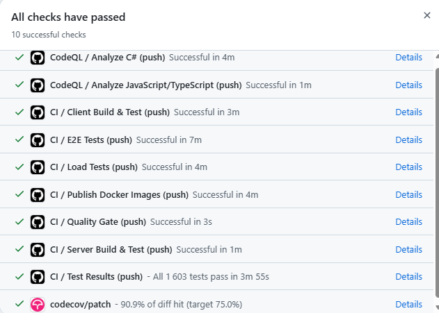

### GitHub Actions Workflows

| Workflow | File | Trigger | Purpose |
|---|---|---|---|
| **CI** | `ci.yml` | Push / PR | Full quality pipeline — build, test, lint, coverage |
| **CodeQL** | `codeql.yml` | Push / PR / schedule | Static analysis for C# and JavaScript/TypeScript |

### Required CI Checks

| Check | Time | What It Runs |
|---|---|---|
| **CI / Client Build & Test** | ~2 min | Angular build (zero warnings), Vitest unit tests, architecture tests |
| **CI / E2E Tests** | ~7 min | Playwright across all auth roles (public, authenticated, admin, developer) with axe-core WCAG 2.2 AA scanning |
| **CI / Load Tests** | ~4 min | k6 quick profile in isolated Docker environment — all scenarios must pass thresholds |
| **CI / Quality Gate** | ~4 sec | Meta-check that all required jobs passed; blocks merge if any gate fails |
| **CI / Server Build & Test** | ~1 min | .NET build (`TreatWarningsAsErrors=true`), xUnit tests, Roslyn analyzer enforcement |
| **CI / Test Results** | ~3 min 43s | Aggregates all test suites with [dorny/test-reporter](https://github.com/dorny/test-reporter) — publishes `3,100+ tests pass` summary to the PR |

### Code Scanning

| Check | Time | What It Covers |
|---|---|---|
| **CodeQL / Analyze C#** | ~4 min | Security and quality queries across all C# source — `csharp-security-and-quality.qls` |
| **CodeQL / Analyze JavaScript/TypeScript** | ~1 min | Security and quality queries across the Angular client — `javascript-security-and-quality.qls` |
| **Code scanning results / CodeQL** | ~3 sec | GitHub native gate — blocks merge if any new CodeQL alert is introduced by the PR |

### Coverage

[Codecov](https://codecov.io/gh/actionjacksonthegoat-debug/SeventySix) aggregates coverage from both the .NET server (`dotnet test --collect:"XPlat Code Coverage"`) and Angular client (Vitest V8 provider). Coverage reports upload on every CI run. The `codecov.yml` at the repo root configures patch and project thresholds. The badge in the header reflects the current coverage level.

### Local Equivalents

Every CI check has a local counterpart — no waiting for GitHub Actions to catch problems:

| CI Check | Local Command |
|---|---|
| Client Build & Test | `npm run test:client` |
| Server Build & Test | `npm run test:server` |
| E2E Tests | `npm run test:e2e` |
| Load Tests | `npm run loadtest:quick` |
| CodeQL C# | `npm run scan:codeql:ci:csharp` |
| CodeQL JS/TS | `npm run scan:codeql:ci:typescript` |
| CodeQL (both) | `npm run scan:codeql:ci` |
| Format (lint gate) | `npm run format` |

## Testing

Multiple test suites provide automated checks across the full stack:

| Suite | Framework | Tests | Command | What It Covers |
|---|---|---|---|---|
| Server | xUnit + NSubstitute + Shouldly | 1,670+ | `npm run test:server` | Server projects: API, Domains, Identity, Shared, Architecture, Analyzers |
| Client | Vitest | 1,570+ | `npm run test:client` | Unit/integration tests across 100+ spec files + architecture enforcement |
| E2E | Playwright | 320+ | `npm run test:e2e` | Specs across auth roles (public, authenticated, admin, developer), WCAG 2.2 AA accessibility scanning per role, mock Brevo API |
| Load | k6 (Grafana) | scenarios | `npm run loadtest:quick` | Auth, users, permissions, logging, and health across multiple profiles (smoke, quick, stress, load) |
| DAST | OWASP ZAP | baseline | `npm run test:dast` | Security header validation, injection testing, authenticated API scanning |

### E2E Coverage by Role

Playwright tests authenticate once per role via `global-setup.ts` and reuse saved auth state — no login step in individual tests. Every role category includes a dedicated `accessibility.spec.ts` that scans pages with axe-core for WCAG 2.2 AA compliance.

| Role | Specs | Tests | Key Coverage |
|---|---|---|---|
| Public | 10 | 100+ | Login, registration, forgot/set password, OAuth, error pages, accessibility |
| Authenticated | 11 | 70+ | Profile, password change, MFA/TOTP setup, backup codes, permissions, session, navigation |
| Admin | 8 | 80+ | Dashboard, user CRUD, log viewer, permission approvals, role enforcement |
| Developer | 4 | 20+ | Style guide, role enforcement, accessibility |

### Load Testing Profiles

Load tests run in a fully isolated Docker environment with dedicated ports. The orchestration scripts handle environment setup, test execution, result aggregation into HTML reports, and teardown.

| Profile | Virtual Users | Duration | p95 Target | Error Rate |
|---|---|---|---|---|
| smoke | 2 | 30s | < 2000ms | < 1% |
| quick | 20 | 60s | < 2000ms | < 5% |
| stress | 200 | 10min | < 3000ms | < 10% |
| load | 50 | 5min | < 1500ms | < 5% |

### Gate Condition

All four suites must pass before any work is considered complete:

| Suite | Command | Expected Output |
|---|---|---|
| Server | `npm run test:server` | `Test summary: total: X, failed: 0` |
| Client | `npm run test:client` | `X passed (X)` |
| E2E | `npm run test:e2e` | `[PASS] All E2E tests passed!` |
| Load (quick) | `npm run loadtest:quick` | All scenarios pass thresholds |

> **Note:** Load quick tests require the load-testing Docker environment (`docker compose -f docker-compose.loadtest.yml up -d`). Full load and stress profiles can take 10-30+ minutes — use `npm run loadtest:smoke` for a fast health-only sanity check.

## Production Deployment

See [docs/Deployment.md](docs/Deployment.md) for the complete production deployment guide.

**Quick summary:**

- **Target:** Hetzner CCX23 (4 dedicated AMD vCPU / 16 GB) @ US West Hillsboro + Cloudflare free
- **Cost:** ~$35/month (server $28.99 + backups $5.80, 2 TB traffic included)
- **Deploy:** Push to master → CI tests → images publish to GHCR → CD deploys via SSH
- **Secrets:** All production secrets stored in GitHub repository Secrets/Variables — no `.env` file on server
- **Backups:** Daily to Cloudflare R2 (free 10 GB)

See [docs/Scaling-Plan.md](docs/Scaling-Plan.md) for the full scaling roadmap (vertical scale, dedicated CPU, multi-server, K3s).

## License

MIT License — Copyright (c) 2026 SeventySix

See [LICENSE.txt](LICENSE.txt) for the full license text.
