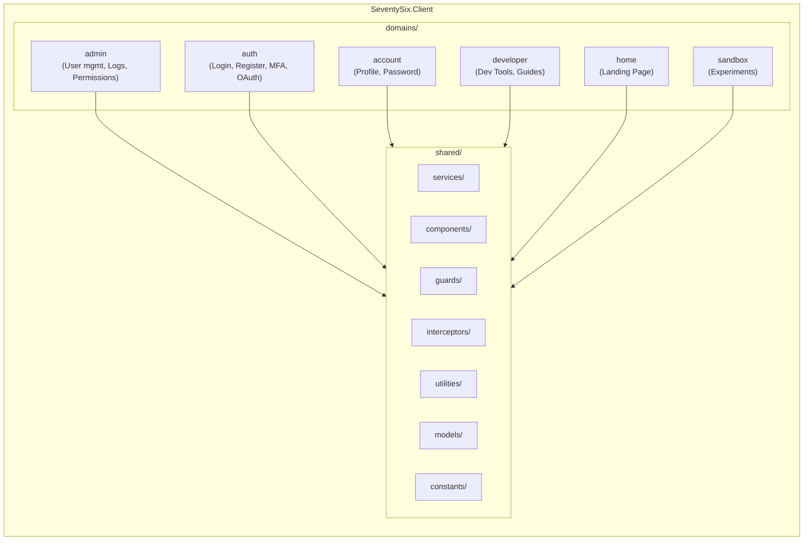
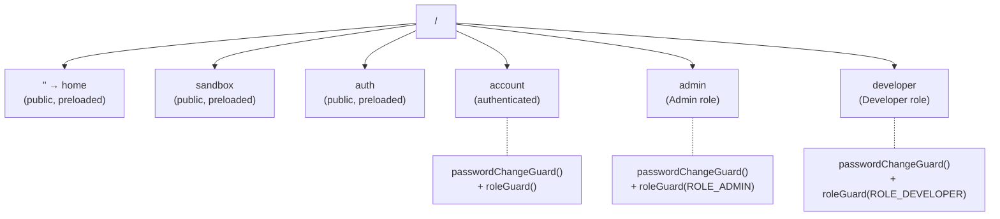
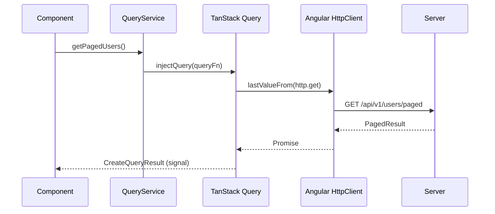
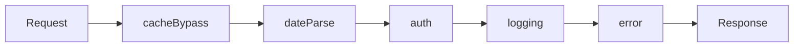

# SeventySix Client

Angular 21 single-page application with Zoneless change detection, Signals, TanStack Query for server state, and Material Design 3. The client implements strict domain boundaries where each feature area is fully isolated.

## Quick Start

### Prerequisites

- [Node.js 22+](https://nodejs.org/)
- Server infrastructure running (see [Server README](../SeventySix.Server/README.md))

### Development

```bash
# Install dependencies
cd SeventySix.Client
npm install

# Start dev server (proxies API calls to https://localhost:7180)
npm start

# Run unit + architecture tests
npm test

# Format all client, E2E, and load-testing files
npm run format
```

The dev server runs at `https://localhost:4200` with hot reload.

### Other Commands

| Command | Purpose |
|---------|---------|
| `npm start` | Dev server with API proxy |
| `npm test` | Architecture tests + Vitest |
| `npm run test:coverage` | Vitest with coverage report |
| `npm run lint` | ESLint check only |
| `npm run format` | ESLint fix + dprint fmt + ESLint fix |
| `npm run test:e2e` | Full E2E suite (Docker + Playwright) |
| `npm run generate:openapi` | Regenerate typed API client from server spec |

## Architecture

The application follows domain-driven design with strict isolation between feature areas and a shared foundation layer.



### Domain Isolation Rule

Each domain imports only `@shared/*` and itself. Domains never import from other domains. This is enforced by architecture tests in `scripts/architecture-tests.mjs`.

| From | @shared | @admin | @auth | @account | @developer | @sandbox | @home |
|------|---------|--------|-------|----------|------------|----------|-------|
| **@admin** | Allowed | Allowed | -- | -- | -- | -- | -- |
| **@auth** | Allowed | -- | Allowed | -- | -- | -- | -- |
| **@account** | Allowed | -- | -- | Allowed | -- | -- | -- |
| **@developer** | Allowed | -- | -- | -- | Allowed | -- | -- |
| **@sandbox** | Allowed | -- | -- | -- | -- | Allowed | -- |
| **@home** | Allowed | -- | -- | -- | -- | -- | Allowed |

### Zoneless + Signals

The application runs without Zone.js. All reactivity is signal-based:

- `input.required<T>()` and `output<T>()` replace `@Input()` and `@Output()`
- `computed()` signals replace method calls in templates
- `effect()` for side effects
- `OnPush` change detection on every component
- `takeUntilDestroyed()` for subscription cleanup

### Route Structure

Routes use `canMatch` guards to prevent lazy module download until authorization is verified.



Public routes (home, sandbox, auth) are preloaded for fast navigation. Protected routes check role authorization before downloading the module bundle.

## Domain Details

Each domain is a self-contained feature area with its own routes, services, models, and components. Domains import only `@shared/*` and themselves — never another domain. The sections below describe what each domain provides at the page level. For the visual overview, see the [Application Showcase](../README.md#application-showcase) in the top-level README.

### Admin Domain

The admin domain provides a full management interface for administrators. All data tables use the shared `DataTableComponent` with server-side pagination, sorting, and filtering powered by `BaseFilterService` and `BaseQueryService`.

**Dashboard** — A multi-tab `mat-tab-group` serves as the admin control center:

| Tab | Implementation | Content |
|---|---|---|
| System Overview | Grafana iframe (`seventysix-system-overview`) | API Health, Total Requests, Error Rate, Response Time p95, Memory, GC, CPU, Thread Pool |
| API Metrics | Grafana iframe (`seventysix-api-endpoints`) | Top 10 Slowest Endpoints, HTTP Status Codes, Per-Endpoint Performance |
| Cache Metrics | Grafana iframe (`seventysix-valkey`) | Connected Clients, Memory, Uptime, L2 Hit Rate, Network I/O, Operations/sec |
| External Systems | Angular components | Third-Party API Statistics table, Scheduled Jobs table, Observability tool links (dev), Data tool links (dev) |

Grafana iframes use `ObservabilityConfig` to resolve dashboard UIDs and append `&theme=light` or `&theme=dark` based on the active application theme — no manual Grafana theme switching required.

**User Management** — Paginated data table with quick filter chips (All, Active, Inactive, Deleted). Row actions via `mat-menu`: View, Edit, Reset Password, Restore (soft-deleted accounts), Deactivate. A four-step `mat-stepper` creation wizard validates username uniqueness asynchronously. The detail page displays audit information (created/modified dates, last login) and supports role assignment. CSV export and bulk operations (activate, deactivate) are available from the list view.

**Log Management** — Data table with log level badges (Debug, Info, Warning, Error, Critical) and a date range picker for filtering. Clicking a row opens a detail dialog showing the full log payload. The dialog includes an **"Open in Jaeger"** button that constructs a Jaeger trace URL from the log's `CorrelationId`, giving one-click access to the distributed trace. Bulk delete is available for housekeeping between scheduled cleanup jobs.

**Permission Requests** — Data table showing pending role requests from users. Each row has Approve and Reject action buttons. Bulk selection via `SelectionModel` supports approving or rejecting multiple requests at once. Approval triggers cross-domain cache invalidation through `CacheCoordinationService` so the user's new permissions take effect immediately.

### Auth Domain

The authentication domain handles public-facing identity flows across the following routes:

| Route | Page | Purpose |
|---|---|---|
| `login` | Login | Email/password login with GitHub OAuth button and Altcha CAPTCHA |
| `register-email` | Email Registration | Initiate registration with email verification |
| `register-complete` | Registration Completion | Complete profile after email verification |
| `forgot-password` | Forgot Password | Request password reset email |
| `change-password` | Change Password | Change password for authenticated users |
| `set-password` | Set Password | Set password from a reset link token |
| `mfa-verify` | MFA Verification | Enter TOTP code or backup code after login |
| `totp-setup` | TOTP Setup | Enroll authenticator app with QR code |
| `backup-codes` | Backup Codes | Generate and display single-use backup codes |

All public forms (login, registration, forgot password) integrate the shared `altcha-widget` component for proof-of-work CAPTCHA protection. The GitHub OAuth flow redirects to the server's OAuth endpoint and returns with a JWT on success. `AuthService` is a root-level singleton shared across the application — not scoped to the auth domain's routes.

### Account Domain

**Profile** — Edit email and full name with form validation. Includes a Linked Accounts section to connect or disconnect external OAuth providers (e.g., GitHub).

**Request Permissions** — Checkbox-based role selection form. Users select desired roles and submit the request, which enters the admin Permission Request queue for approval.

### Developer Domain

**Style Guide** — A comprehensive Material Design 3 component reference organized into tabs: Colors, Typography, Buttons, Forms, Tables, Feedback, Icons, and Loading States. Live theme controls at the top allow previewing every component across multiple theme variants (light/dark × color variants). This page serves as both visual documentation and a design system reference for contributors.

### Home Domain

Dual-theme parallax landing page showcasing the project's tech stack, features, architecture patterns, and stats. Serves as the default page for all visitors.

### Sandbox Domain

Open-ended experimentation space for prototyping new features. Public route, no authentication required.

### Navigation Structure

The application uses a responsive sidebar with collapsible sections based on the authenticated user's roles:

| Section | Required Role | Pages |
|---|---|---|
| **Main** | All users | Home, Sandbox |
| **Developer** | Developer or Admin | Style Guide |
| **Management** | Admin only | Dashboard, Users, Logs, Permission Requests |

The header contains a theme toggle dropdown (multiple variants) and a user menu with profile and logout links. Unauthenticated visitors see only the Main section with a Login link in the header.

## Directory Structure

```
src/app/
├── app.config.ts              # Providers: zoneless, router, TanStack Query, interceptors
├── app.routes.ts              # Route definitions with guards
├── app.ts                     # Root component
├── domains/
│   ├── admin/                 # Admin feature area
│   │   ├── admin.routes.ts
│   │   ├── components/        # Reusable admin-scoped components
│   │   ├── constants/         # Admin-scoped constants
│   │   ├── logs/              # Log management subdomain
│   │   ├── models/            # Admin-scoped models
│   │   ├── pages/             # Route page components
│   │   ├── permission-requests/  # Permission subdomain
│   │   ├── services/          # Admin-scoped services (route providers ONLY)
│   │   ├── testing/           # Admin-scoped test utilities
│   │   └── users/             # User management subdomain
│   ├── auth/                  # Authentication feature area
│   │   ├── auth.routes.ts
│   │   ├── constants/
│   │   ├── models/
│   │   ├── pages/             # Login, Register, Forgot, Set password, MFA
│   │   ├── services/
│   │   ├── testing/
│   │   └── utilities/
│   ├── account/               # User account management
│   │   ├── account.routes.ts
│   │   ├── models/, pages/, services/, testing/
│   ├── developer/             # Developer tools
│   │   ├── developer.routes.ts
│   │   └── pages/
│   ├── home/                  # Landing page
│   │   ├── home.routes.ts
│   │   └── pages/
│   └── sandbox/               # Experimental features
│       ├── sandbox.routes.ts
│       └── pages/
└── shared/                    # Cross-cutting foundation
    ├── animations/            # Reusable Angular animations
    ├── components/            # Layout, breadcrumb, data-table, dialogs, etc.
    ├── constants/             # Routes, roles, HTTP, validation, UI timing
    ├── directives/            # Table height directive
    ├── generated-open-api/    # Auto-generated TypeScript API client
    ├── guards/                # passwordChangeGuard, roleGuard
    ├── interceptors/          # HTTP interceptor pipeline
    ├── models/                # Shared models, error types, query request base
    ├── pages/                 # Error pages (403, 404, 500)
    ├── services/              # singleton services
    ├── styles/                # SCSS: theme, mixins, variables, utilities
    ├── testing/               # Test helpers, builders, mock factories
    └── utilities/             # Null checks, clipboard, HTTP params, query keys
```

## Key Patterns

### 1. TanStack Query for Server State

Services extend `BaseQueryService<TFilter>` for reactive server state with automatic cache management.



| Class | Purpose |
|-------|---------|
| `BaseFilterService` | Signal-based filter state management |
| `BaseQueryService` | Query/mutation helpers + cache invalidation |
| `QueryKeys` | Centralized cache key factory |
| `CacheCoordinationService` | Cross-feature cache invalidation |

### 2. HTTP Interceptor Pipeline

Interceptors execute in registration order. The order matters for correct behavior:



| Interceptor | Purpose |
|-------------|---------|
| `cacheBypass` | Adds cache-busting headers for mutations |
| `dateParse` | Converts ISO date strings to Date objects |
| `auth` | Attaches JWT token, handles 401 refresh |
| `logging` | Logs request/response for diagnostics |
| `error` | Maps errors to `AppError`, triggers notifications |

### 3. Service Scoping

| Type | Location | Registration | Lifecycle |
|------|----------|-------------|-----------|
| App singleton | `@shared/services/` | `providedIn: 'root'` | App lifetime |
| Domain scoped | `@{domain}/services/` | Route `providers` array | Route lifetime |

Domain services in `@{domain}/services/` must never use `providedIn: 'root'`. They are provided through the route configuration so they are created and destroyed with the route.

### 4. Error Handling

Client errors are classified by visibility:

| Data | Destination | Never |
|------|-------------|-------|
| Validation field errors | User-visible toast | -- |
| 4xx `detail` | User-visible message | -- |
| 5xx `detail` | `diagnosticDetails[]` (copy-only) | User-visible toast |
| URL, HTTP status | `diagnosticDetails[]` | User-visible toast |

Auth errors use `mapAuthError()` with an explicit switch on `errorCode` — the default case returns a generic message and never passes through raw server text.

### 5. App Initialization

Startup hooks run before the application renders:

1. `initializeTheme()` — applies saved color scheme
2. `initializeTelemetry()` — sets up OpenTelemetry
3. `initializeWebVitals()` — registers Core Web Vitals reporting

## Code Quality

### Formatting Pipeline

The Client uses an umbrella configuration that covers all TypeScript files including E2E tests and load tests:

| **ESLint** — flat config (`eslint.config.js`) with `@stylistic`, `@typescript-eslint`, and custom rules
- **dprint** — local formatting (`dprint.json`) for TypeScript and JSON
- **Custom ESLint rules** — `eslint-rules/` directory enforces assignment newlines, arrow body formatting, etc.

```bash
# Format everything (from SeventySix.Client/)
npm run format

# Or from repo root
npm run format
```

### Architecture Tests

`scripts/architecture-tests.mjs` runs before every `npm test` to enforce 28 rules across these categories:

| Category | What's Enforced |
|----------|----------------|
| Signal Pattern | `input.required<T>()` / `output<T>()` only — no `@Input()`/`@Output()`; `OnPush` required |
| Control Flow | `@if`/`@for`/`@switch` only — no structural directives |
| Dependency Injection | `inject()` function only — no constructor injection |
| Zoneless | No `NgZone`; no `fakeAsync`/`tick`; `provideZonelessChangeDetection` in all tests |
| Domain Boundaries | No cross-domain imports; shared independence; route-scoped services |
| Code Quality | Max 800 lines/file, 50 lines/method, 6 params, 12 public methods; no `!!` or `\\|\\|` null coercion |
| Date/Time | `DateService` only — no native `new Date()` |

See `scripts/architecture-tests.mjs` for the complete rule set. The server has 25 additional architecture test classes — see the root [README](../README.md#ai-assisted-development-with-architecture-guardrails).\n\n`npm run format` runs ESLint + dprint — see root [README](../README.md#formatting) for the full formatting pipeline.

### Date/Time Handling (CRITICAL)

| Rule | Required | Forbidden |
|------|----------|----------|
| All date operations | `DateService` (wraps `date-fns`) | `new Date()`, `Date.now()`, `Date.parse()`, `Date.UTC()` |
| Allowed exceptions | `date.service.ts`, `date.service.spec.ts` | All other files |

Enforced by: Architecture test "Date Handling" in `scripts/architecture-tests.mjs`.

> **Note**: `Date.now()` is allowed in E2E tests and load testing code for generating unique test data IDs.

### OpenAPI Client Generation

The typed API client is auto-generated from the server's OpenAPI specification:

```bash
npm run generate:openapi
```

This updates `shared/generated-open-api/generated-open-api.ts` with type-safe interfaces matching the server's API contracts.

### Icon Generation

Generate all PWA icons and favicon from a single source image using [sharp](https://sharp.pixelplumbing.com/):

```bash
# From root — uses default filename icon-source-file.png
npm run generate:icons

# From client — with custom filename
cd SeventySix.Client
node scripts/generate-icons.mjs my-custom-logo.png
```

**Requirements:**
- **Source file location**: `public/icons/icon-source-file.png`
- **Recommended size**: 512×512 pixels or larger (square)
- **Format**: PNG with transparency recommended

**What it generates:**

| Output | Sizes | Purpose |
|--------|-------|---------|
| Standard icons | 48, 72, 96, 128, 144, 152, 192, 384, 512px | PWA manifest icons |
| Maskable icons | 192, 512px | Adaptive icons (80% safe zone, blue background) |
| `favicon.ico` | 32px | Browser tab icon |

> **Note**: The source file is deleted after generation. Keep a backup if needed.

## Testing

Unit and integration tests use Vitest with Angular's zoneless TestBed.

| Library | Purpose |
|---------|---------|
| Vitest | Test runner (never Jest) |
| Angular TestBed | Component/service testing |
| `@testing/test-bed-builders` | `ComponentTestBed`, `setupServiceTest`, `setupSimpleServiceTest` |
| `@testing/provider-helpers` | Composable providers: `withHttpTesting()`, `withQueryTesting()`, etc. |
| `@testing/mock-factories` | Pre-configured mock services and dependencies |

### Running Tests

```bash
npm test                    # Architecture tests + Vitest
npm run test:coverage       # With coverage report
```

Expected output: `X passed (X)`

### Key Testing Rules

- Every `TestBed.configureTestingModule` includes `provideZonelessChangeDetection()`
- No `fakeAsync`, `tick`, or `NgZone` (zoneless application)
- Use `TestBed.flushEffects()` to trigger signal effects in tests
- All test data uses builders and mock factories, not inline construction

## PWA Support

The application supports Progressive Web App features via Angular's service worker:

- `ngsw-config.json` defines caching strategies
- `public/manifest.webmanifest` provides install metadata
- Pre-cached assets for offline capability

## Feature Flags

The client reads feature flags from the API at startup (`GET /api/v1/config/features`). These flags control UI visibility for MFA, TOTP, and OAuth flows:

| Flag | Effect on client UI |
|------|---------------------|
| `mfaEnabled` | Shows/hides the MFA code entry step during login |
| `totpEnabled` | Shows/hides TOTP authenticator enrollment in account settings |
| `oAuthEnabled` | Shows/hides OAuth login buttons and account linking UI |

Flags are controlled server-side in `appsettings.json`. See [Optional Feature Flags](../docs/Startup-Instructions.md#optional-feature-flags) for the full reference and production recommendations.

## Related Projects

- [Repository Overview](../README.md) — Top-level README with full architecture, security, and setup guide
- [Server README](../SeventySix.Server/README.md) — .NET API that this client consumes
- [E2E Tests](e2e/README.md) — Playwright browser automation for this application
- [Load Tests](load-testing/README.md) — k6 performance testing against the server API

## Troubleshooting

### Dev server proxy errors

The proxy configuration (`proxy.conf.json`) forwards API calls to `https://localhost:7180`. Ensure the server is running. See [Server README](../SeventySix.Server/README.md) for setup.

### SSL certificate errors

Generate development certificates from the repo root:

```bash
.\scripts\generate-dev-ssl-cert.ps1
```

### ESLint custom rule errors

The 6 custom ESLint rules in `eslint-rules/` are plain JavaScript files loaded by the flat config. If a rule fails to load, check that `eslint.config.js` paths are correct relative to the project root.

### TanStack Query cache stale data

Cache invalidation is coordinated through `CacheCoordinationService`. After mutations, services call `invalidateQueries()` with the appropriate `QueryKeys` to refresh affected queries.

### Architecture test failures

`scripts/architecture-tests.mjs` checks import paths at the file system level. If a domain accidentally imports from another domain, fix the import to use `@shared/*` or move the shared code to the shared layer.
