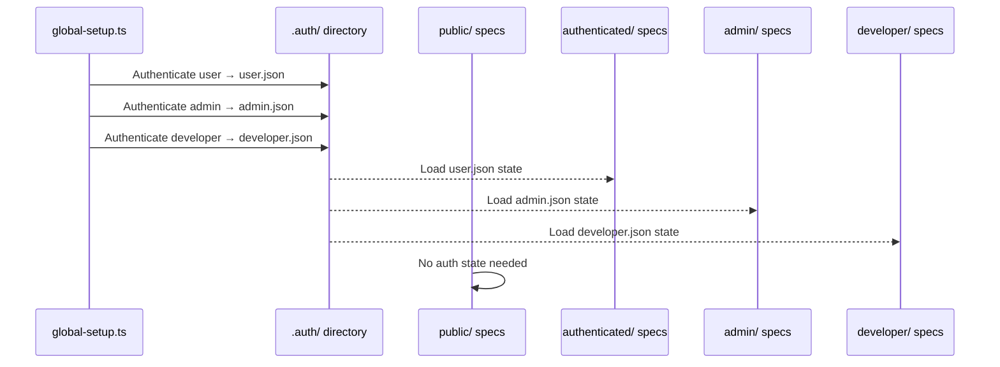
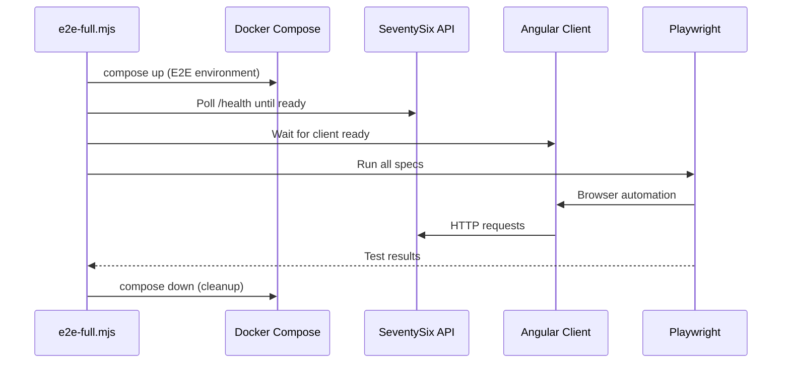

# SeventySix E2E Tests

Playwright browser automation with role-based authentication, accessibility scanning, and custom fixtures. Tests cover the SeventySix application across user roles: public, authenticated, admin, and developer.

## Quick Start

### Prerequisites

- [Node.js 22+](https://nodejs.org/)
- Docker Desktop (for the full E2E environment)
- Playwright browsers (installed automatically on first run)

### Run All E2E Tests

From the repository root:

```bash
npm run test:e2e
```

This orchestrates the full lifecycle: starts Docker services, waits for health checks, runs all specs, and tears down the environment.

### Run Specific Tests (with environment already running)

```bash
cd SeventySix.Client
npx playwright test                           # All specs
npx playwright test e2e/specs/public/         # Public specs only
npx playwright test --grep "login"            # By test name
npx playwright test --project=admin           # By auth role
```

## Architecture

E2E tests use Playwright's project-based authentication model. A global setup step authenticates once per role and saves the auth state. Each test category loads the appropriate saved state — no login step in individual tests.



### Playwright Projects

| Project | Auth State | Depends On | Specs Directory |
|---------|-----------|------------|-----------------|
| `setup` | Performs login for all roles | -- | `global-setup.ts` |
| `public` | None | -- | `specs/public/` |
| `authenticated` | User role | `setup` | `specs/authenticated/` |
| `admin` | Admin role | `setup` | `specs/admin/` |
| `developer` | Developer role | `setup` | `specs/developer/` |

### Full E2E Orchestration

The `npm run test:e2e` command runs the complete lifecycle through `scripts/e2e-full.mjs`:



The E2E environment uses `docker-compose.e2e.yml` with isolated ports separate from development.

## Directory Structure

```
e2e/
├── global-setup.ts                # Authenticates all roles, saves state to .auth/
├── .auth/                         # Saved auth state (gitignored)
│   ├── user.json
│   ├── admin.json
│   └── developer.json
├── fixtures/                      # Test infrastructure
│   ├── index.ts                   # Barrel export — single import point
│   ├── auth.fixture.ts            # Extends Playwright test with auth state
│   ├── email.fixture.ts           # MailDev email verification helpers
│   ├── fresh-login.fixture.ts     # Tests requiring fresh login (not cached)
│   ├── page-helpers.fixture.ts    # Page object fixture injection
│   ├── unauthenticated.fixture.ts # Tests that need explicit unauthenticated state
│   ├── assertions.helper.ts       # Custom assertion helpers
│   ├── config.constant.ts         # E2E environment configuration
│   ├── page-text.constant.ts      # Expected page text (no hardcoded strings)
│   ├── routes.constant.ts         # Route paths for navigation
│   ├── selectors.constant.ts      # data-testid selectors for all elements
│   ├── test-users.constant.ts     # Test user credentials per role
│   ├── timeouts.constant.ts       # Timeout values for waits
│   ├── helpers/
│   │   ├── accessibility.helper.ts  # axe-core WCAG scanning
│   │   ├── altcha.helper.ts         # CAPTCHA challenge solver
│   │   ├── login.helper.ts          # Login flow automation
│   │   └── totp.helper.ts           # TOTP code generation
│   └── pages/                     # Page object classes
│       ├── admin-dashboard.page.ts
│       ├── auth.page.ts
│       ├── change-password.page.ts
│       ├── home.page.ts
│       └── index.ts
├── reporters/
│   └── concise-reporter.ts        # Streamlined CI output
└── specs/
    ├── public/                    # specs — no auth required
    ├── authenticated/             # specs — standard user role
    ├── admin/                     # specs — admin role
    └── developer/                 # specs — developer role
```

## Test Categories

### Public (No Authentication)

| Spec | Covers |
|------|--------|
| `login.spec.ts` | Email/password login, validation, error messages |
| `register.spec.ts` | Registration flow, validation, email verification |
| `forgot-password.spec.ts` | Password reset initiation |
| `set-password.spec.ts` | Password set from reset link |
| `oauth-login.spec.ts` | OAuth provider login flow |
| `forced-password-change.spec.ts` | Forced password change redirect |
| `home.spec.ts` | Landing page content |
| `sandbox.spec.ts` | Sandbox page rendering |
| `error-pages.spec.ts` | 404, 403, 500 error pages |
| `accessibility.spec.ts` | WCAG 2.2 AA compliance |

### Authenticated (User Role)

| Spec | Covers |
|------|--------|
| `profile.spec.ts` | Profile viewing and editing |
| `change-password.spec.ts` | Password change form |
| `change-password-flow.spec.ts` | End-to-end password change |
| `mfa-login.spec.ts` | MFA-protected login |
| `totp-setup.spec.ts` | TOTP enrollment flow |
| `backup-codes.spec.ts` | Backup code generation |
| `request-permissions.spec.ts` | Role permission requests |
| `session.spec.ts` | Session management |
| `logout.spec.ts` | Logout flow |
| `navigation.spec.ts` | Route navigation and breadcrumbs |
| `user-access.spec.ts` | Role-based access verification |
| `accessibility.spec.ts` | WCAG 2.2 AA compliance |

### Admin (Admin Role)

| Spec | Covers |
|------|--------|
| `admin-dashboard.spec.ts` | Dashboard metrics and navigation |
| `user-management.spec.ts` | User listing, search, pagination |
| `user-create.spec.ts` | User creation form |
| `user-detail.spec.ts` | User detail view and actions |
| `log-management.spec.ts` | Log viewer and deletion |
| `permission-request-list.spec.ts` | Permission approval/rejection |
| `admin-access.spec.ts` | Admin role enforcement |
| `accessibility.spec.ts` | WCAG 2.2 AA compliance |

### Developer (Developer Role)

| Spec | Covers |
|------|--------|
| `architecture-guide.spec.ts` | Architecture documentation page |
| `style-guide.spec.ts` | Component style guide page |
| `developer-access.spec.ts` | Developer role enforcement |
| `accessibility.spec.ts` | WCAG 2.2 AA compliance |

## Key Patterns

### 1. Single Barrel Import

All test infrastructure is imported from one path. Never import from individual fixture files.

```typescript
import {
    test, expect, ROUTES, SELECTORS, PAGE_TEXT, TIMEOUTS
} from "../../fixtures";
```

### 2. data-testid Selectors

All element selection uses `data-testid` attributes. Never use CSS classes, tag names, or DOM structure.

```typescript
// Correct
page.locator(SELECTORS.login.emailInput)

// Never
page.locator(".login-form input:first-child")
```

### 3. Anti-Flake Rules

| Never | Always |
|-------|--------|
| `page.waitForTimeout(1000)` | `page.waitForLoadState("load")` |
| `page.locator(".row:nth-child(2)")` | `page.locator("[data-testid='user-row']")` |
| `await page.waitForNavigation()` | `await expect(page).toHaveURL(/pattern/)` |
| Hardcoded strings | `PAGE_TEXT.headings.title` |
| Test order dependencies | Each test fully independent |

### 4. Accessibility Testing

Every test category includes an `accessibility.spec.ts` that scans pages with axe-core:

```typescript
import AxeBuilder from "@axe-core/playwright";

const axeResults =
    await new AxeBuilder({ page })
        .withTags(["wcag2a", "wcag2aa", "wcag21aa"])
        .analyze();

const criticalViolations =
    axeResults.violations.filter(
        (violation) =>
            violation.impact === "critical"
                || violation.impact === "serious");

expect(criticalViolations).toHaveLength(0);
```

### 5. Test Isolation

Every test creates unique data to avoid conflicts with parallel execution:

```typescript
const uniqueEmail = `e2e_test_${Date.now()}@test.local`;
```

### 6. Page Object Pattern

Page objects encapsulate page-specific locators and actions:

```typescript
export class AdminDashboardPageHelper
{
    readonly page: Page;
    readonly dataTable: Locator;

    constructor(page: Page)
    {
        this.page = page;
        this.dataTable = page.locator(SELECTORS.adminDashboard.dataTable);
    }

    async waitForTableLoad(): Promise<void>
    {
        await this.page.waitForLoadState("load");
        await expect(this.dataTable).toBeVisible();
    }
}
```

## CI Compatibility

| Rule | Local | CI |
|------|-------|-----|
| Retries | 0 | 1 |
| Workers | Auto | CI-configured workers |
| Platform | Windows or macOS | `ubuntu-latest` |
| SSL | Dev certificates | Generated via `openssl` |
| Reporter | HTML + concise | Concise only |

Tests must never assume Windows-only tools. Use `process.platform` guards for platform-specific logic.

## Configuration

The Playwright configuration (`playwright.config.ts` in Client root) defines:

- **Base URL**: `https://localhost:4201` (E2E port)
- **Timeouts**: 30s test timeout, 10s assertion timeout
- **Global setup**: `e2e/global-setup.ts` (auth for all roles)
- **Projects**: One per role, with setup dependencies
- **Reporter**: HTML report + custom concise reporter

## Adding a New Test

1. Identify the category: `public`, `authenticated`, `admin`, or `developer`
2. Create a spec file in the appropriate `specs/` subfolder
3. Add any new `data-testid` selectors to `fixtures/selectors.constant.ts`
4. Add any new routes to `fixtures/routes.constant.ts`
5. Add expected text to `fixtures/page-text.constant.ts`
6. Import everything from the barrel: `import { test, expect, ... } from "../../fixtures"`
7. Use page helpers for complex multi-step interactions
8. Run: `npx playwright test e2e/specs/{category}/{name}.spec.ts`

## Architecture Test Coverage

E2E test code is scanned by the client architecture tests (`scripts/architecture-tests.mjs`) alongside load-testing code. These rules enforce the same code quality standards as production source:

| Rule | What It Catches |
|---|---|
| No double-bang (`!!`) | Use explicit boolean checks instead of `!!value` |
| No single-letter lambdas | Use descriptive names (e.g., `.map((row) =>` not `.map((r) =>`) |

Run `npm test` from the client directory to verify — E2E architecture violations appear in the "E2E & Load Testing Tests" section.

## Related Projects

- [Repository Overview](../../README.md) — Top-level README with full architecture, security, and setup guide
- [Client README](../README.md) — Angular application under test
- [Server README](../../SeventySix.Server/README.md) — API that the client communicates with
- [Load Tests](../load-testing/README.md) — Performance testing companion

## Troubleshooting

### Browsers not installed

Playwright installs browsers on first run. To manually install:

```bash
npx playwright install
```

### Auth state expired or stale

Delete the `.auth/` directory and re-run tests. The global setup will re-authenticate all roles.

```bash
rm -rf e2e/.auth/
npx playwright test
```

### Tests flaky in CI

1. Check for `waitForTimeout` usage — replace with `waitForLoadState`
2. Verify selectors use `data-testid` — not CSS classes
3. Ensure test data uses unique prefixes (`e2e_test_${Date.now()}`)
4. Check that tests don't depend on execution order

### Docker environment won't start

1. Verify Docker Desktop is running
2. Check for port conflicts: E2E uses its own port range
3. View logs: `docker compose -f docker-compose.e2e.yml logs`
4. Clean restart: `docker compose -f docker-compose.e2e.yml down -v && docker compose -f docker-compose.e2e.yml up -d`
