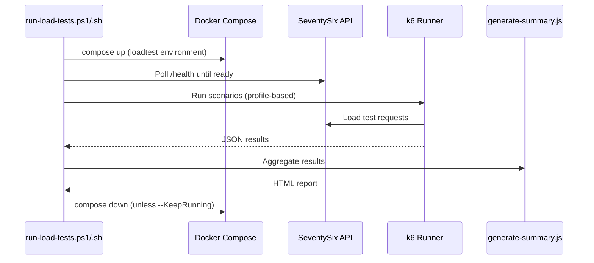
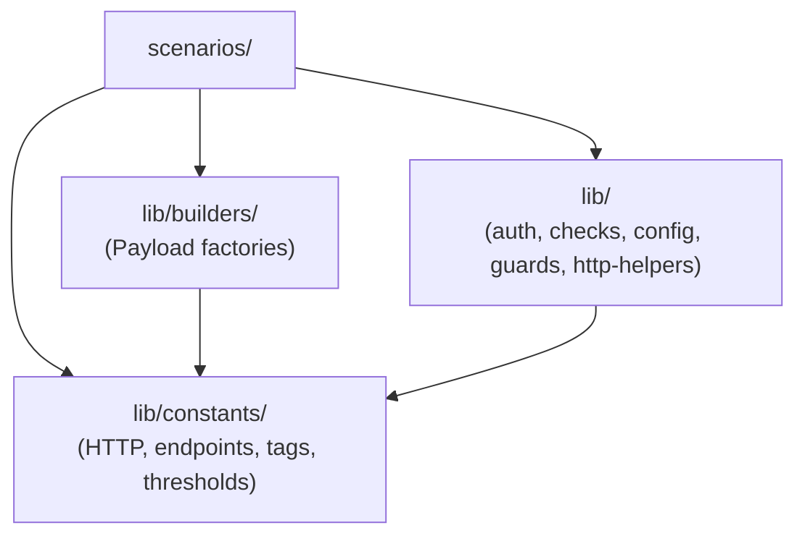

# SeventySix Load Tests

Performance and load testing infrastructure for SeventySix using [Grafana k6](https://grafana.com/docs/k6/).

## Architecture

Load tests run against a fully isolated Docker environment with its own database, cache, and API instances. The orchestration scripts handle the full lifecycle: environment setup, test execution, result aggregation, and teardown.



### Shared Code Structure

Scenarios build on a layered library of constants, builders, and helpers:



## Quick Start

### Prerequisites

1. **k6** — install via `winget install grafana.k6` (Windows) or `brew install k6` (macOS)
2. **Docker Desktop** — running and healthy
3. **Node.js** — for summary report generation

### Run Quick Tests (Recommended First Run)

From the repository root:

```bash
npm run loadtest:quick
```

Or from `SeventySix.Client/load-testing/`:

```powershell
# Windows
.\scripts\run-load-tests.ps1

# Linux / macOS
./scripts/run-load-tests.sh
```

### Run Load / Stress Profiles

```bash
npm run loadtest:load
npm run loadtest:stress
```

### Run a Single Scenario

```powershell
# Windows
.\scripts\run-load-tests.ps1 -Profile smoke -Scenario auth/login

# Linux / macOS
./scripts/run-load-tests.sh smoke auth/login
```

### Keep Environment Running After Tests

```powershell
# Windows
.\scripts\run-load-tests.ps1 -KeepRunning

# Linux / macOS
KEEP_RUNNING=1 ./scripts/run-load-tests.sh
```

## Test Profiles

| Profile | VUs | Duration | p95 Target | Error Rate | Use Case |
|---------|-----|----------|------------|------------|----------|
| smoke   | 2   | 30s      | < 2000ms   | < 1%       | Health-only sanity check — verify infrastructure is alive |
| quick   | 20  | 60s      | < 2000ms   | < 5%       | **Completion gate** — a condensed set of core scenarios |
| stress  | 200 | 10min    | < 3000ms   | < 10%      | Breaking point analysis — find maximum throughput |
| load    | 50  | 5min     | < 1500ms   | < 5%       | Baseline capacity — sustained traffic simulation |

> Use **context7 MCP** for up-to-date k6 API documentation when writing new scenarios.

## Directory Structure

```
SeventySix.Client/load-testing/
├── config/               # Profile configurations (smoke, load, stress, quick)
├── grafana/              # Grafana dashboard JSON
├── lib/                  # Shared libraries
│   ├── constants/        # Shared constant modules
│   │   ├── api-endpoints.constants.js
│   │   ├── http.constants.js
│   │   ├── tags.constants.js
│   │   ├── test-data.constants.js
│   │   ├── thresholds.constants.js
│   │   └── index.js      # Barrel export
│   ├── builders/         # Payload factory functions
│   │   ├── log-payload.builder.js
│   │   ├── user-payload.builder.js
│   │   └── index.js      # Barrel export
│   ├── auth.js           # Login/logout/refresh helpers
│   ├── checks.js         # Reusable k6 check assertions
│   ├── config.js         # Config loader (merges default + profile)
│   ├── data-generators.js # Test data factories (loadtest_ prefix)
│   ├── guards.js         # Setup data validation guards
│   ├── http-helpers.js   # Authenticated HTTP wrappers
│   └── summary.js        # Shared handleSummary for HTML + JSON
├── reports/              # Generated HTML reports (gitignored)
├── results/              # Raw JSON results (gitignored)
├── scenarios/            # k6 test scripts
│   ├── auth/             # Authentication flows
│   ├── health/           # Health check baseline
│   ├── logs/             # Client logging
│   ├── permissions/      # Permission workflows
│   └── users/            # User management CRUD
├── scripts/              # Orchestration scripts
│   ├── generate-summary.js  # Aggregates results into summary.html
│   ├── run-load-tests.ps1   # Windows orchestrator
│   └── run-load-tests.sh    # Linux orchestrator
└── package.json          # k6 test scripts + @types/k6
```

## Code Quality

Load-testing files are linted and formatted through the **Client's umbrella tooling** — no separate configs.

- **ESLint**: Config block in `SeventySix.Client/eslint.config.js` (same `@stylistic` + custom rules as Client)
- **dprint**: Included paths in `SeventySix.Client/dprint.json` (same formatting rules as Client)
- **Format command**: `npm run format` from repo root or `npm run format` from `SeventySix.Client/`

### Constants Reference

| Module | Contents |
|--------|----------|
| `http.constants.js` | `HTTP_STATUS`, `HTTP_HEADER`, `CONTENT_TYPE` |
| `api-endpoints.constants.js` | `AUTH_ENDPOINTS`, `USER_ENDPOINTS`, `PERMISSION_ENDPOINTS`, `LOG_ENDPOINTS`, `HEALTH_ENDPOINTS` |
| `tags.constants.js` | `FLOW_TAGS`, `OPERATION_TAGS`, `buildTags()` |
| `thresholds.constants.js` | `THRESHOLDS` — preset threshold objects per scenario type |
| `test-data.constants.js` | `TEST_DATA_PREFIX`, `LOG_LEVEL`, `HEALTH_STATUS`, `SLEEP_DURATION` |

## Scenarios

| Scenario | Domain | Description |
|----------|--------|-------------|
| `health/health-check` | Health | Baseline API health endpoint |
| `auth/login` | Auth | Login with valid credentials |
| `auth/registration` | Auth | Registration initiation |
| `auth/token-refresh` | Auth | JWT token refresh via cookie |
| `auth/logout` | Auth | Authenticated logout |
| `users/create-user` | Users | Admin creates users |
| `users/update-user` | Users | Admin updates users |
| `users/get-users-paged` | Users | Paged user listing |
| `users/bulk-operations` | Users | Bulk activate/deactivate |
| `permissions/request-permission` | Permissions | User requests role |
| `permissions/grant-permission` | Permissions | Admin grants permission |
| `logs/client-log` | Logging | Single client log entry |
| `logs/client-log-batch` | Logging | Batch client log entries |

## Adding a New Scenario

Use the Copilot prompt:

```
@workspace /new-load-test
```

1. Create `scenarios/{domain}/{name}.test.js`
2. Add endpoint constant to `lib/constants/api-endpoints.constants.js`
3. Add operation tag to `lib/constants/tags.constants.js`
4. Export new constants from `lib/constants/index.js`
5. If needed, create a payload builder in `lib/builders/`
6. Choose threshold preset from `THRESHOLDS.*` or define scenario-specific
7. Use `isSetupInvalid(data)` guard in `default function`
8. Use `buildTags(FLOW_TAGS.*, OPERATION_TAGS.*)` for all requests
9. Use `sleep(SLEEP_DURATION.*)` instead of literal numbers
10. Run: `npm run format` from `SeventySix.Client/`
11. Run: `k6 run --env PROFILE=smoke scenarios/{domain}/{name}.test.js`

## Docker Environment

The load test environment is completely isolated with its own ports:

| Service    | Port  |
|------------|-------|
| PostgreSQL | 5435  |
| Valkey     | 6381  |
| API        | 7175  |
| Client     | 4202  |
| MailDev UI | 1081  |
| MailDev SMTP| 1026 |

Start manually:

```bash
docker compose -f docker-compose.loadtest.yml up -d
```

Stop:

```bash
docker compose -f docker-compose.loadtest.yml down
```

## Grafana Dashboard

Import `grafana/k6-dashboard.json` into your Grafana instance for real-time monitoring during load tests. The dashboard shows:

- Virtual Users over time
- Request rate by scenario
- Response time percentiles (p50, p90, p95, p99)
- Error rate gauge
- Threshold pass/fail status

## Troubleshooting

### k6 not found

Install k6: `winget install grafana.k6` (Windows) or `brew install k6` (macOS).

### API health check fails

1. Check Docker containers: `docker compose -f docker-compose.loadtest.yml ps`
2. Check API logs: `docker compose -f docker-compose.loadtest.yml logs seventysix-api-loadtest`
3. Verify ports aren't in use: `netstat -an | findstr 7175`

### SSL certificate errors

Generate dev certificates: `npm run generate:ssl-cert` from the repository root.

### Tests fail on second run (not idempotent)

All test data uses unique prefixes (`loadtest_` + timestamp). If you see duplicate errors, check the data generators in `lib/data-generators.js`.

## Related Projects

- [Repository Overview](../../README.md) — Top-level README with full architecture, security, and setup guide
- [Server README](../../SeventySix.Server/README.md) — .NET API that load tests target
- [Client README](../README.md) — Angular application
- [E2E Tests](../e2e/README.md) — Playwright browser automation companion
