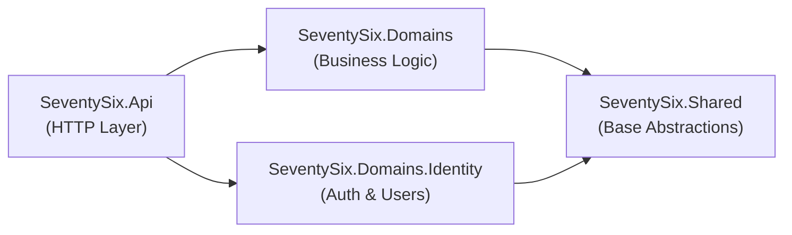
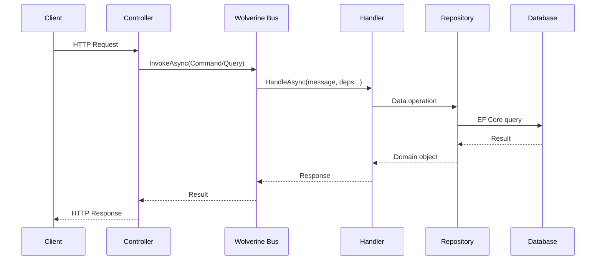
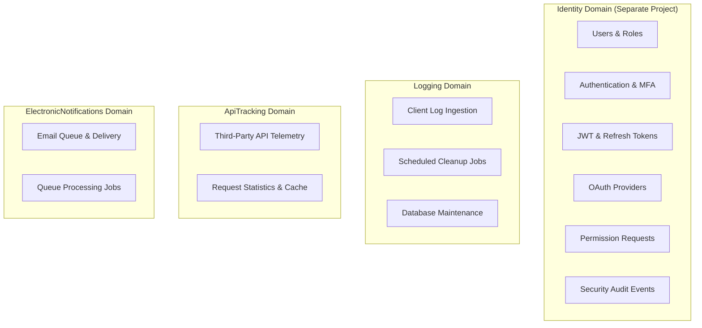
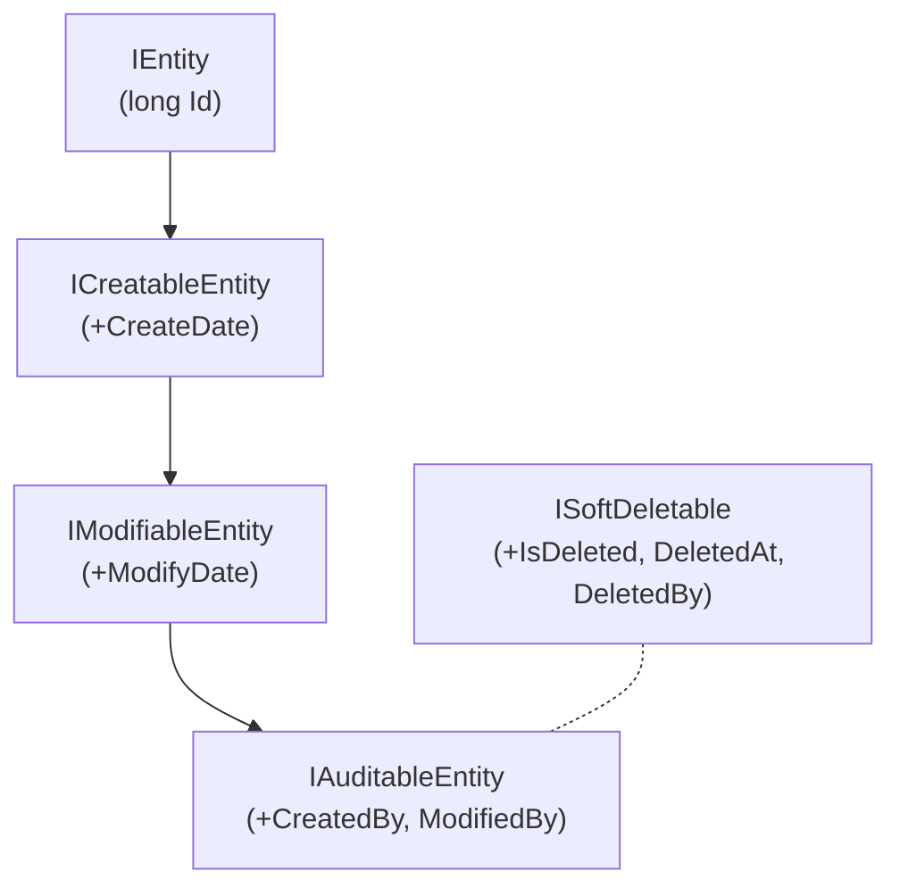
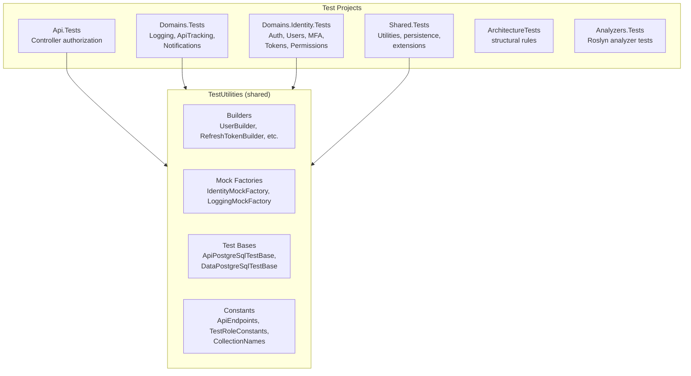

# SeventySix Server

.NET 10 API built on Clean Architecture, Wolverine CQRS, and Entity Framework Core. The server provides a secure, domain-driven backend for identity management, client logging, API telemetry, and email delivery.

## Quick Start

### Prerequisites

- [.NET 10 SDK](https://dotnet.microsoft.com/download)
- [Docker Desktop](https://www.docker.com/products/docker-desktop/) (for PostgreSQL and Valkey)
- User secrets configured (see `scripts/load-user-secrets.ps1`)

### Build and Run

```bash
# Start infrastructure (PostgreSQL, Valkey, MailDev)
npm run start:infrastructure

# Build the solution
cd SeventySix.Server
dotnet build

# Run the API (from Api project)
cd SeventySix.Api
dotnet run

# Run all tests
cd SeventySix.Server
dotnet test
```

The API starts at `https://localhost:7180` with Scalar API documentation available in development mode.

## Architecture

The server follows Clean Architecture with strict dependency inversion. Each layer depends only on the layer below it — never the reverse.



| Layer | Responsibility | References |
|-------|---------------|------------|
| **SeventySix.Shared** | Entity interfaces, persistence base classes, utilities, constants, exceptions | None |
| **SeventySix.Domains** | Bounded contexts (Logging, ApiTracking, ElectronicNotifications) with CQRS handlers | Shared only |
| **SeventySix.Domains.Identity** | Identity bounded context — users, auth, roles, MFA, OAuth, tokens | Shared only |
| **SeventySix.Api** | Thin HTTP controllers, middleware, configuration, registration | Domains + Shared |

### Vertical Slices with CQRS

Each feature is a self-contained vertical slice: command/query record, handler, optional validator, and optional DTOs — all colocated in the same folder. Wolverine auto-discovers and wires handlers at startup.



Controllers are thin dispatchers — they call `IMessageBus.InvokeAsync` and return the result. Zero business logic in controllers.

## Domain-Driven Design

The server is organized around bounded contexts, each owning its database schema, entities, and business rules.



| Domain | Project | Schema | Key Entities | Key Endpoints |
|--------|---------|--------|-------------|---------------|
| **Identity** | `SeventySix.Domains.Identity` | `identity` | ApplicationUser, ApplicationRole, RefreshToken, MfaChallenge, PermissionRequest, TrustedDevice, SecurityEvent | `/auth`, `/users`, `/mfa`, `/password`, `/registration`, `/oauth`, `/permission-requests`, `/user-roles` |
| **Logging** | `SeventySix.Domains` | `logging` | Log, RecurringJobExecution | `/logs` |
| **ApiTracking** | `SeventySix.Domains` | `api_tracking` | ThirdPartyApiRequest | `/third-party-api-requests` |
| **ElectronicNotifications** | `SeventySix.Domains` | `electronic_notifications` | EmailQueueEntry | (internal — job-driven) |

### Domain Details

**Identity** — The largest domain, housed in its own project. Manages the full user lifecycle: registration (email verification flow), login (JWT with refresh token rotation), multi-factor authentication (TOTP + backup codes), GitHub OAuth login and account linking (link/unlink external providers from the profile page), trusted device management, role-based access control (User, Admin, Developer), and permission request workflows. Administrators approve or reject permission requests; approval triggers cross-domain cache invalidation so the role takes effect immediately. Soft-deleted user accounts can be restored. Security events are audited. Background jobs maintain the Identity domain:

| Job | Purpose |
|---|---|
| `RefreshTokenCleanupJob` | Removes expired refresh tokens older than the configurable retention period |
| `IpAnonymizationJob` | Nullifies `LastLoginIp` for users who haven't logged in within retention window (GDPR Article 4 compliance) |
| `OrphanedRegistrationCleanupJob` | Deletes users who never completed email verification |

**Logging** — Ingests client-side logs via the `/logs` endpoint. The `Log` entity captures multiple fields including the full OpenTelemetry trace context — `TraceId`, `SpanId`, `ParentSpanId`, and `CorrelationId` — enabling the admin UI to construct direct Jaeger trace URLs from any logged event. Background jobs maintain the logging tables:

| Job | Purpose |
|---|---|
| `LogCleanupJob` | Purges log entries older than the configurable retention period |
| `DatabaseMaintenanceJob` | Runs PostgreSQL `VACUUM ANALYZE` on logging tables to prevent bloat from high-volume ingestion |

`RecurringJobExecution` tracks execution history for all scheduled jobs (JobName, StartTime, EndTime, Status, ErrorMessage), surfaced in the admin dashboard's External Systems tab.

**ApiTracking** — Monitors third-party API consumption for cost control. The `ThirdPartyApiRequest` entity records daily call counts per external API (ApiName, RequestDate, RequestCount, DailyLimit, IsLocked). When `RequestCount` reaches `DailyLimit`, the API is automatically locked to prevent overage charges — for example, the Brevo email integration holds queued emails until the next day's free allocation resets. `ThirdPartyApiStatisticsDto` aggregates this data for the admin dashboard's External Systems tab. Statistics are cached with a 5-minute TTL via FusionCache.

**ElectronicNotifications** — Queue-based email delivery using Brevo SMTP. `EmailQueueEntry` entities track status (Pending, Sent, Failed) with idempotency keys and configurable retry logic. Template-based emails store structured data as `TemplateData` JSON payloads. The `EmailQueueProcessJob` runs every 10 seconds, fetching pending emails in configurable batches and sending them via `IEmailService` with rate limiting and automatic retry. The queue decouples email sending from request processing — failed sends are retried without blocking the original request.

### Health Checks

Each domain registers a Wolverine-based health check via `AddWolverineHealthCheck<>()` that verifies both database connectivity (through the domain's `DbContext`) and message handler reachability. Jaeger connectivity is checked independently via `JaegerHealthCheck`. The combined health endpoint at `/health` reports per-domain status as well as infrastructure dependencies.

### Domain Size Guidance

| Size | Criteria | Location |
|------|----------|----------|
| **Small** | Few entities, minimal logic | Folder inside `SeventySix.Domains/` |
| **Large** | 5+ entities, background jobs, complex services | Separate `SeventySix.Domains.{Name}/` project |

Identity is the only large domain. The other three are small domains colocated in `SeventySix.Domains/`.

## Project Structure

```
SeventySix.Server/
├── Directory.Build.props              # TreatWarningsAsErrors, analyzer wiring
├── SeventySix.Server.slnx             # Solution file
├── SeventySix.Api/                    # HTTP layer
│   ├── Program.cs                     # Entry point — Serilog, Wolverine, Kestrel
│   ├── Controllers/V1/               # thin CQRS dispatcher controllers
│   ├── Registration/                  # Domain wiring: AddIdentityDomain(), AddLoggingDomain(), etc.
│   ├── Configuration/                 # Settings, validators, rate limiting, cache policies
│   ├── Middleware/                     # Security headers, HTTPS redirect
│   ├── Filters/                       # Password change enforcement
│   ├── Extensions/                    # Cache invalidation, Serilog, claims
│   ├── Infrastructure/                # Auth cookies, health checks, metrics, rate limiting
│   ├── HealthChecks/                  # Jaeger connectivity
│   ├── Logging/                       # Database log sink for Serilog
│   ├── Seeders/                       # E2E test data seeder
│   └── appsettings.*.json             # Per-environment configuration
├── SeventySix.Domains/                # Small bounded contexts
│   ├── Registration/                  # LoggingRegistration, ApiTrackingRegistration, etc.
│   ├── Logging/                       # Commands, Queries, Entities, Jobs, Settings
│   ├── ApiTracking/                   # Queries, Repositories, Services, Cache
│   └── ElectronicNotifications/       # Email queue, delivery jobs, settings
├── SeventySix.Domains.Identity/       # Large bounded context
│   ├── Commands/                      # Wolverine command handlers
│   ├── Queries/                       # Wolverine query handlers
│   ├── Entities/                      # domain entities
│   ├── Services/                      # domain services
│   ├── Repositories/                  # Auth, Token, MFA, Permission
│   ├── Infrastructure/                # IdentityDbContext, UserContextAccessor
│   ├── Settings/                      # settings records + validators
│   ├── Jobs/                          # Token cleanup, IP anonymization, orphaned registrations
│   ├── Constants/                     # Policy, role, JWT, OAuth, rate limit constants
│   └── POCOs/                         # DTOs, Requests, Responses, Results
├── SeventySix.Shared/                 # Base abstractions (no domain references)
│   ├── Entities/                      # IEntity, IAuditableEntity, ISoftDeletable
│   ├── Persistence/                   # BaseDbContext, BaseRepository, AuditInterceptor
│   ├── Constants/                     # ProblemDetails, Schema, Pagination, Security headers
│   ├── Exceptions/                    # DomainException, EntityNotFoundException
│   ├── BackgroundJobs/                # Recurring job infrastructure
│   ├── Registration/                  # DomainDbContext, FusionCache, TransactionManager
│   └── Validators/                    # Base query validator, command validator factory
├── SeventySix.Analyzers/              # Custom Roslyn analyzers (SS001-SS006)
├── SeventySix.Analyzers.CodeFixes/    # Auto-fix providers for each analyzer
└── Tests/                             # Test projects
```

### Domain Internal Structure

Each domain follows the same folder layout. The POCO subfolder name determines the type suffix:

| Folder | Suffix | Example |
|--------|--------|---------|
| `POCOs/DTOs/` | `*Dto` | `UserDto` |
| `POCOs/Requests/` | `*Request` | `LoginRequest` |
| `POCOs/Responses/` | `*Response` | `AuthResponse` |
| `POCOs/Results/` | `*Result` | `AuthResult` |

```
{Domain}/
├── Commands/{Action}{Entity}/
│   ├── {Action}{Entity}Command.cs        # Record
│   ├── {Action}{Entity}CommandHandler.cs  # Static class + static HandleAsync
│   └── {Action}{Entity}RequestValidator.cs # FluentValidation (optional)
├── Queries/Get{Entity}{Variant}/
│   ├── Get{Entity}{Variant}Query.cs
│   └── Get{Entity}{Variant}QueryHandler.cs
├── Entities/
├── Infrastructure/                        # DbContext + configurations
├── POCOs/DTOs/, Requests/, Responses/, Results/
├── Services/, Repositories/, Interfaces/
├── Settings/                              # Record + validator pairs
├── Constants/, Exceptions/, Extensions/
├── Jobs/                                  # Background job handlers
├── Registration/                          # Add{Domain}Domain() extension
└── Migrations/                            # EF Core migrations (never in Infrastructure/)
```

## Key Patterns

### 1. Wolverine CQRS Handlers

Static class with a static `HandleAsync` method. Dependencies are method-injected (not constructor). Wolverine discovers handlers automatically.

```csharp
public record DeleteLogCommand(long LogId);

public static class DeleteLogCommandHandler
{
    public static async Task<Result> HandleAsync(
        DeleteLogCommand command,
        ILogRepository repository,
        CancellationToken cancellationToken)
    {
        bool deleted =
            await repository.DeleteByIdAsync(
                command.LogId,
                cancellationToken);

        return deleted
            ? Result.Success()
            : Result.Failure($"Log {command.LogId} not found");
    }
}
```

### 2. Registration Pattern

Each bounded context registers itself via a static extension method named `Add{Domain}Domain()`. This wires up the DbContext, validators, services, repositories, and health checks.

```csharp
public static IServiceCollection AddLoggingDomain(
    this IServiceCollection services,
    string connectionString,
    IConfiguration configuration)
{
    services.AddDomainDbContext<LoggingDbContext>(connectionString, SchemaConstants.Logging);
    services.AddScoped<ILogRepository, LogRepository>();
    services.AddTransactionManagerFor<LoggingDbContext>();
    services.AddWolverineHealthCheck<CheckLoggingHealthQuery>(SchemaConstants.Logging);
    services.AddDomainValidatorsFromAssemblyContaining<LoggingDbContext>();
    return services;
}
```

### 3. Settings Pattern

Immutable records with `get/init` properties paired with FluentValidation validators. All validated at startup via `ValidateOnStart()`.

```csharp
public record LogCleanupSettings
{
    public const string SectionName = "Logging:Cleanup";
    public bool Enabled { get; init; }
    public int RetentionDays { get; init; }
}

public sealed class LogCleanupSettingsValidator : AbstractValidator<LogCleanupSettings> { ... }
```

### 4. Entity Interface Hierarchy



The `AuditInterceptor` in `SeventySix.Shared.Persistence` automatically sets timestamps and user tracking fields on save.

### 5. Secure ProblemDetails

API responses never expose raw exception messages. Internal details go to `ILogger`; client responses use curated constants from `ProblemDetailConstants.Details.*`. Auth errors include explicit `errorCode` values for client-side mapping.

## Roslyn Analyzers

Custom Roslyn analyzers enforce formatting rules at compile time. `Directory.Build.props` wires them to every project automatically with `TreatWarningsAsErrors = true`.

| Analyzer | Rule | Purpose |
|----------|------|---------|
| SS001 | `AssignmentNewline` | Newline after `=`, value indented |
| SS002 | `MultiArgumentNewline` | 2+ params each on own line |
| SS003 | `ClosingParenSameLine` | `)` on same line as last argument |
| SS004 | `LambdaArgumentNewline` | Lambda on new line after `(` |
| SS005 | `DateTimeUsage` | Ban `DateTime.Now/UtcNow` — use `TimeProvider` |
| SS006 | `AssignmentContinuationIndent` | Continuation lines indented under value |

### Date/Time Handling (CRITICAL)

| Rule | Required | Forbidden |
|------|----------|----------|
| Timestamps | `DateTimeOffset` | `DateTime` |
| Current time | `TimeProvider.GetUtcNow()` | `DateTime.Now`, `DateTime.UtcNow`, `DateTimeOffset.UtcNow` |
| Testing | `FakeTimeProvider` | `Task.Delay`, `Thread.Sleep` |

Enforced by: Roslyn analyzer SS005 (`DateTimeUsage`) + Architecture tests in `ArchitectureTests/` project.
Each analyzer has a matching code fix provider in `SeventySix.Analyzers.CodeFixes/` for automatic repair.

## Architecture Tests

`SeventySix.ArchitectureTests/` contains architecture enforcement tests using reflection:

| Test | Enforces |
|------|----------|
| `BoundedContextTests` | Shared never references domains; domains never reference each other |
| `AsyncNamingTests` | All async methods end with `Async` |
| `PrimaryConstructorTests` | Services use primary constructors |
| `SealedServiceTests` | All service classes are sealed |
| `SettingsPatternTests` | Settings are records with validators |
| `VariableNamingTests` | No single/two-letter variable names |
| `TimeProviderUsageTests` | No `DateTime.Now` — must use `TimeProvider` |
| `TransactionUsageTests` | Transactions use `TransactionManager` |
| `NamingConventionTests` | POCO suffix matches folder name |
| `ProductionConfigTests` | Production config has no development values |

## Testing



| Library | Purpose |
|---------|---------|
| xUnit | Test framework |
| NSubstitute | Mocking (never Moq) |
| Shouldly | Assertions (never FluentAssertions) |
| Testcontainers | PostgreSQL integration tests |
| FakeTimeProvider | Time-sensitive test scenarios |

### Test Naming Convention

Method names follow `MethodName_Scenario_ExpectedResultAsync`:

```
CreateAsync_ValidUser_ReturnsSuccessAsync
Handle_ExpiredToken_ReturnsUnauthorizedAsync
```

### Running Tests

```bash
cd SeventySix.Server
dotnet test
```

Expected output: `Test summary: total: X, failed: 0`

## EF Core Migrations

Each domain has one migrations folder at the domain root — never inside `Infrastructure/`.

Migration files are auto-generated. After generating a migration, run `npm run format:server` then manually fix any remaining analyzer warnings (e.g., SS006 multi-argument formatting). All migration files must pass the same formatting rules as other code — no exemptions.

```bash
# Identity — run from SeventySix.Server/SeventySix.Domains.Identity/ (separate project)
dotnet ef migrations add MigrationName -c IdentityDbContext -o Migrations

# Other 3 domains — run from SeventySix.Server/SeventySix.Domains/
dotnet ef migrations add MigrationName -c LoggingDbContext -o Logging/Migrations
dotnet ef migrations add MigrationName -c ApiTrackingDbContext -o ApiTracking/Migrations
dotnet ef migrations add MigrationName -c ElectronicNotificationsDbContext -o ElectronicNotifications/Migrations
```

## Configuration

| File | Environment | Purpose |
|------|-------------|---------|
| `appsettings.json` | All | Base configuration shared across environments |
| `appsettings.Development.json` | Local dev | Developer-specific overrides |
| `appsettings.E2E.json` | E2E tests | Isolated test environment settings |
| `appsettings.Test.json` | Unit/integration tests | In-memory and Testcontainer config |
| `appsettings.Production.json` | Production | Production-hardened settings |

Sensitive values (connection strings, JWT keys, API secrets) are stored in .NET User Secrets during development and Docker environment variables in production.

### User Secrets Reference

All dev secrets are managed via `scripts/manage-user-secrets.ps1` (run `npm run secrets:init` to initialise). The following keys must be set and are exported to Docker Compose by `scripts/internal/load-user-secrets.ps1`:

| Secret Key | Docker Env Var | Description |
|---|---|---|
| `Database:Password` | `DB_PASSWORD` | PostgreSQL password |
| `Database:Name` | `DB_NAME` | PostgreSQL database name |
| `Database:User` | `DB_USER` | PostgreSQL username |
| `Jwt:SecretKey` | `JWT_SECRET_KEY` | JWT signing key |
| `Auth:OAuth:Providers:0:ClientId` | `GITHUB_CLIENT_ID` | GitHub OAuth client ID |
| `Auth:OAuth:Providers:0:ClientSecret` | `GITHUB_CLIENT_SECRET` | GitHub OAuth client secret |
| `Email:SmtpUsername` | `EMAIL_SMTP_USERNAME` | Brevo SMTP login |
| `Email:SmtpPassword` | `EMAIL_SMTP_PASSWORD` | Brevo SMTP key/password |
| `Email:FromAddress` | `EMAIL_FROM_ADDRESS` | Envelope sender address for all outgoing emails |
| `Site:Email` | `SITE_EMAIL` | Public contact email shown on legal pages (Privacy Policy, Terms of Service); served to the client via `/api/v1/config/features` |
| `AdminSeeder:Email` | `ADMIN_EMAIL` | Dev admin account email |
| `AdminSeeder:InitialPassword` | `ADMIN_PASSWORD` | Dev admin initial password |
| `Altcha:HmacKeyBase64` | `ALTCHA_HMAC_KEY` | ALTCHA HMAC key (auto-generated) |
| `Grafana:AdminUser` | `GRAFANA_ADMIN_USER` | Grafana admin username |
| `Grafana:AdminPassword` | `GRAFANA_ADMIN_PASSWORD` | Grafana admin password |
| `PgAdmin:DefaultEmail` | `PGADMIN_DEFAULT_EMAIL` | pgAdmin web UI email |
| `PgAdmin:DefaultPassword` | `PGADMIN_DEFAULT_PASSWORD` | pgAdmin web UI password |
| `DataProtection:UseCertificate` | `DATA_PROTECTION_USE_CERTIFICATE` | Enable certificate-based key protection |
| `DataProtection:CertificatePath` | `DATA_PROTECTION_CERTIFICATE_PATH` | Path to DataProtection PFX file |
| `DataProtection:CertificatePassword` | `DATA_PROTECTION_CERTIFICATE_PASSWORD` | DataProtection PFX password |

> `Email:FromAddress` and `Site:Email` are two distinct values. `FromAddress` is the SMTP envelope sender. `Site:Email` is the publicly displayed contact address on legal pages — it is never used as a sender.

### Optional Features (disable via appsettings)

The following features are optional and can be turned off in `appsettings.Development.json` without modifying the base `appsettings.json`:

| Setting | Effect when `false` |
|---------|---------------------|
| `Mfa.Enabled` | Login requires only email + password — no email OTP sent |
| `Mfa.RequiredForAllUsers` | MFA becomes opt-in per user rather than enforced globally |
| `Totp.Enabled` | TOTP authenticator enrollment is hidden and disabled |
| `Auth.OAuth.Enabled` | OAuth login buttons are hidden; provider configuration is ignored |

**Minimal local setup (no email or OAuth needed):**

```json
{
  "Mfa": { "Enabled": false, "RequiredForAllUsers": false },
  "Totp": { "Enabled": false }
}
```

OAuth is disabled by default and only activates when OAuth provider secrets are present in user secrets.

> ### ⚠️ Production Security Recommendation
>
> | Flag | Production Recommendation |
> |------|---------------------------|
> | `Mfa.Enabled` | **`true` (strongly recommended)** — disabling removes email second-factor for all users |
> | `Mfa.RequiredForAllUsers` | **`true` (recommended)** — disabling makes MFA opt-in per user |
> | `Totp.Enabled` | **`true` (recommended)** — enables authenticator app enrollment |
> | `Auth.OAuth.Enabled` | Safe to leave `false` until OAuth provider secrets are configured |
>
> See [Optional Feature Flags](../docs/Startup-Instructions.md#optional-feature-flags) for the full reference.

## Adding a New Domain

See `.github/instructions/new-domain.instructions.md` for the full blueprint. Quick checklist:

1. Create project (or folder for small domains) referencing `SeventySix.Shared` only
2. Add DbContext with domain schema
3. Create `Add{Domain}Domain()` registration extension
4. Wire registration in `SeventySix.Api/Registration/`
5. Add controller(s) to `Controllers/V1/`
6. Create initial EF Core migration
7. Add test project in `Tests/`
8. Add health check via `AddWolverineHealthCheck<>()`

## Related Projects

- [Repository Overview](../README.md) — Top-level README with full architecture, security, and setup guide
- [Client README](../SeventySix.Client/README.md) — Angular SPA that consumes this API
- [E2E Tests](../SeventySix.Client/e2e/README.md) — Playwright browser automation
- [Load Tests](../SeventySix.Client/load-testing/README.md) — k6 performance testing

## Troubleshooting

### Build fails with analyzer warnings

`TreatWarningsAsErrors` is enabled globally. Fix the formatting issue flagged by the Roslyn analyzer — do not suppress with `#pragma warning disable`.

### Database connection refused

Ensure Docker containers are running: `npm run start:infrastructure` from the repository root. Check PostgreSQL is healthy on port `5433`.

### Migration fails

Verify you are running the migration command from `SeventySix.Server/SeventySix.Domains/` (not the Api project). Check the `-c` context name matches the domain DbContext and `-o` output path points to `{Domain}/Migrations/`.

### Settings validation fails at startup

FluentValidation validators run at startup via `ValidateOnStart()`. Check `appsettings.*.json` and user secrets for missing or invalid configuration values.
