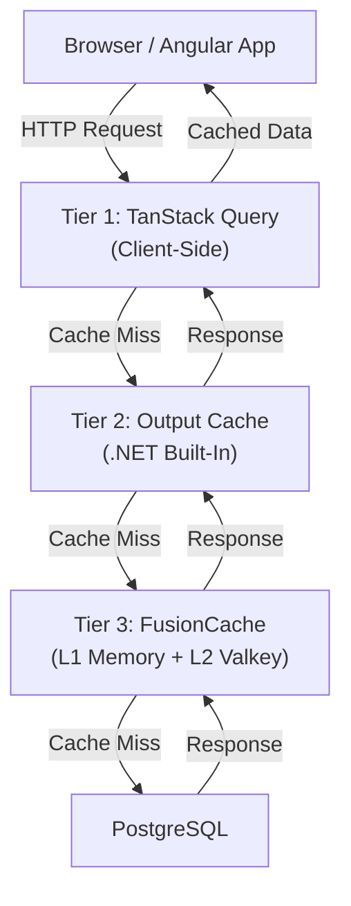

# Caching Strategy

> **Last Updated**: February 13, 2026

## Overview

SeventySix uses a three-tier caching architecture to minimize latency and database load while keeping data fresh.



---

## Tier 1 — Client-Side (TanStack Query)

Single source of truth for all UI-visible server state. Angular signals drive change detection (zoneless).

### Key Concepts

| Concept | Implementation |
|---------|---------------|
| Cache Keys | `QueryKeys` pattern — typed factory functions per domain |
| Stale-While-Revalidate | Default `staleTime` per query; background refetch on window focus |
| Invalidation | `CacheCoordinationService` invalidates query keys after mutations |
| Reactivity | Signal-based — `injectQuery()` returns signals, no manual subscriptions |

### Cache Coordination

After a mutation succeeds, `CacheCoordinationService` invalidates the relevant query keys so dependent components refetch automatically.

```
Mutation → Success → CacheCoordinationService.invalidate(QueryKeys.users.all)
    → All user list components refetch
```

---

## Tier 2 — API Output Cache (.NET Built-In)

Short-lived HTTP response cache applied to GET endpoints via `[OutputCache(PolicyName = "...")]`.

### Policies

| Policy | Duration | VaryBy | Tag | Purpose |
|--------|----------|--------|-----|---------|
| `users` | 60s | `id` | `users` | User list/detail endpoints |
| `logs` | 60s | `logLevel`, dates, pagination | `logs` | Log queries |
| `health` | 15s | — | `health` | Health check endpoints |
| `thirdpartyrequests` | 60s | `page`, `pageSize` | `third-party` | API tracking data |

### Tag-Based Eviction

When a mutation occurs, the corresponding Output Cache tag is evicted:

| Mutation | Evicts Tag |
|----------|-----------|
| Create/Update/Delete User | `users` |
| Log writes | `logs` |
| API request tracking | `third-party` |

### When to Skip Output Cache

- Real-time validation endpoints (username/email existence checks)
- Health checks requiring live state
- Endpoints serving user-specific data without `VaryBy` coverage

---

## Tier 3 — Domain/Persistence (FusionCache + Valkey)

Two-tier distributed cache: L1 in-memory (per process) + L2 Valkey (shared across nodes).

### Architecture

```
┌─────────────────────────────────────────────────────────────┐
│                     Application Nodes                       │
├───────────────────────┬─────────────────────────────────────┤
│       Node 1          │                Node 2               │
│  ┌─────────────────┐  │  ┌─────────────────┐               │
│  │  L1 Memory Cache│  │  │  L1 Memory Cache│               │
│  └────────┬────────┘  │  └────────┬────────┘               │
│           ▼           │           ▼                         │
│  ┌──────────────────────────────────────────┐               │
│  │     FusionCache Backplane (Pub/Sub)      │               │
│  └───────────────────┬──────────────────────┘               │
│                      ▼                                      │
│  ┌──────────────────────────────────────────┐               │
│  │   L2 Distributed Cache (Valkey/Redis)    │               │
│  │   MemoryPack Serialization               │               │
│  │   Instance: seventysix:                  │               │
│  └───────────────────┬──────────────────────┘               │
│                      ▼                                      │
│  ┌──────────────────────────────────────────┐               │
│  │          PostgreSQL Database              │               │
│  └──────────────────────────────────────────┘               │
└─────────────────────────────────────────────────────────────┘
```

### Named Caches

| Cache Name | Purpose | Default TTL | Use Case |
|------------|---------|-------------|----------|
| Default | General application cache | Configurable | Miscellaneous data |
| Identity | User and authentication data | 1 minute | Users, profiles, roles |
| Logging | Log data | 5 minutes | Read-heavy log queries |
| ApiTracking | API statistics | 5 minutes | Analytics and monitoring |

### Cache Key Patterns

All keys follow: `{domain}:{entity}:{identifier}`

**Identity Domain**

| Key Pattern | Description |
|-------------|-------------|
| `identity:user:{id}` | User by ID |
| `identity:profile:{id}` | User profile |
| `identity:user-roles:{id}` | User's assigned roles |
| `identity:available-roles:{id}` | Roles available to assign |
| `identity:user:email:{sanitized}` | User by email (lowercase) |
| `identity:user:username:{sanitized}` | User by username (lowercase) |
| `identity:permission-requests` | All pending permission requests |
| `identity:all-users` | All users list |

**ApiTracking Domain**

| Key Pattern | Description |
|-------------|-------------|
| `apitracking:stats:{date}` | Daily API statistics |

### Cache Invalidation

`ICacheInvalidationService` centralizes all cache eviction:

| Method | Keys Invalidated | Triggered By |
|--------|-----------------|--------------|
| `InvalidateUserCacheAsync` | User by ID, profile, email, username | User updates, deletes |
| `InvalidateUserRolesCacheAsync` | User roles, available roles | Role add/remove |
| `InvalidateUserProfileCacheAsync` | User profile only | Profile-only updates |
| `InvalidateUserPasswordCacheAsync` | User profile, user by ID | Password changes |
| `InvalidateBulkUsersCacheAsync` | All keys for multiple users + all users list | Bulk operations |
| `InvalidateAllUsersCacheAsync` | All users list | User create/update/delete |
| `InvalidatePermissionRequestsCacheAsync` | Permission requests list | Approve/reject/cancel |
| `InvalidateApiStatisticsCacheAsync` | Daily statistics | Statistics update |

### FusionCache Features

| Feature | Value | Purpose |
|---------|-------|---------|
| Fail-Safe | Enabled | Serve stale data on backend failures |
| Eager Refresh | 80% of TTL | Proactively refresh before expiration |
| Jitter | 10% max delay | Prevent thundering herd |
| Soft/Hard Timeouts | Configured per cache | Fast fallback to stale data |
| Backplane | Valkey Pub/Sub | Cross-node invalidation |

### Handlers Intentionally NOT Cached

| Handler | Reason |
|---------|--------|
| `GetAdminCountQueryHandler` | Security-critical for last-admin protection |
| `CheckUsernameExistsQueryHandler` | Real-time validation for registration |
| `CheckEmailExistsQueryHandler` | Real-time validation for registration |
| Health check handlers | Must reflect real-time state |
| Paged query handlers | Complex pagination with dynamic filters |

---

## Configuration Reference

### Valkey Connection

```json
{
  "Cache": {
    "Valkey": {
      "ConnectionString": "localhost:6379",
      "InstanceName": "seventysix:",
      "ConnectTimeoutMs": 5000,
      "SyncTimeoutMs": 1000,
      "ConnectRetry": 3,
      "KeepAliveSeconds": 60
    }
  }
}
```

### Output Cache Policies

Configured in `appsettings.json` under `Cache.OutputCache.Policies`. Each policy has: `DurationSeconds`, `VaryByQuery`, `Tag`, `Enabled`.

---

## Best Practices

| DO | DON'T |
|----|-------|
| Use `ICacheInvalidationService` for all evictions | Construct cache keys with string concatenation |
| Use named caches (`CacheNames.Identity`) | Use default cache for domain-specific data |
| Use cache key helpers (`IdentityCacheKeys.UserById(id)`) | Forget to invalidate after mutations |
| Keep TTLs short for security-sensitive data | Cache health checks or real-time validation |

## Testing

In test environments, FusionCache uses memory-only mode (no Valkey). Use `TestCacheFactory.CreateIdentityCache()` for unit tests.

## Monitoring

FusionCache metrics are exported via OpenTelemetry. Monitor: cache hit/miss ratios, backplane sync latency, connection pool health, memory usage per cache.
