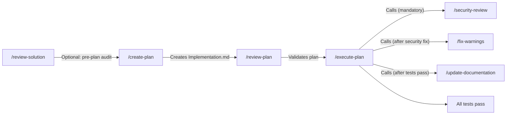

# Copilot Prompt Guide

> A practical guide to using VS Code Copilot prompts in this project.
> Written for developers who are new to prompts — and for the next devs joining the team.

---

## Table of Contents

- [What Are Prompts?](#what-are-prompts)
- [How to Run a Prompt](#how-to-run-a-prompt)
- [Core Workflow Prompts](#core-workflow-prompts)
    - [/create-plan](#create-plan--create-a-new-implementation-plan)
    - [/review-plan](#review-plan--review-an-implementation-plan)
    - [/execute-plan](#execute-plan--execute-an-implementation-plan)
    - [/security-review](#security-review--owasp-security-audit)
- [Scaffolding Prompts](#scaffolding-prompts)
- [Quality & Verification Prompts](#quality--verification-prompts)
- [How Prompts Call Other Prompts](#how-prompts-call-other-prompts)
- [What About Hooks?](#what-about-hooks)
- [Expectations & Results](#expectations--results)
- [Tips & FAQ](#tips--faq)

---

## What Are Prompts?

Prompts are **reusable instruction templates** stored as `.prompt.md` files in `.github/prompts/`. They tell Copilot's agent mode exactly what to do — which files to read, which rules to follow, which tools to use, and what output to produce.

Think of them as **saved commands** you can invoke by name instead of typing long instructions every time.

### Workflow Overview



**Key facts**:

- Prompts live in `.github/prompts/*.prompt.md` — committed to the repo so every team member has access
- Each prompt has a **slash command** (`/prompt-name`) you type in Copilot chat
- Prompts run in **agent mode** — Copilot can read files, run commands, edit code, and use MCP tools
- Prompts are NOT custom models — they are instructions that any model (Claude, GPT, etc.) follows
- You can add your own natural language after the slash command to provide additional context

---

## How to Run a Prompt

1. Open **Copilot Chat** in VS Code (Ctrl+Shift+I or the chat icon)
2. Make sure you are in **Agent mode** (the dropdown at the top-left of the chat panel — select "Agent" not "Ask" or "Edit")
3. Type a slash `/` — VS Code shows a list of available prompts
4. Select one (e.g., `/review-plan`) or type the name
5. Optionally add context after it (e.g., `/create-plan Add a user notification preferences feature`)
6. Press Enter — Copilot reads the prompt file and executes it

**That's it.** The prompt tells Copilot which files to read, which rules to follow, and what to produce. You don't need to remember anything — the prompt encodes it all.

---

## Core Workflow Prompts

These prompts handle the **plan → review → execute** development cycle. Use them together.

### /create-plan — Create a New Implementation Plan

**What it does**: Writes a full `Implementation.md` from scratch for new work you describe.

**When to use**: Starting a new feature, refactor, or migration — before writing any code.

**Sample usage**:

```
/create-plan Add user notification preferences — users can choose email, SMS, or push for each notification type. Server stores preferences in the ElectronicNotifications domain. Client adds a preferences page in the account domain.
```

**What you'll get back**:

- A complete `Implementation.md` with numbered phases, file paths, code patterns, and verification steps
- A final phase that runs all required test suites
- Compaction checkpoints at major tech boundaries (server → client)
- TDD-First strategy — each phase lists test deliverables before implementation code

> **Tip**: For large refactors, run `/review-solution` first to understand the current codebase state, then use that output as context for `/create-plan`.

---

### /review-plan — Review an Implementation Plan

**What it does**: Reads `Implementation.md` and validates every phase against all project rules in `.github/instructions/`.

**When to use**: After you or Copilot writes an `Implementation.md` — before you start executing it.

**Sample usage**:

```
/review-plan
```

That's all you need. The prompt knows to read `Implementation.md` and cross-reference every instruction file.

**What you'll get back**:

- A list of **violations** (phase number + specific issue)
- **Missing coverage** — rules or patterns the plan forgot
- **Suggestions** for improvement
- A **pass/fail** verdict

**Example output** (abbreviated):

> **Violation — Phase 3**: Plan creates a new service with `providedIn: 'root'`, but angular.instructions.md requires domain services use route `providers` array.
>
> **Missing**: No phase addresses E2E test creation for the new feature.

---

### /execute-plan — Execute an Implementation Plan

**What it does**: Proceeds through every remaining phase in `Implementation.md`, writes code, runs tests, and follows all project rules.

**When to use**: After `/review-plan` passes — you're ready to build.

**Sample usage**:

```
/execute-plan
```

Or with extra context:

```
/execute-plan Start from Phase 4 — Phases 1-3 are already done
```

**What happens internally** (prompt calls other prompts automatically):

1. Implements all phases (TDD-First: tests before code)
2. Runs `/security-review` — mandatory OWASP/PII/Auth audit
3. Runs `/fix-warnings` — clears all build/lint warnings
4. Runs all required test suites (server, client, E2E, load)
5. Runs `/update-documentation` if docs are in scope

**Built-in safety rules**:

- Will NOT send commits (you handle those)
- Will NOT run `db:reset` or `reset-database`
- Will NOT suppress warnings — always fixes root causes
- Will NOT truncate terminal output

---

### /security-review — OWASP Security Audit

**What it does**: Comprehensive security audit — OWASP Top 10, PII exposure, auth flows, infrastructure, client-side vulnerabilities.

**When to use**: Called automatically by `/execute-plan` before the final test gate. Can also be run standalone at any time.

**What you'll get back**:

- Findings organized as Critical / High / Medium / Low
- Critical and High findings are **blocking** — must be fixed before tests run
- Medium findings are documented as GitHub issues if not immediately fixable

---

## Scaffolding Prompts

These prompts generate code for specific components or domains. They handle file creation, naming, patterns, and test stubs. They can be invoked directly or referenced inside `implementation-N.md` phases.

| Command                | What It Creates                                  | Example Usage                                                               |
| ---------------------- | ------------------------------------------------ | --------------------------------------------------------------------------- |
| `/new-domain-feature`  | Full-stack feature (Angular + .NET)              | `/new-domain-feature User profile editing with avatar upload`               |
| `/new-server-domain`   | New .NET bounded context domain                  | `/new-server-domain Notifications`                                          |
| `/new-client-domain`   | New Angular domain module                        | `/new-client-domain billing`                                                |
| `/new-component`       | Angular component (with template, styles, tests) | `/new-component notification-preferences-card in the account domain`        |
| `/new-angular-service` | Angular service with domain scoping              | `/new-angular-service NotificationPreferencesService in the account domain` |
| `/new-service`         | .NET service + repository                        | `/new-service NotificationPreferencesService in ElectronicNotifications`    |
| `/new-e2e-test`        | Playwright E2E test                              | `/new-e2e-test Test the notification preferences page`                      |
| `/new-load-test`       | k6 load test scenario                            | `/new-load-test Load test the notification preferences API`                 |

**All scaffolding prompts**:

- Read the relevant `.github/instructions/` files before generating code
- Follow the project architecture (server: `Shared ← Domains ← Api`, client: domains import only `@shared/*`)
- Use the correct naming conventions (C# PascalCase, Angular kebab-case files, etc.)
- Generate tests alongside production code (TDD-First)
- Use MCP tools (context7 for docs, postgresql for schema)

---

## Quality & Verification Prompts

| Command                  | What It Does                                              | When to Use                          |
| ------------------------ | --------------------------------------------------------- | ------------------------------------ |
| `/code-review`           | Reviews staged changes and auto-fixes violations          | Before committing a significant diff |
| `/fix-warnings`          | Finds and fixes all build/lint warnings (never suppress)  | Called by `/execute-plan` + standalone |
| `/review-solution`       | Deep review of entire codebase; outputs `Implementation.md` | Before large refactors or periodic health checks |
| `/run-site-base`         | Full-site Chrome DevTools walkthrough with screenshots    | After deployments, before demos |
| `/update-documentation`  | Aligns all READMEs and docs with current implementation   | Called by `/execute-plan` when docs are in scope + standalone |

**`/code-review`** checks for: formatting violations, security issues, accessibility gaps, architecture violations, naming problems, and testing gaps. It fixes every violation automatically, then runs `/fix-warnings` and the full test suite.

**`/fix-warnings`** runs `dotnet build`, `ng build`, and ESLint, then fixes every warning. It never suppresses — always fixes root causes.

**`/review-solution`** is the most comprehensive prompt — it reads every instruction file, cross-references every pattern with Context7 docs, and delegates Stage 2 (security) to `/security-review`. Output is a prioritized `Implementation.md` plan.

**`/run-site-base`** automates a 21-step walkthrough: landing page → login → MFA → admin dashboard → user management → logs → permissions → profile → developer tools → error pages → logout. Generates a `walkthrough-report.md` and screenshots. Run it after any client-facing changes.

---

## How Prompts Call Other Prompts

Some prompts are designed to call others at key points in their workflow:

| Parent Prompt | Calls | When |
|---|---|---|
| `/execute-plan` | `/security-review` | After all implementation phases, before test gate |
| `/execute-plan` | `/fix-warnings` | After security fixes, before test gate |
| `/execute-plan` | `/update-documentation` | After all tests pass, when docs are in scope |
| `/review-solution` | `/security-review` | Stage 2 of the solution review |
| `/create-plan` | — | Recommends `/review-solution` as optional pre-plan step |
| `/code-review` | `/fix-warnings` | Step 4 of the review workflow |

---

## What About Hooks?

**Hooks are already configured and run automatically — you don't need to do anything.**

This project has a `.vscode/copilot-hooks.json` file with **post-edit hooks** that trigger automatically whenever Copilot edits a file:

| Hook                | Trigger                                                    | What It Does                               |
| ------------------- | ---------------------------------------------------------- | ------------------------------------------ |
| **ESLint auto-fix** | After Copilot edits any `.ts` file in `SeventySix.Client/` | Runs `npx eslint --fix` on the file        |
| **dotnet format**   | After Copilot edits any `.cs` file in `SeventySix.Server/` | Runs `dotnet format --include` on the file |

**You will notice**:

- After Copilot writes or modifies a TypeScript file, ESLint immediately auto-fixes formatting (trailing commas, quotes, semicolons, etc.)
- After Copilot writes or modifies a C# file, dotnet format immediately normalizes indentation and style

**You do NOT need to**:

- Run these manually — they fire automatically
- Configure anything — the hooks file is committed to the repo
- Select or approve hooks — VS Code runs them on every Copilot edit

**Hooks vs. Prompts**:

|                       | Prompts                                   | Hooks                                 |
| --------------------- | ----------------------------------------- | ------------------------------------- |
| **Triggered by**      | You (type `/command`)                     | Automatically (after every file edit) |
| **Purpose**           | Multi-step tasks (scaffold, review, plan) | Single-file formatting fixes          |
| **You interact with** | Yes — you read output, provide context    | No — runs silently in background      |
| **Can be skipped**    | Yes — just don't invoke them              | No — always runs if configured        |

---

## Expectations & Results

### What to Expect From Each Prompt Type

| Prompt Type                                 | Time                         | Output                              | Human Effort After                |
| ------------------------------------------- | ---------------------------- | ----------------------------------- | --------------------------------- |
| **Planning** (`/create-plan`)               | 2-5 min                      | A complete `Implementation.md`      | Review it, then `/review-plan`    |
| **Review** (`/review-plan`, `/code-review`) | 1-3 min                      | Violation list with pass/fail       | Fix violations or re-plan         |
| **Execution** (`/execute-plan`)             | 5-30 min (depends on phases) | Code changes + test results         | Commit if tests pass              |
| **Scaffolding** (`/new-*`)                  | 1-5 min                      | Files created with correct patterns | Fill in business logic, run tests |
| **Quality** (`/fix-warnings`)               | 2-10 min                     | All warnings fixed                  | Verify build is clean             |

### What Prompts Will NOT Do

- **Send commits** — you always commit manually
- **Run database resets** — `db:reset` is forbidden for Copilot
- **Suppress warnings** — always fixes root causes, never `// @ts-ignore`
- **Skip tests** — execution prompts MUST run all required test suites before finishing
- **Break architecture** — prompts encode the dependency rules (`Shared ← Domains ← Api`)

### Signs a Prompt Worked Correctly

| You Know It Worked When...                                    | You Know Something Went Wrong When...                          |
| ------------------------------------------------------------- | -------------------------------------------------------------- |
| `/review-plan` gives a clear pass/fail verdict with specifics | Vague "looks good" with no rule references                     |
| `/execute-plan` ends with 3 green test suites                 | Claims "done" without showing test output                      |
| `/new-component` creates files in the correct domain folder   | Files appear in the wrong domain or at the root                |
| `/code-review` lists specific files and line numbers          | Generic advice with no file references                         |
| `/fix-warnings` shows before/after for each fix               | Says "no warnings found" but `dotnet build` still has warnings |

---

## Tips & FAQ

### "Which prompt should I start with?"

If you're building something new → `/create-plan` → `/review-plan` → `/execute-plan`
If you want a broad health check or pre-refactor audit → `/review-solution`
If you're fixing up existing code → `/fix-warnings` or `/code-review`
If you need one specific thing → `/new-component`, `/new-service`, etc.
If you want to visually verify everything is working → `/run-site-base`

### "Can I chain prompts?"

Yes, that's the intended workflow. The typical flow:

1. `/create-plan <describe work>` — generates `Implementation.md`
2. `/review-plan` — validates the plan
3. Fix any issues the review found (manually or ask Copilot)
4. `/execute-plan` — builds everything (internally calls `/security-review`, `/fix-warnings`, `/update-documentation`)
5. `/run-site-base` — optional visual verification after client changes

### "What if a prompt produces wrong code?"

- The prompt is a starting point. You can tell Copilot to fix issues in the same chat: "The component is in the wrong domain — move it to account"
- If a prompt consistently produces wrong patterns, the fix is in the `.github/instructions/` files, not in repeating yourself every chat

### "Do I need to be in Agent mode?"

**Yes.** All prompts use `agent: agent` in their frontmatter. If you run them in "Ask" or "Edit" mode, they won't have access to file editing, terminal commands, or MCP tools.

### "What MCP tools do prompts use?"

Each prompt declares which MCP servers it needs. You don't pick them — Copilot activates them automatically. Here's the mapping:

| Prompt | MCP Servers |
| ------ | ----------- |
| `/create-plan` | context7, postgresql |
| `/review-plan` | context7 |
| `/execute-plan` | context7, postgresql, github |
| `/security-review` | context7 |
| `/code-review` | github, context7 |
| `/fix-warnings` | context7 |
| `/review-solution` | context7, postgresql, github, chrome-devtools |
| `/run-site-base` | chrome-devtools, postgresql |
| `/update-documentation` | chrome-devtools, context7 |
| `/new-domain-feature` | context7, postgresql |
| `/new-server-domain`, `/new-service` | context7, postgresql |
| `/new-client-domain`, `/new-angular-service` | context7 |
| `/new-component` | context7 |
| `/new-e2e-test` | context7, chrome-devtools, playwright |
| `/new-load-test` | context7 |

### "Will hooks run when I edit files manually?"

No. Hooks only trigger when **Copilot** edits a file. Your manual edits, your formatter, and your IDE save actions are unaffected.
